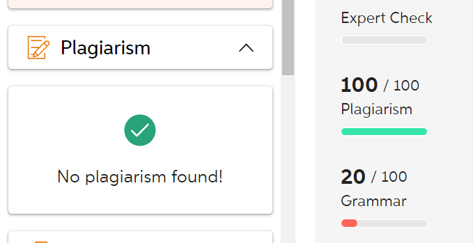

宗旨:
不管会不会,知不知道格式,先写了再说.因为先写完了才能知道写得好不到才有时间改!

信标的分析
1. [ ] 每个信标即使在同一点测量到的信号值也有可能不同.
2. [ ] 每个信标在10m的最远距离和0m的最近距离得到的信标值.

- [ ] 最好是自己再重新弄一个app能够显示信标的RSSI. 按一下显示一下.

测距仪器的分析
1. [ ] 距离测距分析20  40 60 100 , 仪器数据 实物数据对比. 与实际的距离进行误差分析.

2023年7月30日
___
- [ ] 看一下理论怎么写
	- [ ] 看一下report的评分要求
- [ ] risk assessment
- [ ] 询问一下如果想让老师帮忙看报告,需要在什么时候之前发报告给老师?
- [ ] 我至少要写20个引用.且需要大部分都是书本上的,而不是网站上的.

- [x] 检查一遍海报字体,发给老师看一下海报
	- [x] 改一下海报一个conclusion
	- [x] 看一下poster的评分要求,根据要求来
	- [x] 问一下刘羿和萱萱 这个introduction和conclsion是必须写的吗
	- [x] 需不需要加上队友的成果,说他们还未完成,我们后面会加上他们正在开发的功能,不然四个人就做这些人太少了

生活
___
- [ ] 买裤子,先试一下原来的裤子看一下原来的尺码大还是小,再买新裤子

食物
___
- [x] 包子
- [ ] 牛奶
- [x] 火鸡面
- [ ] 苹果
- [ ] 香蕉
- [ ] 可乐
- [x] 芬达
- [x] 饺子
- [ ] 饺子
- [x] 菠萝

# 查重

The Bluetooth signal will gradually attenuate as the distance increases. Moreover, the signal strength of the same Bluetooth beacon may vary at the same distance.

这一段话是我自己写的.没有重复率. 等几天之后我再来查询看看有没有

# 一定不能删除的事情

- [ ] 取消Ubereat续订
- [ ] 取消Amazon Primer续订
- [ ] 取消Cite me As 续订 还没定

