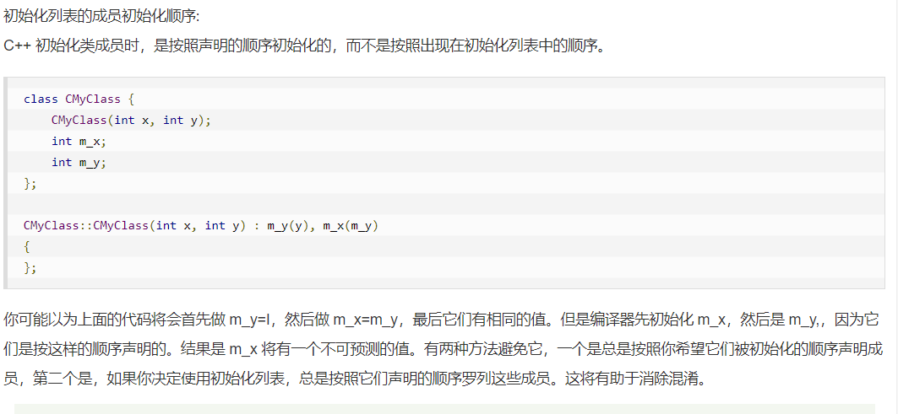

[03 Dart的数据类型详解 int double String bool List Maps-2021更新\_哔哩哔哩\_bilibili](https://www.bilibili.com/video/BV1S4411E7LY?p=3&spm_id_from=pageDriver&vd_source=2f6e531d9d833ca7fdcd8c5bb99bd1bb)
[Dart中类的默认构造函数和命名构造函数](https://www.itying.com/dart/dart25.html)
[List 数组的常用方法](https://blog.csdn.net/qq_42351033/article/details/107924344)

# 01
[安装Dart SDK](https://dart.dev/get-dart)
CMD中 `dart --version` 可以检测Dart SDK是否成功安装

配置VSCODE
___
1. 安装 Dart 插件
2. 安装 code Runner 插件


# 03 数据类型

String
___
$```$三个单引号可以写多行字符.

字符串拼接: Print(Str1 + Str2) 或者Print($Str + $Str)

var
___
推断数据类型

List 集合类型
___
```dart
// 方式一
var l1 = ["Jack",20,True];
// 集合是可以不同数据类型的

//方式二 指定数据类型
var l2 = <int>[12,30];

//方式三
var l3 = [];
l3.add(14);
l3.add("jack")
l3.length


```
map
___
```dart
//1

var person = {
"name" : "Jack",
"age" : 20,
"work" : ["1","2"]
};

print(person[name]);


//2
var p = new Map();

p["name"] = "Jack";
p["age"] = 22;
p["work"] = ["程序员","外卖员"];
print(p);

p.addAll({
"height": 160 //Map里就只有addAll 没有add
})
```

is
___
`print(A is int) //输出 true / false`


set
___
也是数组,主要功能是去重.
例如:
```dart

var x = new Set[1,2,3,4,1,1]
print(x); //输出[1,2,3,4]
```

# 06 List Map常用英雄
```dart
//函数是可以没有名字的
(){
	print("Hello");//这也是一个合法函数
	//但是只能用在方法的方法中
}

```


```dart
List myList = [1,2,3,4];

//
var newList = myList.map((value){
	return value*2;
})
//这里返回的newList 是这样的(1,2,3,4),不是一个List.所以需要用var来定义,然后转换成List
print(newList.toList()); 
```

遍历数组方法
___
```dart
for(var item in myList){
	print(item);
}

myList.forEach((value){print("$value")})

```


# 07 函数参数

```dart
//可选参数
void Person(String name,[int age , String sex ]){

}
//age sex这两个可选参数在调用函数的时候可以不赋值.也是对的


//默认参数
void Person(String name,[int age = 20, String sex = "male"]){


}
//如果在调用这个函数的时候没有给age和sex赋值,那么age和sex的值就会是默认值


//命名参数
void Person(String name,{int age, String sex = "male"}){

}

Peson("Jack",age : 20);
//在传递参数的时候必须要带上变量名
```


# 09 类

构造函数与命名构造函数
___
```dart
class Person{
int age;

Person(this.age);
Person.set(int age){
	this.age = age;
}

Person p2=new Person.set(20);   //命名构造函数

```
私有 公有
___
不像Java和C++. Dart语言没有private与public等修饰符.

但是如果你想将Dart语言中的变量修饰为 Private,
你只需要在变量名之前加入`_`即可
```dart
var _name = "Jack";

//_name 是私有变量
```


# 10 静态非静态方法
静态方法
___
```dart
//访问静态变量不需要this, 不管是不是静态成员函数
class Person{
	static int age = 0
	
	static void printName(){
		print(name); //访问静态变量不需要this.name
	} 
	
	void printName2(){
		print(name); //访问静态变量不需要this.name, 不管是不是静态成员函数
	} 
}

```

继承
___
构造函数是不能继承的.
[Extends](assets/Pasted%20image%2020230623144343.png)

```dart

class Rect{
  int height;
  int width;
  Rect():height=2,width=10{      //Dart类中的初始化列表
    print("${this.height}---${this.width}");
  }
  getArea(){
    return this.height*this.width;
  } 
}

void main(){
  Rect r=new Rect();
  print(r.getArea()); 
   
}
```




# 11 抽象类


Datr中的多态：
*允许将子类类型的指针赋值给父类类型的指针，同一个函数调用会有不同的执行效果*

子类的实例赋值给父类的引用。

多态就是父类定义一个方法不去实现，让继承他的子类去实现，每个子类有不同的表现。

```dart
abstract class Animal()
{
	void eat();

	//这个就是公用的方法,可以被子类继承后直接调用的
	void printf(){
		print("I am an animal"); 
	}
}


Dog extends Animal()
{
	@override
	void eat(){
		print("Dog");
	}
	
	void run(){
		print("run");
	}
}

Dog extends Animal()
{
	@override
	void eat(){
		print("Cat");
	}

	void run(){
		print("run");
	}
}

Animal d = new Dog();

d.eat();

Animal c = new Cat();
c.run(); //这个就会报错
```
#抽象类与接口的区别
___
抽象类中尚且还有公用的方法,例如上文中的`printf`.
一旦没有公用的方法,抽象类只是用来做一个子类继承时,必须重写的函数的标准,那么就可以把这个抽象类声明为接口.

Java
1. 单继承
2. 但是可以实现多个接口

Dart
1. 多继承 with实现 成为Mixin方法
2. 可实现多个接口 [用 implement 继承class. 没有interface这个关键字,接口接直接用abstract定义]

C++
1. 可实现多继承
2. 没有接口(implements)这一个概念,但是带有纯虚函数的类可以当做接口使用

# 12


主要是第二点,作为mixins的类不能有构造函数
```dart
class A{
	print("A");
}

class B{
	print("B");
}

Class C with A,B{

}
//A B 作为Minins 类是不允许有构造函数的

```

# 13 泛型类 泛型方法

#泛型方法
___
```dart
//不指定类型放弃了类型检查,我们想实现的是传入什么,返回什么数据类型

//这样写 泛型方法

T getData<T>(T value){
	return value;

}

void main(){

	//print(getData(21)); //这个就没指定类型,就不会有类型检查
	getData<String>("你好");
}


```
#泛型类
___
```dart
class MyList<T>{
	List list = <T>[]; //泛型 受到一会儿<String>这个的指定的类型限制
	void add(T value){
		this.list.add(value);
	}

	List getList(){
		return list;
	}
}

void main(){
	MyList l1 = new MyList();//这个就可以添加任意的数据
	MyList l2 = new MyList<String>();//这个就只能添加String类型的数据

}
```


# 14 如何引入库


#await_async
___

- async和await就是为了让线程执行时,不等待需要大量时间执行的函数,而是在执行这个函数的同时,也执行下面的函数.


# 15
#late 关键字
___


- late允许之后给这个变量赋初值
```dart

//没有late
//这时就会出错,因为没有构造函数来给age幅值,age也没有初值.
class Person{
	int age;

	void showAge(){
		print("${age}");
	}

}

//这几种写法都对
//1.
class Person{
	late int age;

	void showAge(){
		print("${age}");
	}

}

//2.
class Person{
	int age = 0;

	void showAge(){
		print("${age}");
	}

}

//3
class Person{
	int age;

	Person(this.age);

	void showAge(){
		print("${age}");
	}

}

//4 和3一样只是写法不同
class Person{
	int age;

	Person(int age){
		this.age = age;
	}

	void showAge(){
		print("${age}");
	}

}

```

#required 关键字
___
```dart
// 命名参数
String printUserInfo1(String username, {int age = 10, String sex = "男"}){

}

String printUserInfo2(String username, {required int age = 10, required String sex = "男"})

/*
函数1可以只传递username,因为age sex都有默认的值
函数2必须要传递三个参数,因为required 即使age与sex 有默认值也需要传递参数

*/
```

```dart
printf1({int age = 10, int age2 = 20}) {

print("${age}" + "${age2}");

}

  

printf2({required int age = 10, required int age2 = 20}) {

print("${age}" + "${age2}");

}

  

void main() {

printf1(age: 22, age2: 11);

  

printf1(age2: 11);

}
```

# 16
