Dart是语言
Flutter是框架

| 计划 |             |
| ---- | ----------- |
|      | 每天4个     |
|      | 预计7号看完 | 
#最基本的程序应该是这样的

Myapp

Scalfold

HomePage

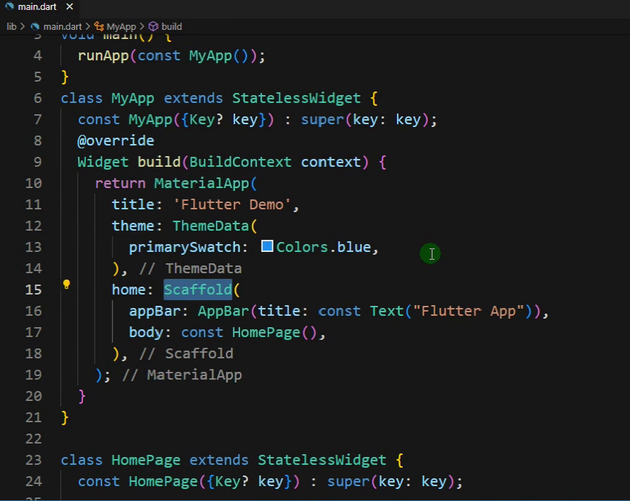

#必须要注意的点

什么是常量构造函数

const有时候会导致错误


#命名参数

{1,2,3,4}按照名字进行赋值

#位置参数

按照位置进行赋值

#配置边距

```dart
margin:const EdgeInsets.all(10)//所有间距都为10
```


#圆形图片

1. 利用Container的 border

```dart
decoration: BoxDecoration(
color: Colors.blue,
borderRadius: BorderRadius.circular(15)

```

2. 利用ClickAvatar

# 如何遍历数组

1. For
2. Map语句

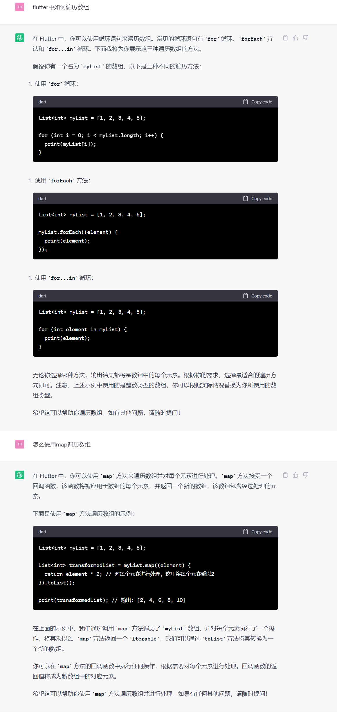


# 20

1. 组件都是类,所以字母要大写
2. 命名参数的名字则不用大写

#语法检查
___
analysis_options.yaml 
这是语法检查的文件可以不要.全部注释掉就行了,不会影响程序的运行.


#no_widger 
___
这个是由于没有写主要的组件导致的.可能是因为现在的语法不一样了

#模拟器
___
在VSCODE中打开模拟器:
1. ctrl+shift+P 打开控制面板
2. Flutter: Launch Emulator

# 04

1. MaterialApp Scalfold组件
2. 代码抽离

#文件

___

pubspec.yaml : 项目的版本号,以及依赖等等.


#应用

Material是顶层应用.是根组件.

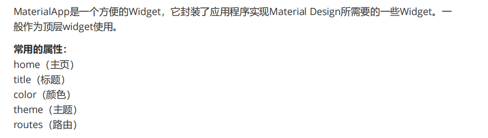


#热加载

r 键：点击后热加载，也就算是重新加载吧。

p 键：显示网格，这个可以很好的掌握布局情况，工作中很有用。

o 键：切换android和ios的预览模式。

q 键：退出调试预览模式。


#抽离组件

```dart
class name extends StatelessWidget {
  const name({super.key});

  @override
  Widget build(BuildContext context) {
    return ();
  }
}
```

Stateless widget

Statefull widget


# 05 Container

#常见错误

最常见的错误就是把不const的变量用const修饰.
1. 大小
2. 怎么变成圆形
```dart
decoration: BoxDecoration(

          color: Colors.red,

          border: Border.all(color: Colors.blue, width: 1),

          borderRadius: BorderRadius.circular(100)),
```
3. 怎么调整内部元素的位置
4. 怎么调整容器与外部容器的位置
5. 怎么调整内部元素与容器的边缘的间隔.


# 06 Image 图片组件

1. 加载远程图片
2. 实现圆形图片:在container中

Container中加载图片需要在decoration中实现.

```dart
import 'package:flutter/material.dart';
void main() {
runApp(MaterialApp(
home: Scaffold(
appBar: AppBar(title: const Text("你好Flutter")), body: const MyApp()),
));
}
class MyApp extends StatelessWidget {
const MyApp({Key? key}) : super(key: key);
@override
Widget build(BuildContext context) {
return Center(
child: Container(
width: 150,
height: 150,
decoration: BoxDecoration(
color: Colors.yellow,
borderRadius: BorderRadius.circular(75),
image: const DecorationImage(
image: NetworkImage(
"https://www.itying.com/themes/itying/images/ionic4.png",
),
fit: BoxFit.cover)),
),
);
}
}
```


#SizedBox

就相当于一个块,可以用来做分隔,间隔.

# 07 Icon 图标组件

1. 加载FLutter内置的图标
2. 加载第三方图标

#第三方

1. 下载图标文件
2. pubspec.yaml 中搜索fonts,取消掉注释,再更改一下内容

```json
fonts:
	- family : ityingIcon #指定的字体名, 根据需求定义,随意取.这个就是一会儿我们需要这样调用的名字ityingIcon.Wechat
	  fonts:
		- asset: fonts/iconfont.ttf
```

3. 复制,将下载好的图标文件都放在lib同级目录下新建的fonts文件夹下

   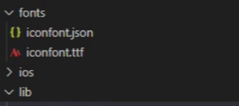

4. 新建 指定字体名.dart 文件在里面编程

注意这个fontFamliy是和yaml中的fontfamily一样的.

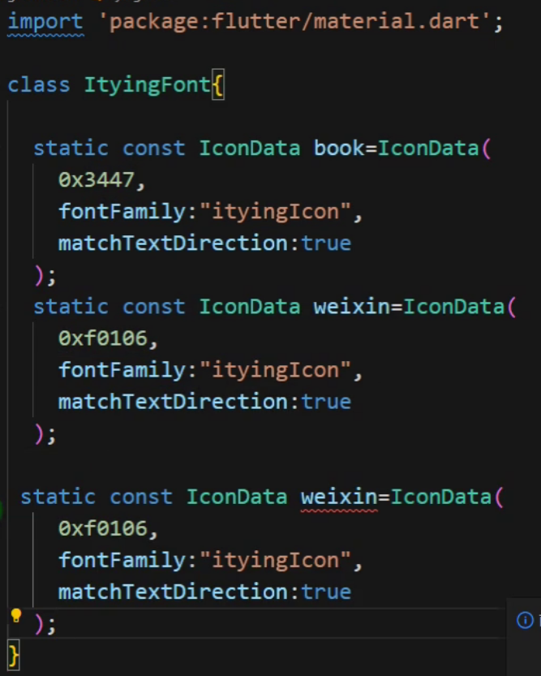

5. 这样调用就可以了

   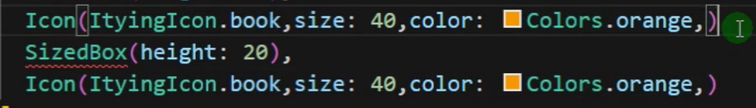


#图标库

阿里巴巴图标库上有常见的图标,例如支付宝

# 08 Listview 列表

#特点:

1.  可以上下滑动,不会出现元素过多导致超出页面范围出错的问题
2.  Listview的childeren是常量化的数组组件

#水平垂直 列表

1. 水平列表高度是自适应的
2. 垂直列表宽度是自适应的

意思就是调节宽度和高度是没有用的.

解决办法:

把Listview放在一个容器中.

例如SizedBox中再放上ListView


#重点

1. Leading
2. Trailing
3. Subtitle
4. 怎么垂直水平滑动等等


#一个最基本应用结构 

```dart
/*
大体的结构是这样的
runApp(MyApp())

MyApp(home:Scalfold())

Scalfold(body: const MyHomepage())

Home: 
*/

import 'package:flutter/material.dart';
import './ityingFont.dart';

void main() {
  runApp(const MyApp());
}

class MyApp extends StatelessWidget {
  const MyApp({Key? key}) : super(key: key);

  // This widget is the root of your application.
  @override
  Widget build(BuildContext context) {
    return MaterialApp(
      theme: ThemeData(
        primarySwatch: Colors.yellow,
      ),
      home: Scaffold(
        appBar: AppBar(title: const Text("Flutter ICON")),
        body: const MyHomePage(),
      ),
    );
  }
}

class MyHomePage extends StatelessWidget {
  const MyHomePage({Key? key}) : super(key: key);
  @override
  Widget build(BuildContext context) {
    return ListView(
      children: const [
        SizedBox(height: 20),
        Icon(
          Icons.home,
          size: 40,
          color: Colors.red,
        ),
        SizedBox(height: 20),
        Icon(Icons.settings),
        SizedBox(height: 20),
        Icon(Icons.search),
        SizedBox(height: 20),
        Icon(Icons.personal_injury_outlined),
        SizedBox(height: 20),
        Icon(
          Icons.category,
          size: 60,
          color: Colors.blue,
        ),
        Icon(
          Icons.category,
          size: 60,
          color: Colors.blue,
        ),
        Icon(
          Icons.shop,
          size: 60,
          color: Colors.red,
        ),
        SizedBox(height: 40),
        Icon(
          ItyingIcon.book,
          size: 40,
          color: Colors.orange,
        ),
        SizedBox(height: 20),
        Icon(
          ItyingIcon.weixin,
          size: 40,
          color: Colors.green,
        ),
        SizedBox(height: 20),
        Icon(
          ItyingIcon.yonghu,
          size: 30,
          color: Colors.black,
        ),
        SizedBox(height: 20),
        Icon(
          ItyingIcon.address
        ),
         SizedBox(height: 20),
        Icon(
          ItyingIcon.category
        ),   
         SizedBox(height: 20),
        Icon(
          ItyingIcon.weixin,
          size: 40,
          color: Colors.green,
        ),
        SizedBox(height: 20),
        Icon(
          ItyingIcon.yonghu,
          size: 30,
          color: Colors.black,
        ),
        SizedBox(height: 20),
        Icon(
          ItyingIcon.address
        ),
         SizedBox(height: 20),
        Icon(
          ItyingIcon.category
        ),         
      ],
    );
  }
}

```


# 09 Listview动态列表组件


# 10 GridView组件

1. 四种方法来实现网格布局
2. 怎么样改变组件之间的间距


这里面的组件都是放在数组里面的.

```dart
children: <Widget>[1,3,4],//等等
```


#元素之间的间距 #内部间距

```dart
padding: const EdgeInsets.all(10)
```

# 11 页面布局

Padding既是一个组件元素也可以是一个组件的属性.

```dart
Padding(
padding: const EdgeInsets.all(10),//让本元素与所有的元素之间的间隔为10
```


#difference #PaddingAndMargin

在Flutter中，Padding（内边距）和Margin（外边距）是用于布局和定位小部件的两个常见属性。

1. Padding（内边距）：Padding是指小部件内部内容与其边缘之间的空间。通过设置Padding属性，可以在小部件的内部创建额外的空白区域。Padding会影响小部件的布局和其子部件的位置。例如，如果您将一个具有10像素内边距的容器放在另一个容器中，那么容器内部的内容将与容器的边缘有10像素的空白区域。

2. Margin（外边距）：Margin是指小部件与其相邻元素之间的空间。通过设置Margin属性，可以在小部件周围创建额外的空白区域。Margin不会影响小部件的布局，但会影响其在父级容器中的位置。例如，如果您在一个具有10像素外边距的容器中放置一个小部件，那么该小部件将与容器的边缘保持10像素的距离。

总结：
- Padding用于在小部件内部创建空白区域，影响布局和子部件的位置。
- Margin用于在小部件周围创建空白区域，仅影响小部件在父级容器中的位置。

## 线性布局组件row and column

row的次轴显示需要一个外部容器,否则没有效果.

## Flex Expand 弹性布局组件


# 12 Stack与Position实现层叠布局

Stack中的元素一个把一个盖住,所有的元素都堆在一块儿

Position组件是相对于stack外层的组件而言的位置


Position组件的宽度和高度配置的不是自己的宽度和高度而是子元素的宽度和高度.

如果使用row组件没有指定Position组件的width与height就会出错,但是使用Contaimer组件则不会.

Position组件是相对于stack外层的组件而言的位置

- 就是下面的stack中的icon相对于container来说的

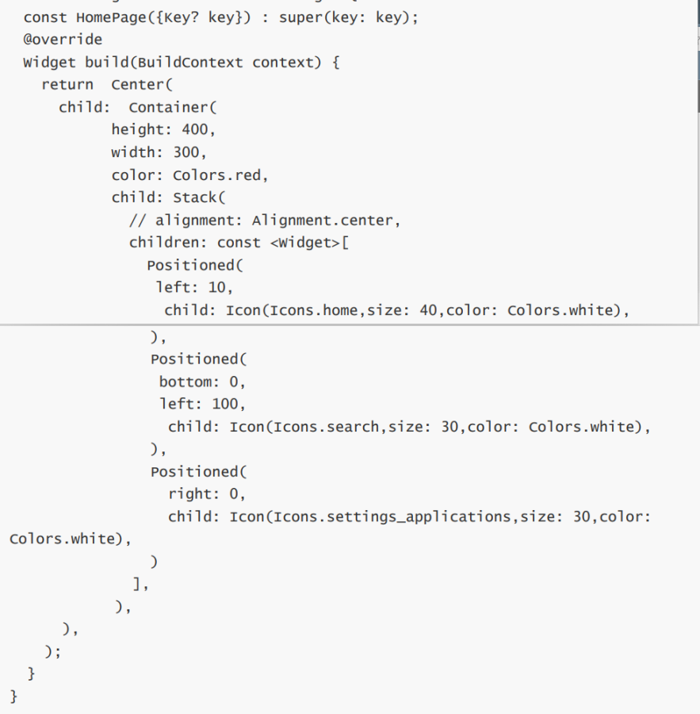

## Align组件

- Align 组件是相对于外面的元素的位置的.
- 这里的Stack只是让里面的元素拥有互相堆叠的属性而已,stack组件没有大小宽度.
- 一般在使用stack时需要外面再加上一个容器.不然容易出错.
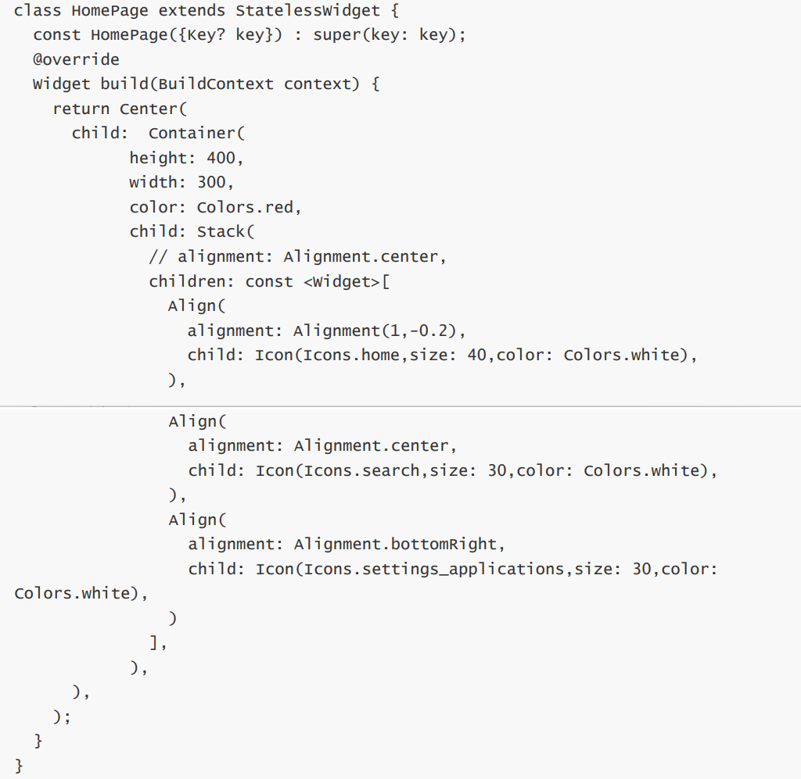

Stack (

align: Alignment(1,1) //左下角 所以是以中心为原点的

)


# 13 Aspect Ratio


# 14 Button 按钮组件

特点

Button本身的大小不能变.但是可以通过将他放在容器中来改变button的大小.


1. 普通 
2. 带边框 
3. 图标按钮
4. 文本按钮

配置圆角按钮

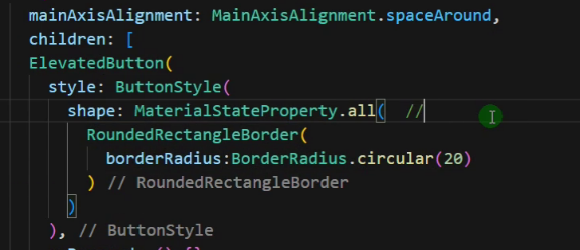

1. Rounded是圆角按钮
2. Circle是圆形按钮
3. 想要改变圆形或者圆角按钮的外边框颜色可以使用

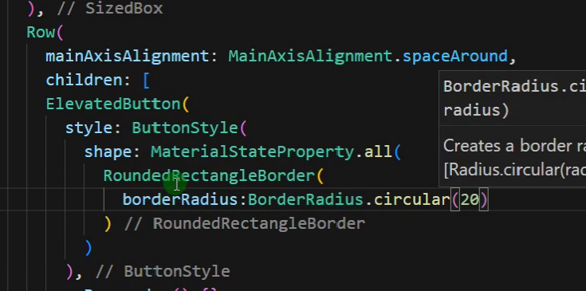

borderRadius这个属性

# Wrap组件

```dart
direction:Axis.vertical
```

# 16 StatefulWidge有状态组件

特点: 由两个函数生成一个组件

一个是组件,一个是状态.


改变数据必须加上:

setState()

Floating Button组件只是Scaffold里面的一个属性而已,并不是一个专门的按钮组件.

# 17 Scaffold 属性

1. 底部菜单栏 BottomNavogationBar


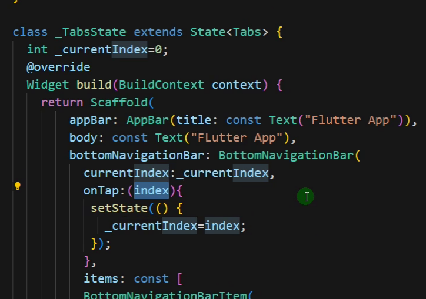

按钮中 setstate会重新构建页面

如何改变选中的颜色 大小等等

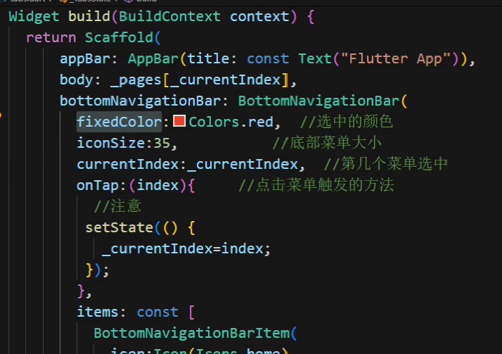

#底部按钮超过三个会出错

这是因为没有配置type, fixed就不会出错

# 19 Scaffold Drawer 的属性还没看


# 22 Router Jump路由  跳转传值

传值的时候需要注意:

1. 定义的时候需要在上面的部分定义 因为构造函数中的Const只能修饰final类型的变量.
2. 传值的时候使用`widget.variables`来调用变量


# 23 命名路由

1. main.dart中引入所有需要使用的路由
2. material 中有一个属性叫做router 在这里面配置所有的路由界面

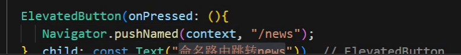

在main.dart中配置所需的路由

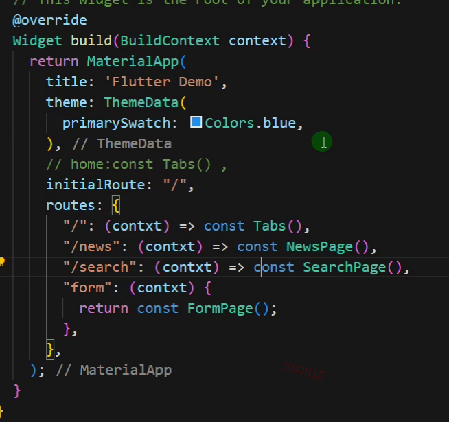
