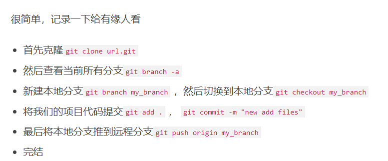

# Github

Hi all,  
Below are some useful git and GitHub (not the same thing, by the way) resources that helped me greatly;  
•	https://learngitbranching.js.org/  
•	https://www.codecademy.com/learn/learn-git  
GitHub Actions CI (advanced);  
•	https://lo-victoria.com/github-actions-101-creating-your-first-workflow  
•	https://www.codeproject.com/Articles/5265628/Writing-CI-Pipeline-using-GitHub-Actions-to-Build  
Tools and others;  
•	https://www.toptal.com/developers/gitignore  
•	https://www.gitkraken.com/  
•	https://education.github.com/pack  
Regards,  
Jan-Hendrik  
Reply  
See this post in context

# 如何初始化一开始的仓库
不要用readme初始化仓库,否则这个仓库就为master.
初始化仓库的时候一定要选择仓库里什么都没有.

新建文件夹 
初始化 
添加远程仓库 
add commit 
git push origin master //这个是本地分支与远程分支不关联的情况下
git push //这个是本地分支与远程分支关联的情况下
[如何关联](assets/Pasted%20image%2020230223171106.png)
然后再用githubdesk打开

```git
git init
git remote add origin website
git add .
git commit -m "init"
git push origin master
```

# git clone
#clone
clone只克隆主分支,要想其分支下拉到本地
1. 创建这个本地分支并切换过去
2. 下拉这个分支
# 状态获取
git status 获取你当前本地仓库有没有东西需要提交
如果是直接克隆的还会告诉你是不是与远端同步
如果是下拉的则不会

git fetch获取本地仓库是不是与远端同步
同步则不会有任何提示 不同步则会有提示
# 创建分支
#创建分支


# 添加换绑远程

```
  //第一次添加远程库
  git remote add origin git@github.com:michaelliao/learngit.git
```

**第一次需要先添加远程库,再通过 git push remote_name推送**

## 拉取 克隆远程库

**拉取远程库的意思就是将本地文件和远程文件同步**

**即 远程文件修改了,我现在要让本地文件和他一样.**

**git pull 远程库名  这是**​*拉取主分支*  pull就是同步
==注意克隆分支与主分支是不同的操作==

## 克隆分支
~~~git
git clone -b (远端名) https/-------
# 这是和克隆主分支一样的操作

~~~


这个操作是创建本地分支并且与远端分支相关联.
git checkout -b yulong origin/yulong
[git clone远程仓库的指定分支\_51CTO博客\_git clone 指定远程分支](https://blog.51cto.com/u_15688254/5391692)


## 克隆主分支
**git clone 直接https的连接  克隆主分支**

# 推送/下拉分支

**切换到该分支直接推**
git pull origin branch_name
git push origin branch_name
<mark style="background: #FFB86CA6;">在每次推送时一定要确认是否是在需要推送的分支,而不是在错误的分支推送了.</mark>
# Premise

**所有的git 操作都需要在git仓库文件夹下进行，否则就会出现错误。**

[添加远程库 - 廖雪峰的官方网站 (liaoxuefeng.com)](https://www.liaoxuefeng.com/wiki/896043488029600/898732864121440)

[Git心得](https://segmentfault.com/a/1190000023734704)

**git clone [url] 克隆远端工程**

**git remote -v 查看目前git连接的哪台远端服务器**

**git push [origin] [master] 本地推向远端**

**git checkout branch_name 切换分支**

**git branch -a 查看所有分支包括远端分支**

**git branch branch_name  remotes/origin/test12 克隆分支 创建分支然后clone**

**git pull origin branch_name 这是**​*拉取分支*  不过本地要先有这个分支并切换过去 origin就是远程的意思

**git remote add origin **[git@github.com](mailto:git@github.com):michaelliao/learngit.git  第一次初始化仓库都需要添加远程库

---

**关联远程库后**

**git pull origin remote_name 拉取**

**git push 推送**

---
---
**拉取**

**git pull origin remote_name 拉取远程分支**

---

[https://z.itpub.net/article/detail/F83C6A58E0296138376A73FE4A1ADF61](https://z.itpub.net/article/detail/F83C6A58E0296138376A73FE4A1ADF61)

---

**使本地分支与远程分支创建联系**

**git push --set-upstream origin remote_name**

​`git branch -vv`​命令可以查看本地分支关联的远程分支的对应关系


## 操作步骤

# Git websites

[Git是什么？可以用来做什么？如何使用？ - 知乎 (zhihu.com)](https://zhuanlan.zhihu.com/p/99313784)

[添加远程库 - 廖雪峰的官方网站 (liaoxuefeng.com)](https://www.liaoxuefeng.com/wiki/896043488029600/898732864121440)

## 问题

​​​​

## 第一次使用 git

**首先使用git 命令是在git.exe的窗口中,而不是在其他的窗口中.**

1. **首先需要初始化 git init**
2. **然后设置名字**

​​​​

3. **修改**
4. **修改后使用git add file添加提交**
5. **git commit -m &quot;massages&quot;正式提交**

# Commands

* **要随时掌握工作区的状态，使用**​`git status`​命令。
* **如果**​`git status`​告诉你有文件被修改过，用`git diff`​可以查看修改内容。
* **git log 日志查询**

# git中回退
[git 回退](https://blog.csdn.net/fareast_mzh/article/details/93709734)
[版本回退的强行推送](https://blog.csdn.net/spoliedchild/article/details/90066687)
```git
git reset --hard dde8c25694f34acf8971f0782b1a676f39bf0a46 
回退到指定的commit号
```

```git
 $ git reset --hard HEAD^
```

```c
 $ git reset --hard 1094a
```

​`git reflog`​用来记录你的每一次提交号

​`git log`​ 用来查看提交历史
## 版本回退的强行推送
~~~git
git push -f origin <branch name>
~~~

别人提交或拉取代码可能会因为我们回退了版本而出现错误或者无法拉取，解决命令如下：

```git
git fetch --all 
```

# 关于git于github

**git是一种版本管理工具，是可以离线使用的。**

**github算是远程仓库**

# 查看工作区和版本库里面最新版本的区别

​`git diff HEAD -- readme.txt`​

# 撤销工作区修改

**又到了小结时间。**

**场景1：当你改乱了工作区某个文件的内容，想直接丢弃工作区的修改时，用命令**​`git checkout -- file`​。

**场景2：当你不但改乱了工作区某个文件的内容，还添加到了暂存区时，想丢弃修改，分两步，第一步用命令**​`git reset HEAD <file>`​，就回到了场景1，第二步按场景1操作。

**场景3：已经提交了不合适的修改到版本库时，想要撤销本次提交，参考**​[版本回退](https://www.liaoxuefeng.com/wiki/896043488029600/897013573512192)一节，不过前提是没有推送到远程库。

# 删除本地文件后从版本库中恢复文件

**git checkout -- text.md**

# 工作区 暂存区 版本控制区

**使用git add 把文件放到stage中后**

​​​​

**使用git commit把文件放到master分支后**

​​​​

# 为什么需要SSH Key密匙对

**为什么GitHub需要SSH Key呢？因为GitHub需要识别出你推送的提交确实是你推送的，而不是别人冒充的，而Git支持SSH协议，所以，GitHub只要知道了你的公钥，就可以确认只有你自己才能推送。**

**当然，GitHub允许你添加多个Key。假定你有若干电脑，你一会儿在公司提交，一会儿在家里提交，只要把每台电脑的Key都添加到GitHub，就可以在每台电脑上往GitHub推送了。**

**最后友情提示，在GitHub上免费托管的Git仓库，任何人都可以看到喔（但只有你自己才能改）。所以，不要把敏感信息放进去。**

**如果你不想让别人看到Git库，有两个办法，一个是交点保护费，让GitHub把公开的仓库变成私有的，这样别人就看不见了（不可读更不可写）。另一个办法是自己动手，搭一个Git服务器，因为是你自己的Git服务器，所以别人也是看不见的。这个方法我们后面会讲到的，相当简单，公司内部开发必备。**

**确保你拥有一个GitHub账号后，我们就即将开始远程仓库的学习。**

# 如何加速国内浏览github的速度

**在浏览器上安装github加速器插件**

# 如何关联远程库并推送到远程库

​​​​

# 远程仓库与本地仓库

**本地仓库可在不联网时编辑**

**只需要在联网时**

# 分支的重要性

**分支在实际中有什么用呢？假设你准备开发一个新功能，但是需要两周才能完成，第一周你写了50%的代码，如果立刻提交，由于代码还没写完，不完整的代码库会导致别人不能干活了。如果等代码全部写完再一次提交，又存在丢失每天进度的巨大风险。**

**现在有了分支，就不用怕了。你创建了一个属于你自己的分支，别人看不到，还继续在原来的分支上正常工作，而你在自己的分支上干活，想提交就提交，直到开发完毕后，再一次性合并到原来的分支上，这样，既安全，又不影响别人工作。**

**其他版本控制系统如SVN等都有分支管理，但是用过之后你会发现，这些版本控制系统创建和切换分支比蜗牛还慢，简直让人无法忍受，结果分支功能成了摆设，大家都不去用。**

**但Git的分支是与众不同的，无论创建、切换和删除分支，Git在1秒钟之内就能完成！无论你的版本库是1个文件还是1万个文件。**

# Git Add

​`git add xx`​命令可以将xx文件添加到暂存区

**如果有很多改动可以通过 **`git add -A .`​来一次添加所有改变的文件。注意 `-A`​ 选项后面还有一个句点。

** **`git add -A`​表示添加所有内容

** **`git add .`​ 表示添加新文件和编辑过的文件不包括删除的文件;

​`git add -u`​ 表示添加编辑或者删除的文件，不包括新添加的文件

# Git

[Hello World - GitHub Docs](https://docs.github.com/cn/get-started/quickstart/hello-world)

# git取消与远程仓库的连接

**连接远程仓库** **git remote add origin 仓库地址**

**查看**​[远程连接](https://so.csdn.net/so/search?q=%E8%BF%9C%E7%A8%8B%E8%BF%9E%E6%8E%A5&spm=1001.2101.3001.7020) **git remote -v**

**git取消与远程仓库的连接** **git remote remove origin**

# git与远程库建立联系并推入

[使用git将本地项目推送到远程仓库github - 简书 (jianshu.com)](https://www.jianshu.com/p/b1f9f684fac8)

# github分支的创建与合并

**点击create直接创建**

---

**pull request中选择两个分支，然后选择create pull request创建就可以开始合并了**

**注意箭头所指的表示最终能够留下来的。另一个被合并了**

---

---

---

---

---

# How to Push Project  in Vscode to Github

[Push](https://www.youtube.com/watch?v=3Tn58KQvWtU)

## 问题

[Git报错解决：OpenSSL SSL_read: Connection was reset, errno 10054 错误解决](https://blog.csdn.net/weixin_43945983/article/details/110882074)

---

# 重新开始

# 更换账号推送失败

## 解决办法

直接在sourcetree中删除账户再重新绑定一次

## 注意点

两个账号来回切换是没问题的,但是有时候在windows上容易出错,建议只用一个账号

是我自己理解错了,我没有在上面加上两个github账号

remote: Permission to 1RanShy/1.git denied to RanShy1011.  
fatal: unable to access 'https://github.com/1RanShy/1.git/': The requested URL returned error: 403

两个原因:

1. 有多个账号的凭据 这个其实是没关系的
2. 主要是我选择的是ssh但是用的确实ssh

## sourcetree 顺序

首先在仓库里 git init

然后再shourcetree里添加这个库

再在设置里填写上远端库的url 地址

‍

## Windows

‍

​​

出现这个问题是因为老的账号的凭据没有删除,要删除老帐号的凭据,添加新账号的凭据才行.

新账号: 1RanShy

老帐号:RanShy1011

老帐号的凭据一直留在电脑里,导致git登录时一直推送给老帐号,但是推送的仓库地址却是新账号的,发生错误.

凭证更改后就出现了这个错误

​​

可以看出确实是由于凭证的原因导致的,而不是与什么ssh


## Mac

也是像Mac一样,不过是在 启动台的 钥匙串里更改. 注意不要删错了,如果删错就需要重新加载账号[在sourcetree中],获得github的授权.

每次切换都需要删除所有关于github的信息

在sourectree中添加新的账号,关联guthub即可

‍

和windows不一样,windows只需改一条

# 如何关掉已经git追踪的文件
## 文件

 git rm --cached *.json
 然后再gitignore中写下这个需要忽略的文件就算完成
## 文件夹
 
git rm -r --cached .obsidian

# 命令行推送失败
unable to access 'https://github.com/1RanShy/Pet-Automatic-Feeder.git/': The requested URL returned error: 403

<mark style="background: #ABF7F7A6;">username: 1RanShy
password: 直接输入密码 这是错误的</mark>
#token


这才是对的
## 如何生成密匙


# 如何选择主分支为master而不是main

# 拉取 推送 关联远程分支
[git操作之pull拉取远程指定分支以及push推送到远程指定分支\_51CTO博客\_git pull 拉取远程分支](https://blog.51cto.com/u_15262460/2883040)


# Git如何查看本地分支状态
要查看远程分支是否有更新，你可以使用 `git fetch` 命令。这个命令会抓取所有远程仓库的最新提交，但并不会自动合并或重置本地分支。

如果你想要查看具体有哪些远程分支有更新，可以使用 `git branch -av` 命令。这个命令会列出所有本地和远程分支的名称，并且会标注出哪些分支是本地分支，哪些分支是远程分支。如果远程分支比本地分支新，它会在分支名称后面附加一个 `*` 号。

例如，如果你的本地仓库中有一个名为 `develop` 的本地分支，远程仓库中有一个名为 `origin/develop` 的远程分支，并且远程分支比本地分支新，那么输出的结果可能是这样的：

```git
$ git branch -av
* develop             abcdefg  Fix some bugs
  remotes/origin/develop   hijklm  Add some features
复制代码
```

这里，`develop` 分支前面的 `*` 号表示它是当前正在使用的分支，而 `origin/develop` 分支后面的 `*` 号表示它是远程分支，并且比本地分支新。

希望这些信息对你有帮助。

# 如何缩小git文件的大小
不要克隆 因为克隆会包含你整个的git

新建初始化本地仓库下拉只会保存你现在的开始的git,会让你的git小不少,不过
git status 不会给你 up to date提示
# 暂存提交合二为一
 `git commit -am "提交描述"`

# Pull 与Clone的区别
clone 是本地没有 repository 时，将远程 repository 整个下载过来。

pull 是本地有 repository 时，将远程 repository 里新的 [commit](https://so.csdn.net/so/search?q=commit&spm=1001.2101.3001.7020) 数据(如有的话)下载过来，并且与本地代码merge。

# 删除所有提交记录使其成为新库
[彻底清除git所有历史提交记录使其为“新”库\_RiskAI的博客-CSDN博客](https://blog.csdn.net/jhsword/article/details/107543884)


# 如何创建一个空分支并推送
[如何新建一个空的分支 - 飞翔的蜗牛\~ - 博客园](https://www.cnblogs.com/fxwoniu/p/14893427.html)
问题场景：
　　需要一个空的分支（啥都没有），用于存放我需要的某一个或几个文件；
问题分析：
　　在Git中创建分支，是必须有一个父节点的，也就是说必须在已有的分支上来创建新的分支，如果你的工程已经进行了一段时间，这个时候是无法创建空分支的。
解决方法：

　　1  、使用 git checkout的--orphan参数:
`git checkout --orphan empty_branch`
　　该命令会生成一个叫 empty_branch 的分支，该分支会包含父分支的所有文件。但新的分支不会指向任何以前的提交，就是它没有历史，如果你提交当前内容，那么这次提交就是这个分支的首次提交。
　　
　　2  、删除所有文件：
　　我们想要空分支，所以我们需要把当前内容全部删除，用git命令
`git rm -rf .` 

　　3 、提交分支：
　　如果没有任何文件提交的话，分支是看不到的，所以我们需要创建一个新文件，然后提交则新创建的branch就会显示出来。
`echo '# new branch' >> README.md`
`git add README.md`
`git commit -m 'new branch'

　　4  、最后push到远程仓库，则新的空分支就创建成功了。
`git push origin empty_branch`


# 重命名分支并推送
[如何在 Git 中重命名本地或远程分支](https://www.freecodecamp.org/chinese/news/how-to-rename-a-local-or-remote-branch-in-git/)

## 本地

重命名本地分支
`git branch -m new-name`

## 远端
删除远端分支名
`git push origin --delete old-branch-name`

重命名远端分支
`git push origin -u new-branch-name`

1.  旧分支：oldBranch
2.  新分支：newBranch

> 步骤：

1.  先将本地分支重命名
    
    ```ebnf
    git branch -m oldBranch newBranch复制代码
    ```
    
2.  删除远程分支（远端无此分支则跳过该步骤）
    
    ```maxima
    git push --delete origin oldBranch复制代码
    ```
    
3.  将重命名后的分支推到远端
    
    ```maxima
    git push origin newBranch复制代码
    ```
    
4.  把修改后的本地分支与远程分支关联
    
    ```delphi
    git branch --set-upstream-to origin/newBranch
    ```
    
# 快速创建readme文件
`echo '# new branch' >> README.md`

# 不commit就会影响其他分支
问题描述： 今天遇到一个git分支切换的问题，我在分支A上做了修改，然后切换到其他分支后发现其他分支上也存在A分支上的修改。（我记得之前碰到这种情况，是无法切换分支的，git会提醒当前A分支上有未提交的改动，这次虽然能切换了（当时就感觉奇怪），果然又碰到现在这个问题）

原因：如果当前分支所做的修改没有提交就切换去其他分支也会看到相同的修改，所以解决这个问题有两个办法。
解决办法：
用 git add和 git commit提交修改，只要用 git status 检查工作区和暂存区是干净的就可以了。
那如果我当前分支上的工作还没做完，不能提交，但又想去其他分支，这时候可以把当前分支的工作现场隐藏起来。用 git stash隐藏当前工作现场，这个时候用 git status 查看工作区是干净的，所以就可以放心地去其他分支了。用 git stash list可以查看隐藏起来的工作现场
恢复工作现场的两种方法：
用 git stash apply恢复，但是恢复后，stash 内容并不删除，需要用 git stash drop来删除；
用 git stash pop，恢复的同时把stash内容也删了，这时候用 git stash list就看不到任何 stash 内容了
可以多次 stash ，恢复的时候，先用 git stash list查看，然后用 git stash apply stash@{0}或者 git stash pop stash@{0}恢复指定的stash


# fetch 与 status
有时候status并不会提示你
update to origin/main
这是因为你的是下拉的,缺失了部分commit history

这时候你就可以使用fetch来看看是不是由文件需要跟新
如果什么都没有说明不需要,如果命令行出现了内容就说明需要更新.

# Gitignore

# 有关token被自动删除
这是因为你在github上传的文件中包含了这个密匙因此就会导致你这个密匙被删除

# The push operation includes a file which exceeds
[Fetching Title#f4en](https://blog.csdn.net/qq_34977392/article/details/110817621)

# Removing files from a repository's history
[About large files on GitHub - GitHub Docs](https://docs.github.com/en/repositories/working-with-files/managing-large-files/about-large-files-on-github)


# Git常用命令查表
