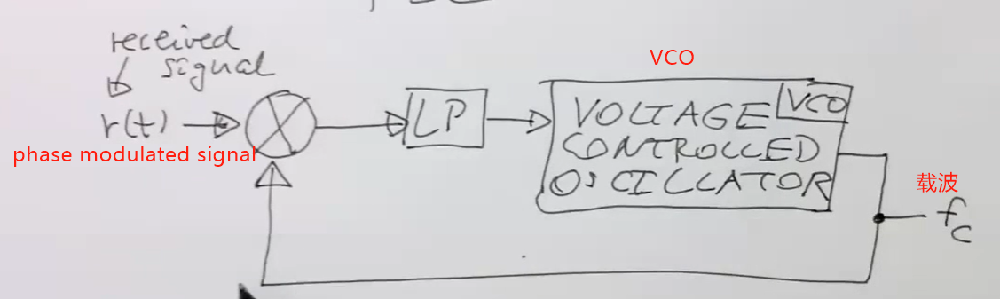
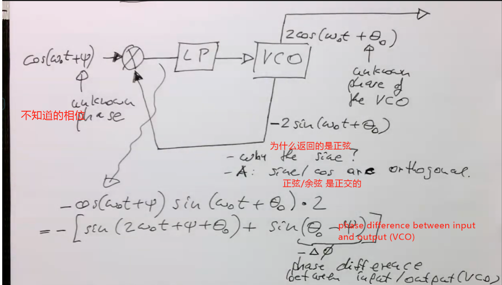
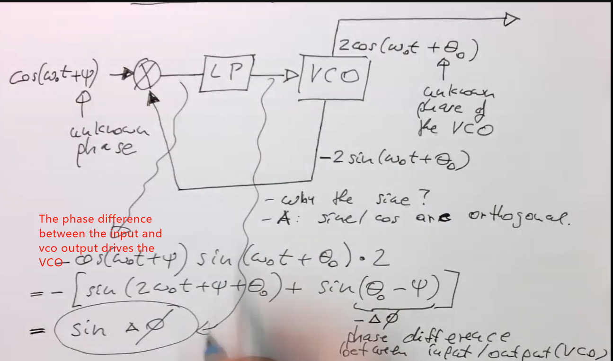
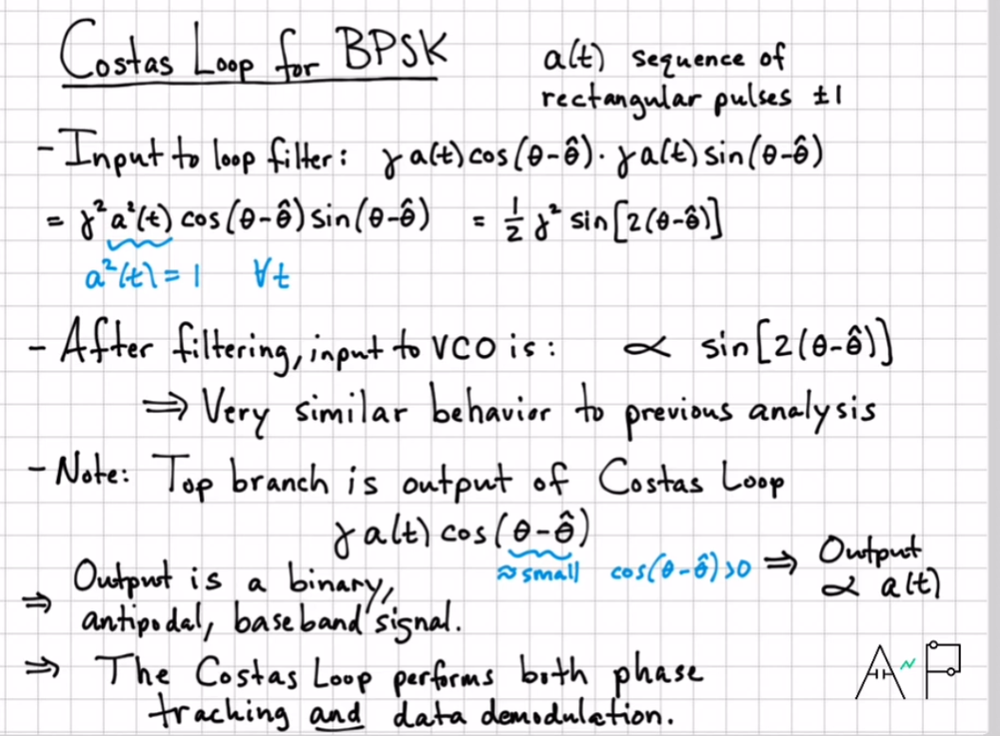
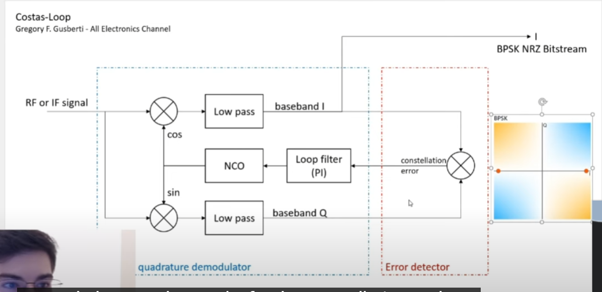
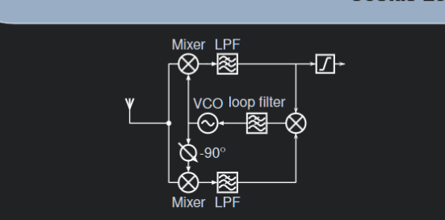
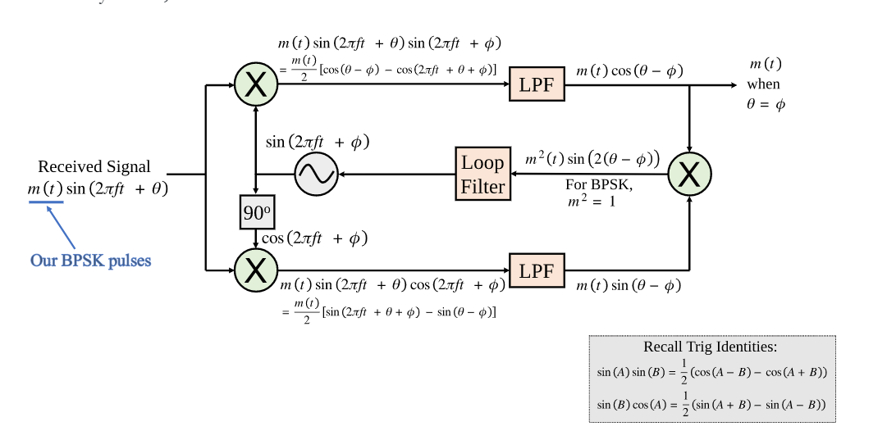
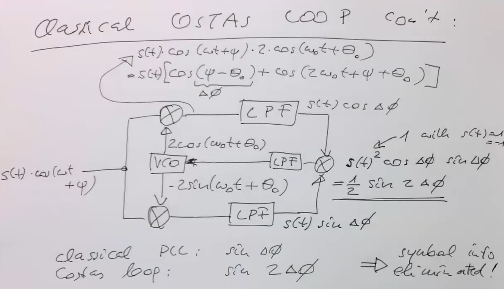

# Lab2

[DC4_labB_py.pdf](assets/DC4_labB_py-20230130200701-4l64znj.pdf)

[DC4_labB_py-20230130200701-4l64znj_merged_public.pdf](assets/DC4_labB_py-20230130200701-4l64znj_merged_public-20230208223932-f7panlw.pdf)

[Digital Communication](https://www.youtube.com/@digitalcommunications8629)

[1_1](https://wirelesspi.com/costas-loop-for-carrier-phase-synchronization/)~~

[1_2](https://www.youtube.com/watch?v=nBUs5V8adj4)~~

[1_3](https://www.google.com/search?q=Digital+Communications+4%3A+Carrier+Recovery+using+Costas+Loop&oq=Digital+Communications+4%3A+Carrier+Recovery+using+Costas+Loop&aqs=chrome..69i57.933j0j7&sourceid=chrome&ie=UTF-8#fpstate=ive&vld=cid:2aa04fff,vid:Zwj63BWtRok)~~

[1_4](https://pysdr.org/content/sync.html)

# 相位调制载波被去除

幅值调制与相位调制的区别是相位调制中的载波实际上已经被去除

幅值调制 (Amplitude Modulation) 和相位调制 (Phase Modulation) 是两种不同的调制方式。幅值调制是通过改变载波的幅度来传输信息，而相位调制是通过改变载波的相位来传输信息。

在相位调制中，载波本身被去除，仅保留关于相位的信息。因此，相位调制不同于幅值调制，它没有用载波传输信息。这使得相位调制能够更有效地传输信息，并且有时具有更低的误码率。

‍

The classic way to recover the carrier frequency is called Phase Lock Loop 锁相环

实际上就是一个反馈系统

那么为什么要恢复相位调制的载波那?



那么为什么要恢复相位调制的载波那

在相位调制的信号传输过程中，去除载波是为了减少干扰和噪声，但是，在接收端，载波必须被恢复，以便将相位信息转换回原始的数字或模拟信号。

载波恢复是通过一个叫做解调器 (Demodulator) 的环节完成的。解调器恢复载波并将其与相位信息结合，从而恢复出原始的数字或模拟信号。

因此，恢复载波是相位调制系统的重要步骤，因为它可以使接收端能够识别和使用相位信息，从而实现正确的信息传输

003



​​

004

why does the PLL Lock

```matlab

fs = 50e6; %采样频率
ts = 1/fs;
num = 2e6;  %数据长度
SNR = -15;
real_fc = 10000500; %实信号频率
data = sin(2*pi*real_fc*(0:num-1)*ts+pi/4)+sqrt(10^(SNR/10))*randn(1,num); %科斯塔斯环的输入信号
fc = 10000000; %本地频率

n = fs/10000; %累积时间为0.1ms
nn = [0:n-1];
nf = floor(length(data)/n);% 将输入数据分成1ms的多个数据块
wfc = 2*pi*fc;  %本地信号
phi_prv = 0;
temp = 0;
frame = 0;
carrier_phase = 0;
phase = 0;

%环路滤波器的参数
c1=1203.9*1.5;
c2=16.22*1.5;
%数据率为4kbps,1bit数据采样点数为12.5K，每5K个点累加一次，相当于4个数据累加清零一次，
%w=0.01*4K,T=1/4K,k0=2*pi*T*fs/2^32,c1=2*0.707*w*T/k0,c2=(wT)^2/k0,

for frame=1:nf
% 产生本地的sin和cos函数
expcol = exp(j*(wfc*ts*nn+phase));
sine = imag(expcol);   
cosine = real(expcol);

x = data((1:n)+((frame-1)*n));
%将数据转换到基带
x_sine = x.*sine;
x_cosine = x.*cosine;

Q = sum(x_sine);      %经过滤波器
I = sum(x_cosine);
phase_discri(frame) = atan(Q/I);   %得到锁相环的输入

%锁相环
dfrq = c1*phase_discri(frame)+temp; %经过环路滤波器
temp = temp+c2*phase_discri(frame);
wfc = wfc-dfrq*2*pi;   %改变本地频率
dfrq_frame(frame) = wfc;
phase = wfc*ts*n+phase;   %得到不同块的相位
dphase_frame(frame) = phase;
end

plot(dfrq_frame/(2*pi));
hold on
plot([1:length(dfrq_frame)], real_fc,'r');
legend('锁相环跟踪','实际的载波频率');
grid
mean_freq=mean(dfrq_frame/2/pi)
p=abs(real_fc-mean_freq)/real_fc;
```

​​

​​



​​



[Matlab代码](https://www.youtube.com/watch?v=q-82PXkwwgY)

看这个matlab代码,然后这个视频前面还有相关的代码,可以看一下视频理解一下.
