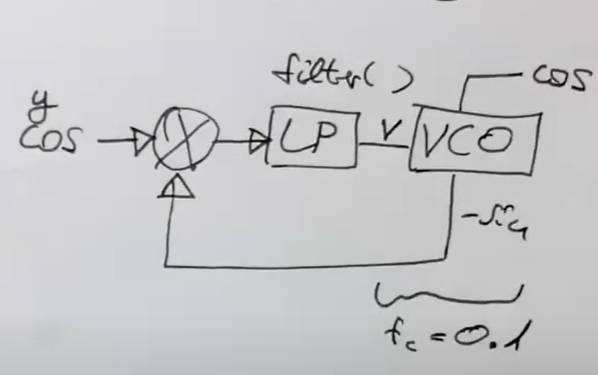
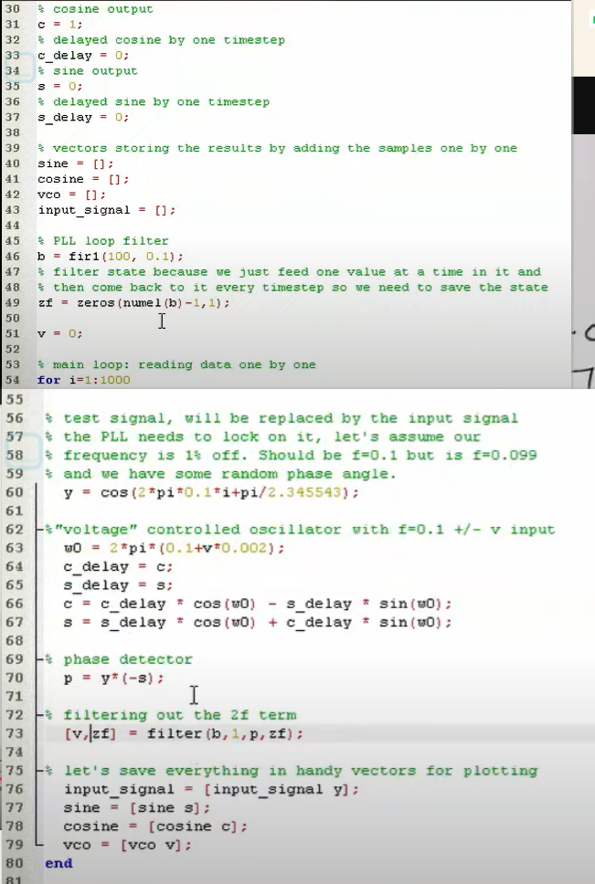

# Matlab

[Matlab代码](https://www.youtube.com/watch?v=q-82PXkwwgY)

​​



0.1 normalized frequency

```matlab
% cosine output
c = 1
% delayed cosine by one timestep
c_delay = 0;
% sine output
s = 0;
% delayed sine by one timestep
s_delay = 0;

% vector storing the results by adding the samples one by one
sine = [];
cosine = [];
vco = [];
input_signal = [];

% PLl Loop filter
b = fir1(100,0.1);
% filter state bacause we just feed one vsalie at a time in it and
% then come banck to it every timestep so we need to save the state
zf = zeros(nume1(b)-1,1);

v = 0;


% main loop reading the data one by one

for i=1:1000

%test signal , will be replaced by the input signal
% the PLL needs to look on it, let;s assume our
%frequency is 1%off. sShould be f = 0.1 but is f  =0.099
% and we have some random phase angle.
	y = cos(2*pi*0.2+pi/2.345543);
% "voltage" controlled oscillatoer with f=0.1 + -v output
w0 = 2*pi*(0.1+v*0.002);
c_delay = c;
s_delay = s;
c = c_delay * cos(w0) - s_delay * sin(w0);
s = s_delay * cos(w0) + c_delay * sin(w0);

%phase detector
p = y * (-s);

% filtering out the 2f term
[v,zf] = filter(b,1,p,zf);

% let's save ervrythinh in handy vectors fot plotting
input_signal = [input_signal y];
sine = [sine s];
cosine  = [cosine c];
vco = [vc0 v];
end


```

---

```python
import numpy as np
import scipy.signal

# cosine output
c = 1
# delayed cosine by one timestep
c_delay = 0
# sine output
s = 0
# delayed sine by one timestep
s_delay = 0

# vector storing the results by adding the samples one by one
sine = []
cosine = []
vco = []
input_signal = []

# PLl Loop filter
b = scipy.signal.firwin(100, 0.1)
# filter state because we just feed one value at a time in it and
# then come back to it every timestep so we need to save the state
zf = np.zeros(len(b) - 1)

v = 0

# main loop reading the data one by one
for i in range(1000):
    # test signal, will be replaced by the input signal
    # the PLL needs to look on it, let's assume our
    # frequency is 1%off. Should be f = 0.1 but is f = 0.099
    # and we have some random phase angle.
    y = np.cos(2 * np.pi * 0.2 + np.pi / 2.345543)
    # "voltage" controlled oscillator with f=0.1 + -v output
    w0 = 2 * np.pi * (0.1 + v * 0.002)
    c_delay = c
    s_delay = s
    c = c_delay * np.cos(w0) - s_delay * np.sin(w0)
    s = s_delay * np.cos(w0) + c_delay * np.sin(w0)

    # phase detector
    p = y * (-s)

    # filtering out the 2f term
    v, zf = scipy.signal.lfilter(b, 1, [p], zi=zf)

    # let's save everything in handy vectors for plotting
    input_signal.append(y)
    sine.append(s)
    cosine.append(c)
    vco.append(v[0])

```
