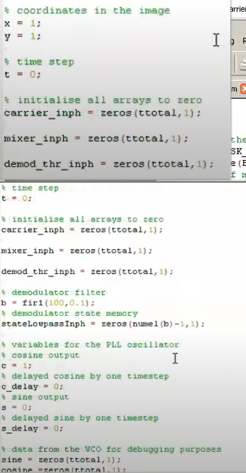
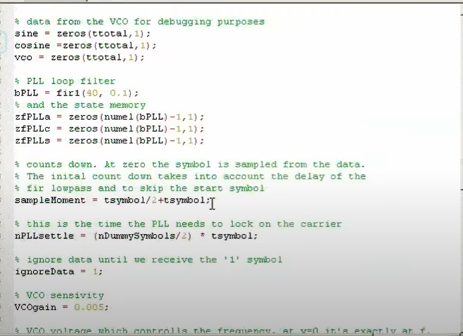
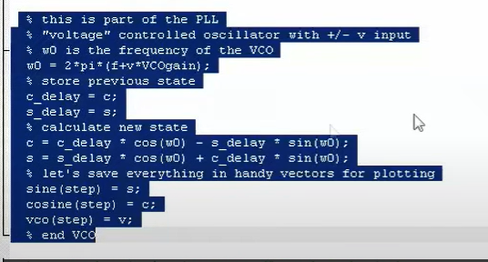
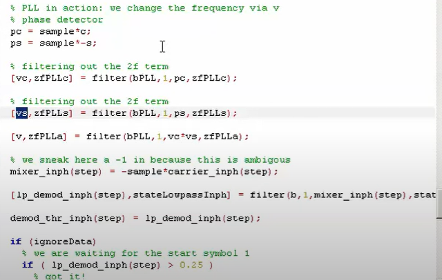

# Matlab2

​​

​​

​​

​​

​​

```matlab
% Coordinates in the image
x = 1;
y = 1;

%timr step
t = 0;

% initialis all arrays to zero
carrier_inph = zeros(ttoal,1);

mixer_inph = zeros(ttoal,1);

demod_thr_inph = zeros(ttotal,1);

demod_the_inph = zeros(ttotal,1);

% demodulated filter
b = fir1(100,0.1);
% demodulator state memory
stateLowpassInph = zeros(nume1(b)-1,1);

% variables for the PLL Oscillator
% cosine output
c = 1;
%delayed cosine by one timestep
c_delay = 0;
%sine output
s = 0;
%delayed sine by one timestep
s_delay = 0;

%data from the VCO for debugging purpose
sine = zeros(ttotal,1);
cosine = zeros(ttotal,1);
vco = zeros(ttotal,1);

%PLL loop filter
bPLL = fir1(40,0.1);

% and the state memory
zfPLLa = zeros(nume1(bPLL)-1,1);
zfPLLc = zeros(nume1(bPLL)-1,1);
zfPLLs = zeros(nume1(bPLL)-1,1);

% counts down. At zero the symbol is sampled from data.
% The initial count down takes into account the delay og the
%fir lowpass and to skip the start symbol
sampleMoment = tsymbol1/2+tsymbol;

% this is the time the PLL needs to lock on the carrier

%ignore data until we receive the "1" symbol
ignoreDara = 1;

%vco sensitivity
VCOgain = 0.005;
% VCO voltage ehich controlls the frequency. At v = 0 it is exactly at f
v = 0;

% main loop which deals the signal sample by samples
for step = 1:ttotal
	%let's get a sample
	sample = BPSK_signal(step);

	% this is part of the PLL
	"voltage" controlled oscillator with +/-v input
	% w0 is the frequency of the VCO
	w0 = 2*pi*(f+v*VCOgain);
	%store previous state
	c_delay = c;
	s_delay = s;
	%calculate new state
	c = c_delay * cos(w0) - s_delay * sin(w0);
	s = s_delay * cos(w0) + c_delay * sin(w0);
	% let's save everythinh in handy vectors for plotting
	sine(step) = s;
	cosine(step) = c;
	vco(step) = v;
	% end VCC

	% store the sine/ cosine waves. Note that the inphase
	% wave is now the sine wave because a PLL with a multillication
	% as a phase detector has a 90 degree phase shift between
	% input and output
	carrier_inph(step) = c;

	% this decides if we are in PLL sync or freeze mode
	% note : this needs to be replacerd by PLL lock in a real
	% reception because we do not lnow when the tansmission actually
	% starts. Here we just suume it stars right at the beginning

	%PLL in action : we change the frequecny via v
	%phase detector
	pc = sample*c
	ps = sample*-s;

	% filtering out the 2f term
	[vc,zfPLLc] = filter(bPLL,1,pc,zfPLLc);
	[vs,zfPLLs] = filter(bPLL,1,ps,zfPLLc);
	[v,zfPLLa] = filter(bPLL,1,vc*vs,zfPLLc);

	%we sneak here a -1 in because this is ambigous
	mixer_inph(step) = -sample*carrier_inph(step);

	[lp_demod_inph(step),stateLowpassInph] = filter(b,1,mixer_inph(step),state)

	demod_thr_inph(step) = lp_demod_inph(step);

	if(ignoreData)
		%we are waiting for the start symbol 1
		if (lp_demod_inph(step) > 0.25
		% got it
		ignoreData = 0;
		end
	else 
		%wait until we are in the middle of a symbol and then we sampke the data
		sampleMoment = sampleMoment - 1;
		if (sampleMoment == 0)
			sampleMoment = tsymbol;
			if (demod_thr_inph(step) > 0)
		lsb = 1;
			else
		lsb = 0;
		end
	
		%debug samples: add samll spikes
		lp_demod_inph(step) = lp_demod_inph(step)+0.1;
		%save the result as an image
		if((x<9) && (y<9)) && (ignoreData == 0)
	rec_image(y,x) = lsb;
	x = x+1;
	if(x>0)
		x = 1;
	 	y = y+1;
	end % if(x>0)
				end %x>9 && y >9
			end % sampleMoment == 0
		end % ignore data
	%next time step in samples
	t = t + 1;
end

```

‍
