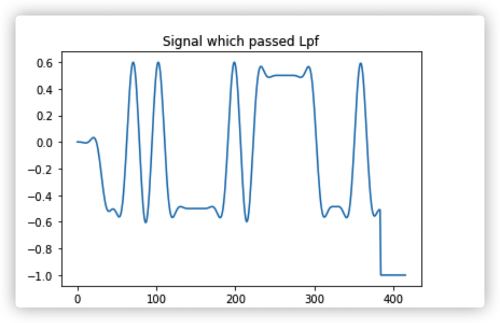

# Lab1

[DC4_labA_py.pdf](assets/DC4_labA_py-20230117213123-53icjkt.pdf)

在报告中的内容:

1. what you have done
2. the results and your conclusions
3. python codes in the appendices

# [Video: Amplitude Shift Keying 2](https://moodle.gla.ac.uk/mod/url/view.php?id=3312878)​**[URL](https://moodle.gla.ac.uk/mod/url/view.php?id=3312878)**

## Modulation

Amplitude modulation and demodulation

​​

$f_c$ normalised carrier frequency 归一化的载波频率

bit_period 就是 bit_length  = the number of samples /16 samples per bit

1/0.125 = 8

16 = 2 * 8 是满足两倍的 奈奎斯特采样定理是满足的

​​

​​

We have a very large spike here. 有一个大的尖峰,这是我们的载波频率.

调制在载波频率两边产生了sideband,这才是传递消息的

## Amplitude Modulation

‍

​​

这种幅度调制的后果是我们在载波频率上放入了很多功率，而这些功率并没有传递信息，只是在运行余弦函数。信息存在于边带中，因此这样我们在载波频率上浪费了很多功率，而不是传递信息。

这句话说明了幅度调制的一个问题，即我们在载波频率上使用了太多的功率，而这些功率并没有传输任何有用的信息。在幅度调制中，我们通过调整载波信号的幅度来携带消息信号，但这种方法会导致大量的功率浪费在载波频率上，而实际的信息存在于边带频率中，这样会导致效率低下。

这是效率很低下的,因为我们把太多的功率放在载波频率上,而它实际上又不传递信息.

## Amplitude Shift Keying（ASK）

是一种数字调制方式，它通过改变载波信号的振幅来传输数据。在ASK中，数据的“1”和“0”用不同的振幅来表示，这个载波信号的振幅会在发送数据时不断改变。这种方法可以在保证数据传输率的同时，达到较高的数据信噪比，因此常用于无线电通信系统中。

‍

## Demodulation

​​

将调制信号鱼载波波形相乘是为了整流,整流是为了将调制的信号转为2禁止信号,更方便地让计算机处理. 调制的信号在未整流前应该是一个模拟信号.

​​

0.1 是 按比例缩小到0.1 的cutoff frequecny

## 为什么/什么是 整流

​​

## 整流阶跃函数

​​

​​

## 延迟

​​

可以看见还原之后的信号与原信号有延迟

## 为什么产生延迟

解调之后的信号与原信号相比有延迟,这是为什么

解调之后的信号与原信号相比有延迟，这是因为在解调过程中使用了数字滤波器，该滤波器包含了在每个点之间的延迟，这些延迟会导致最终的输出信号与原信号有所延迟。在这种情况下，通常需要在代码中考虑这些延迟，例如添加额外的样本来调整数据。

## BPSK QPSK传输效率

相比于QPSK,BPSK的传输效率怎么样.

BPSK (Binary Phase-Shift Keying) 与 QPSK (Quadrature Phase-Shift Keying) 相比，BPSK 的传输效率较低。

BPSK 使用的是两个相位状态（0° 和 180°）来表示每个符号，因此每个符号只能表示一个二进制位。而 QPSK 使用了四个相位状态（0°，90°，180°和270°）来表示每个符号，因此每个符号可以表示两个二进制位。所以，QPSK 的传输效率是 BPSK 的两倍。

然而, BPSK 信号在高噪声环境下的抗干扰能力更强.

总的来说, BPSK 和 QPSK 各有优缺点,应该根据具体的应用场景来选择使用.

​​

可以明显看到载波的幅值是QPSK的小,sideband的幅值是QPSK的大.因此更有效率.

# 代码

# 通过低通滤波器后的调制信号

有负数值,而BPSK没有负数值.

# OPENAI

​​

# QPSK

## [Video: Quadrature Phase Shift Keying 2](https://moodle.gla.ac.uk/mod/url/view.php?id=3312885)​**[URL](https://moodle.gla.ac.uk/mod/url/view.php?id=3312885)**

## 解调制

是分别解调

‍

30 表达式
