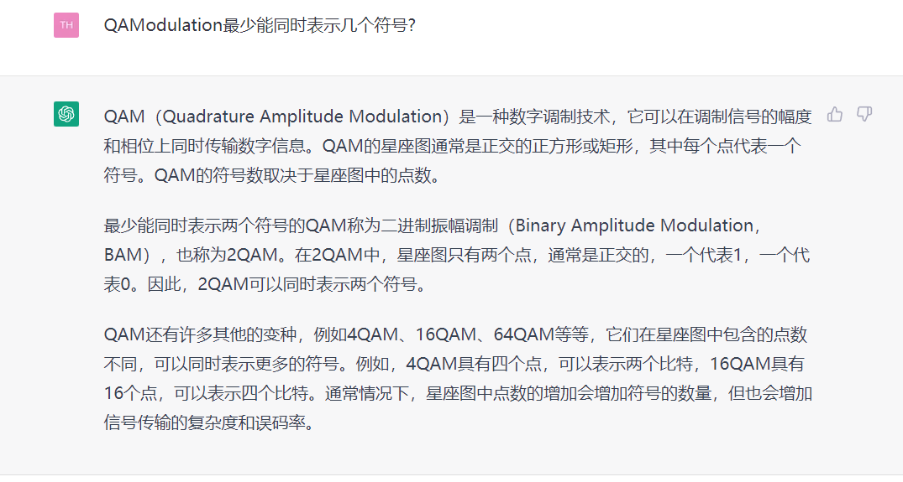

```toc
```
# Lab3

[DC4_lab1_py.pdf](assets/DC4_lab1_py-20230212095852-pzl7bse.pdf)

‍

$$
\frac{1}{2}erfc \sqrt{\frac{10^{snr(dB)/10}}{k}}
$$

‍

`komm.PSKModulation(2)` 和 `komm.PSKModulation(4)` 的区别在于，它们分别创建了二进制相移键控（BPSK）调制器对象和四进制相移键控（Quadrature Phase-Shift Keying，QPSK）调制器对象。在BPSK中，每个符号表示1个比特，使用相位差为180度的两个相移信号来编码“1”和“0”；而在QPSK中，每个符号表示2个比特，使用不同的相移角度来编码4个可能的符号。因此，BPSK和QPSK在传输效率和错误率方面有所不同。

# 偶校验 even check

# 奇偶校验步骤
1.  把原来的数组先转化为奇偶校验数组
2. 一个一个传输奇偶校验数组
3. 解码奇偶校验数组
4. 奇偶校验解码后数组的奇偶性
5. 奇偶性错误 重复2345


# 错误
1. 首先temp是 Npixels,8 的数组 他的temp[0] = [0,0,0,0,1,1,1,1]这个不是getevencheck可以处理的.
2. temp[0]转换为一个整数才能使用get check[]


## 步骤
1. 确认 得到奇偶校验的函数正确
**10*lg(SNR/Noise) = 6**

lg(SNR/Noise )= 0.6
Soignal/Noise = 10^0.6

bpsk 1.89%

## Order的选择
order只能为2 4 16 . 8就不行
因为一个Pixel像素点是8位,
2表示一个symbol 表示一个bit $2^1$,8表示一个symbol表示3bit$2^3$,用来表示一个像素点,要么多了要么少了是不能要的.


## QAM
[komm.QAModulation — Komm 0.7.1 documentation](https://komm.readthedocs.io/en/latest/komm.QAModulation/)

```python
#  amplitude也会影响调制的精度
def modulate_QAM(order,SNR):
    temp = np.copy(tx_bin) #创建一个和原始数组类似的数组用来改为奇偶校验数组
    num = int(tx_bin.shape[0]/8)# dtype to interge
    temp = temp.reshape(num,8)
    temp2 = np.copy(temp)
    psk = komm.QAModulation(order,base_amplitudes=1)
    awgn = komm.AWGNChannel(snr=10**(SNR/10.))
    error_times = 0 #
    times = 0
    print(1)
    for i in range(15000):
        temp[i] = get_evenCheck(temp[i])
        tx_data = psk.modulate(temp[i])
        rx_data = awgn(tx_data)
        rx_bin = psk.demodulate(rx_data)
        temp2[i] = rx_bin
        times = times + 1
        while(partick_Check(temp2[i])):
    #         print("wrong")
            tx_data = psk.modulate(temp[i])
            rx_data = awgn(tx_data)
            rx_bin = psk.demodulate(rx_data)
            temp2[i] = rx_bin  
            error_times = error_times + 1
            times = times + 1
#         print("error times: \n",error_times)
#         print("Total time\n",times)
        for x in range(8):
            pics[i*8 +x] = rx_bin[x]   
    print("",error_times/Npixels) 
    rx_im = np.packbits(pics).reshape(tx_im.size[1],tx_im.size[0])
    plt.imshow(np.array(rx_im),cmap="gray",vmin=0,vmax=255)
    plt.show()
modulate_QAM(4,2)
modulate_QAM(16,2)
modulate_QAM(256,2)
```



<mark style="background: #FFB8EBA6;">还是没弄明白为什么只能从4开始取</mark>
## ARQ to Theoretical Ber


$$\frac{1}{2}erfc\sqrt{\frac{10^{snr(dB)}/10}{k}}$$

## BER
$$\frac{Bit \quad Errors}{Total\quad Bits} = \frac{Bit \quad Errors}{8Npixels}$$
$$\frac{The \quad number \quad of \quad ARQ}{Npixels}$$