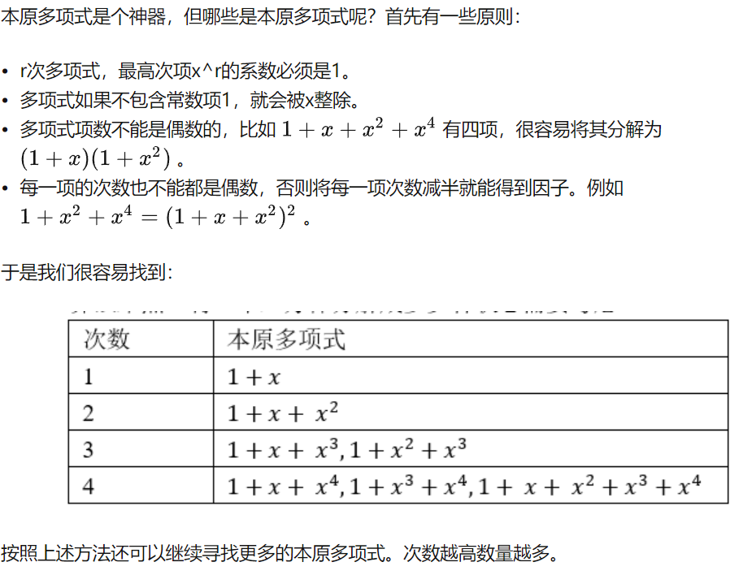
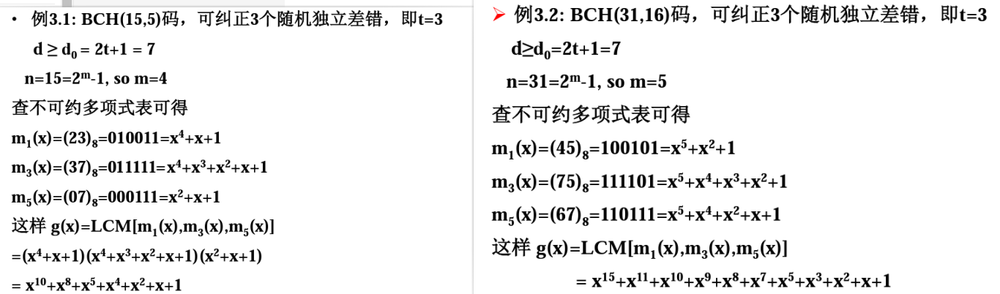
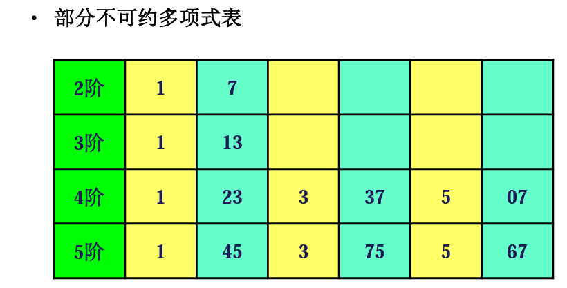

[Lab4](assets/DC4_lab2_py.pdf)
[BCH CODE Youtube](https://www.youtube.com/watch?v=SwjhRtupStg)

什么是BCH编码
多项式什么的干什么用的,怎么得出的.

# BCH Code
## 二进制域与多项式
[BCH编码 - 搜索结果 - 知乎](https://www.zhihu.com/search?type=content&q=BCH%E7%BC%96%E7%A0%81)
<mark style="background: #BBFABBA6;">这里面解释了什么叫做不可约多项式,以及我们为什么需要他.</mark>
首先考虑二进制域，即所有每个位的取值只能是0或1。我们可以尝试把二进制数表示为多项式，二进制数中的从左往右第j位，是多项式x^j的系数。例如11011，可以表示成为 1+x+x3+x41 + x + x^3 + x^4。

二进制域的四则运算与我们常见的十进制差不多，但由于在<mark style="background: #FFB8EBA6;">二进制1 + 1 = 2 = 0</mark><mark style="background: #FFB8EBA6;">，所以我们每次计算后相当于模上2。</mark>例如计算11 11，在多项式表示就是 (1+x)∗(1+x)=1+2∗x+x2=1+x2(1 + x)*(1 + x) = 1 + 2*x + x^2 = 1 + x^2 。这儿的x的系数2在二进制中等于0。<mark style="background: #FF5582A6;">另外很重要的概念就是二进制域中，加等于减，</mark>例如 x2+1=0 x^2 + 1 = 0 相当于 x2=1x^2 = 1

## 本原多项式(primitive polynomials)

## mod(p(x))
mod (px)是什么操作?
除以px取模
2mod2 = 0     3mod2 = 1
在代数学中，mod(p(x))是指用多项式p(x)除另一个多项式时所得到的余数。例如，假设我们有两个多项式f(x)和g(x)，我们可以用g(x)去除f(x)，得到商q(x)和余数r(x)，即：

f(x) = q(x)g(x) + r(x)

其中，r(x)就是f(x)除以g(x)的余数。我们可以使用多项式长除法来计算商和余数，以便在模运算中使用。

在通信中，模运算也经常用于BCH编码中。在BCH编码中，我们需要计算发送的消息多项式m(x)除以编码多项式p(x)的余数r(x)，以确定是否发生了错误并进行纠错。在这种情况下，mod(p(x))就是指将m(x)除以p(x)的余数r(x)。
## 如何得到BCH
就是查找不可约多项式

<<<<<<< HEAD

## BCH

消息组 k位一组  还是原始数据不是二进制形式
	长为n 二进制数字组 称为码字  这个时候已经是二进制了
	消息组的数目为M>=2 
称为信息数目为M的分组码,记作(n,M)
(7,4)?
### 如何计算生成矩阵

### 分组码的概念
349

001 这个整个叫码组
00 信息位 1监督位  0叫做码元

n k r 
n码组的码元数 011 3
k 信息位  01 2
r 监督位 1 1
(3,2)码
### 如何寻找生成多项式

# Convolutional Coding
import komm 
code = komm.ConvolutionalCode(feedforward_polynomials=[[0o7, 0o5]]) 
tblen = 18 
encoder = komm.ConvolutionalStreamEncoder(code) 
decoder = komm.ConvolutionalStreamDecoder(code, traceback_length=tblen, input_type="hard")

# Report
## Outline

## Cov
在卷积编码中,我一开始是使用cov一次性编码和解码数据的但是我发现很慢并且有错误, 于是我将数据进行分组,8个为一组分别接码,这样代码运行起来很快,但是在级联编码中这样会非常麻烦,会涉及到很多次数组的维度变换. 最后我发现是回溯深度导致了我的卷积解码很慢.

# Pics
## BCH

=======

