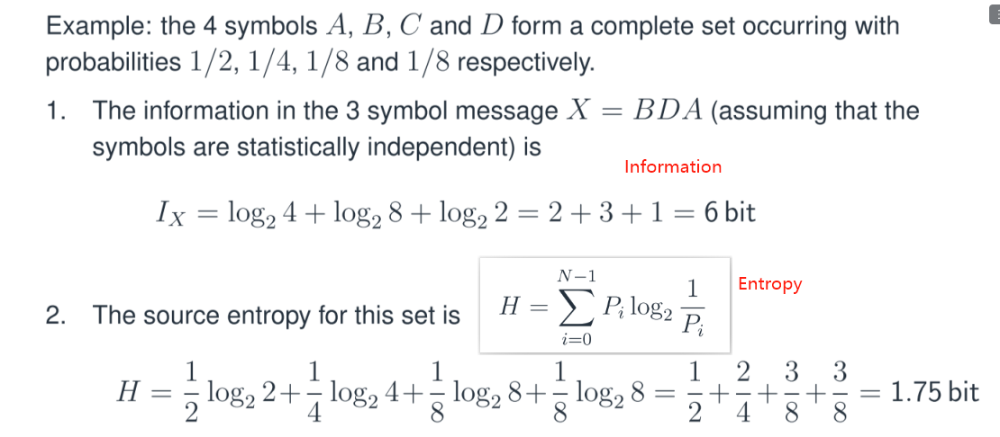
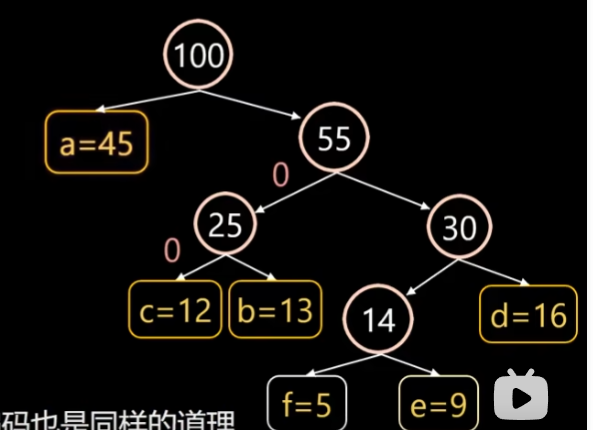
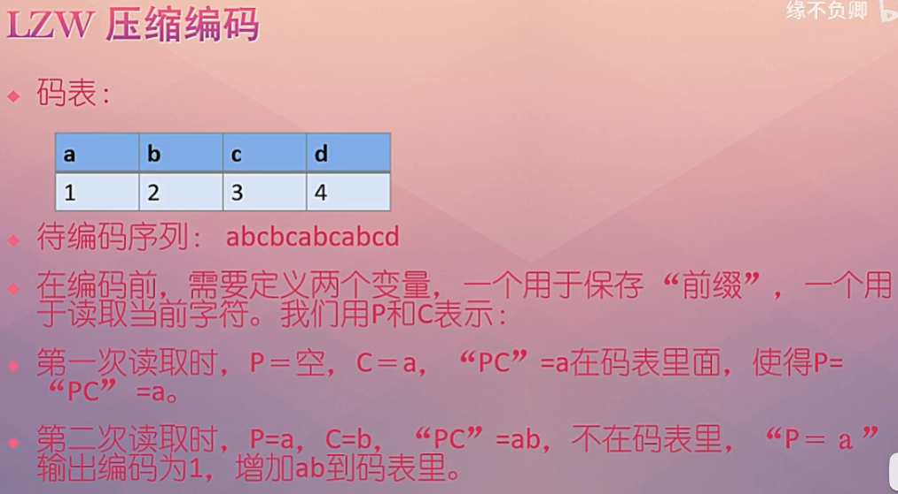
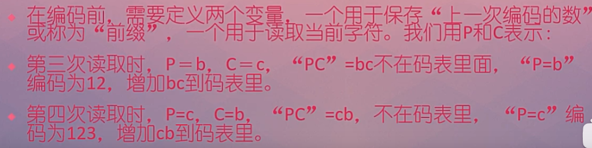
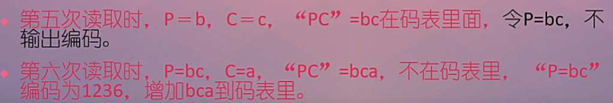
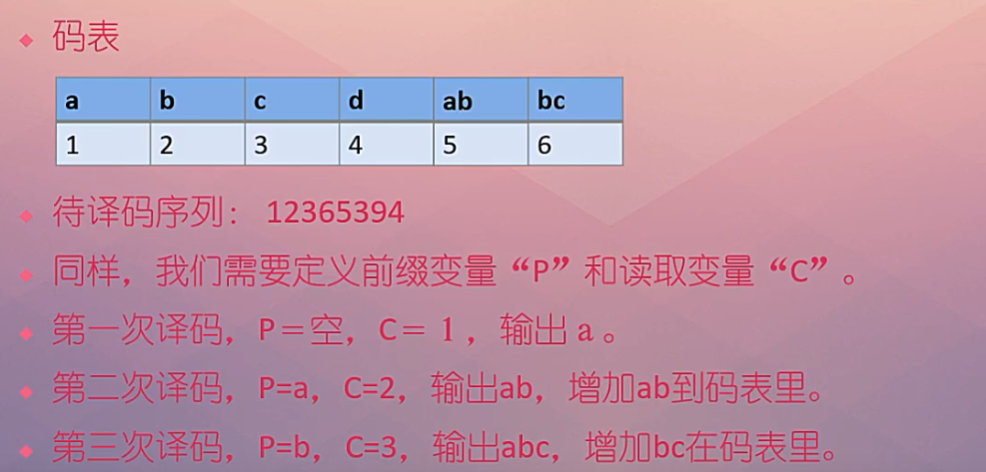
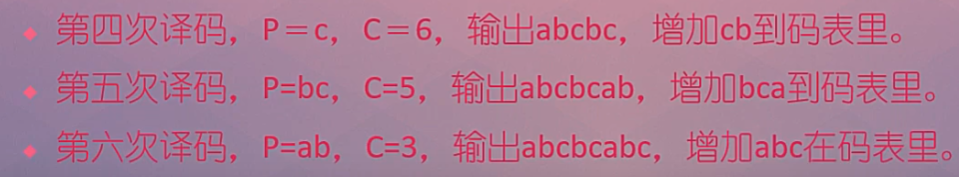
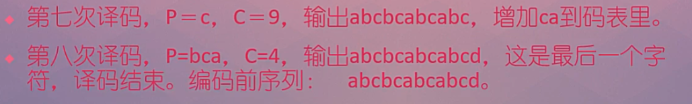

# Lec01

主要是霍夫曼和LZW编码

[lect01.pdf](assets/lect01-20230126225829-8xia1gl.pdf)

‍

I 表示 信息量 直接$log_2(possible)$

H表示熵

‍

# 霍夫曼编码

[霍夫曼编码CSDN](https://blog.csdn.net/FX677588/article/details/70767446)

[B站视频讲解很清楚](https://www.bilibili.com/video/BV18V411v7px/?spm_id_from=333.337.search-card.all.click&vd_source=2f6e531d9d833ca7fdcd8c5bb99bd1bb)

# 列普尔-齐夫-韦尔奇

Lempel-Ziv-Welch（LZW）编码是一种常用于无损数据压缩的字符串压缩算法。它的基本原理是通过在数据中查找重复字符串并将其编码为一个整数编号，从而减少数据的大小。LZW编码在文件压缩、图像压缩等方面都有广泛应用。

[编码](https://blog.csdn.net/qingkongyeyue/article/details/74332484)

[B站视频讲解同时包含Matlab编码](https://www.bilibili.com/video/BV1Ff4y19799/?spm_id_from=333.337.search-card.all.click&vd_source=2f6e531d9d833ca7fdcd8c5bb99bd1bb)

## 编码

C永远都是一个一个读的.

不在码表里,下一次P =C. 在码表里,下一次P = PC

不在码表里才输出编码,然后把不在码表里的字符串写入字典中.

## 解码

​

‍

