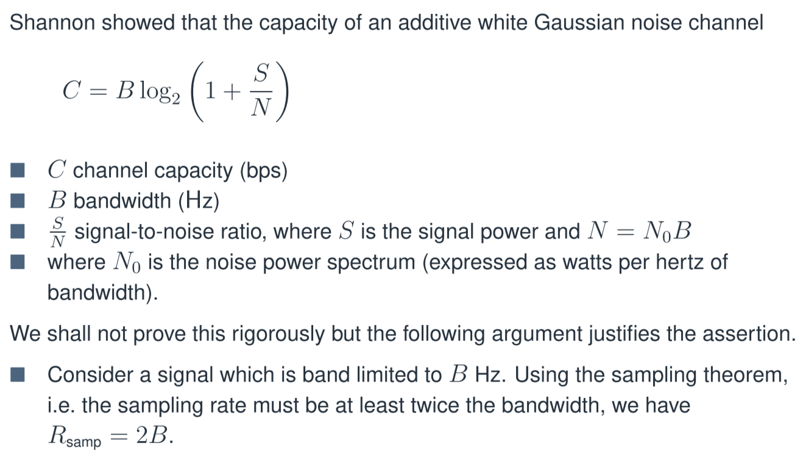

# Lec02

[lect02.pdf](assets/lect02-20230211101313-e6goamc.pdf)

# 信道容量

信道容量是通信信道每单位时间传输信息的理论限制，具有特定的准确度和没有错误。它是通过通信信道传输的最大数据速率的度量，是由信道的带宽和信噪比决定的。信道容量确定了通信系统的效率，并对可以传输的数据量设定了限制。它是信息论和数字通信中的重要概念，广泛应用于通信系统的设计和分析。

‍

# BER

Bit error rate
$\mathbf{d}$
$\mathbf{p}$
1.  构造一个$4 \times 3$矩阵$\mathbf{A}$，其中每一行代表一个校验位的计算方式，即
2. 4.  生成矩阵$\mathbf{G}$为$[\mathbf{d}|\mathbf{p}]\mathbf{A}$，即