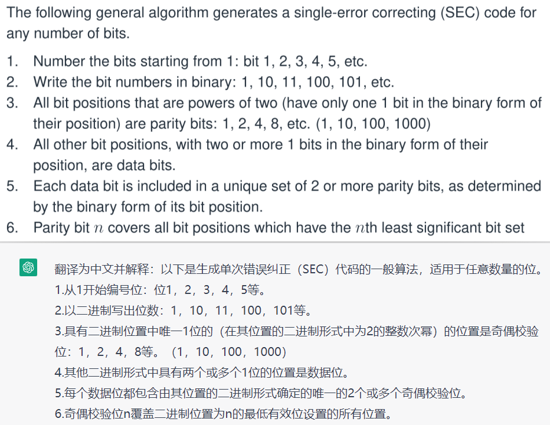

# Lec03 1

https://blog.csdn.net/qq_19782019/article/details/87452394

https://www.cnblogs.com/Philip-Tell-Truth/p/6669854.html

汉明编码还是没搞懂

[lect03.pdf](assets/lect03-20230211101313-utgpkh0.pdf)

# 汉明距离

汉明距离是以理查德·卫斯里·汉明的名字命名的。在信息论中，两个等长字符串之间的汉明距离是两个字符串对应位置的不同字符的个数。换句话说，它就是将一个字符串变换成另外一个字符串所需要替换的字符个数。例如：

1011101 与 1001001 之间的汉明距离是 2。

2143896 与 2233796 之间的汉明距离是 3。

"toned" 与 "roses" 之间的汉明距离是 3。

# 汉明重量

[编辑 ](javascript:;)**[播报](javascript:;)**

汉明重量是字符串相对于同样长度的零字符串的汉明距离，也就是说，它是字符串中非零的元素个数：对于二进制字符串来说，就是 1 的个数，所以 11101 的汉明重量是 4。
11101
0000

# 单词错误纠正代码

# Modulo

模除 9%3 = 0 10%3 = 1

就是取余数

‍

# 汉明码奇偶校验

[奇偶校验(7,4)编码](https://blog.csdn.net/weixin_57915039/article/details/117523933?spm=1001.2014.3001.5501)

## (7,4)编码1

Hamming(7,4) code is a type of error-correcting code that can correct single-bit errors in data transmission. It encodes 4 bits of data into a 7-bit codeword by adding 3 parity bits to the data bits.

The encoding process of Hamming(7,4) code is as follows:

1. Arrange the 4 data bits (d1, d2, d3, d4) in a row.
2. Calculate the parity bits (p1, p2, p3) using the following equations:

* p1 = d1 + d2 + d4
* p2 = d1 + d3 + d4
* p3 = d2 + d3 + d4

where "+" denotes modulo-2 addition.

3. Place the data bits and parity bits in a 7-bit codeword as follows:

* The first bit is p1.
* The second bit is p2.
* The third bit is d1.
* The fourth bit is p3.
* The fifth bit is d2.
* The sixth bit is d3.
* The seventh bit is d4.

The resulting codeword can be transmitted over a noisy channel. When a codeword is received, its parity bits can be recalculated using the same equations. If there is no error, the recalculated parity bits will match the received parity bits. If there is a single-bit error, one of the parity bits will be incorrect, and the error can be located and corrected. If there is a double-bit error or more, the error can be detected but not corrected.

Hamming(7,4) code is widely used in computer memory systems and digital communication systems to detect and correct errors.

# 低密度奇偶检查码

[奇偶检查码](https://zh.wikipedia.org/wiki/%E4%BD%8E%E5%AF%86%E5%BA%A6%E5%A5%87%E5%81%B6%E6%AA%A2%E6%9F%A5%E7%A2%BC)

‍
# 交错编码

<mark style="background: #FF5582A6;">就是有延迟,需要接受到一个完整的块儿才能开始解码.</mark>

交错编码的一个特点是存在与解码相关的延迟，因为在接收到完整的数据块之前无法进行解码，这个延迟被称为延迟时间。

数据块越大，对突发错误的保护就越好，但延迟时间就越长。数据块的大小称为交错深度。

在某些系统中，延迟时间并不太重要，例如数字音频广播（DAB），如果在FM和DAB上收听同一电台，你会注意到延迟约为2秒，部分原因是DAB使用了交错编码和相关的延迟。

对于一些系统，延迟时间很重要，例如在移动电话的GSM系统中，对话的延迟超过330毫秒就是不可接受的，因为较长的延迟对用户来说会很混乱。因此，在GSM系统上，语音信道的交错深度受到了这一考虑的限制。
## 什么是交错编码
<mark style="background: #BBFABBA6;">举例一个简单的例子:</mark>

一个简单的交错编码的例子是奇偶校验码。在奇偶校验码中，将原始数据按照一定的规则进行分组，并对每个分组进行奇偶校验，生成一个校验位。然后将这些分组的数据和校验位按照一定的顺序进行交错，形成交错编码后的数据流。

例如，假设要发送一个4个比特的数据1110，按照奇偶校验码的规则，将其分成两个2比特的分组，分别为11和10。对于每个分组，计算其奇偶校验位，分别为0和1。然后将这两个分组和校验位按照一定的顺序进行交错，形成交错编码后的数据流1011。

在接收端，接收到交错编码的数据流后，按照相同的规则进行反交错和校验，即可检测和纠正可能存在的传输错误。

<mark style="background: #FFB8EBA6;">这个4bit的数据,在接受端怎么解码?
</mark>

在接收端，首先需要将交错编码后的数据流进行反交错操作，以恢复原始的数据块。对于奇偶校验码的例子，反交错操作的方法是按照交错顺序重新排列数据块和校验位，然后对每个数据块进行奇偶校验，如果校验结果与接收到的校验位不一致，说明该数据块存在错误。

以前面的例子为例，接收到交错编码后的数据流1011，按照交错顺序重新排列后得到原始数据块1101。对于第一个数据块11，其校验位为0，经过奇偶校验后发现校验结果为0，因此无需进行纠错。对于第二个数据块10，其校验位为1，经过奇偶校验后发现校验结果为0，说明该数据块存在错误，需要进行纠错。根据校验位和已知的数据位可以得到正确的数据为11。最终恢复的原始数据为1110，与发送端发送的数据一致。

# 看完