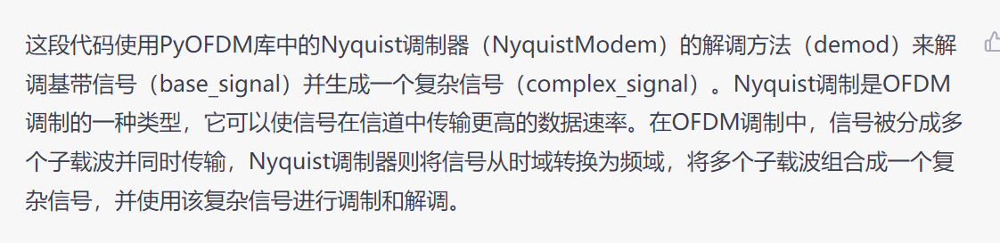
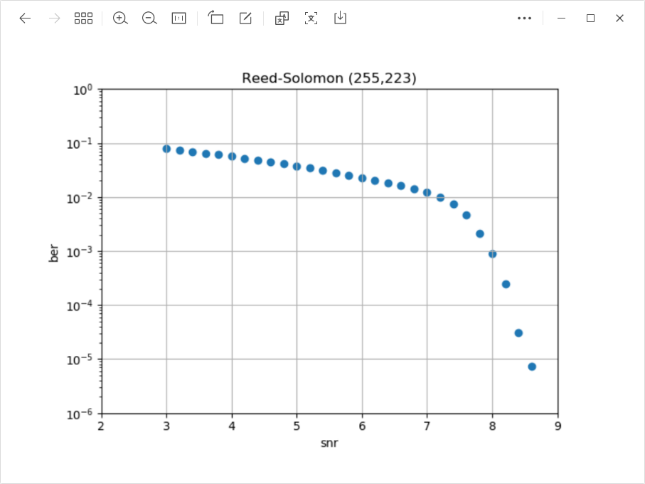

[Lab_Final](assets/DC4_lab5_py_merged_public_with_bookmark.pdf)
# 1.2
实部 虚部展示

~~~python
# append dummy bytes in order to make the data array is a whole multiple of nbytes
pad_num = nbytes - tx_byte.shape[0] % nbytes
tx_byte = np.pad(tx_byte, (0, pad_num), mode="constant", constant_values=127)
/*
这段代码的作用是将数据数组中的元素数量扩充到 nbytes 的整数倍，以便在OFDM编码之前执行，因为OFDM编码要求数据长度必须是符号长度的整数倍。首先，通过计算数据数组中元素的数量与 nbytes 取模的余数，计算需要添加的虚拟字节数。然后，使用numpy中的np.pad函数在数组的末尾添加相应数量的值为 127 的虚拟字节，以便填充数据数组，使其元素数量成为 nbytes 的整数倍。填充的值为 127 的原因是因为在某些情况下（例如，OFDM符号前缀中的循环前缀）需要知道填充值。
*/
~~~

what you’ve done 
首先我使用OFDM调制了一些随机的复数信号,然后将调制后的信号的实部和虚部绘制到同一张图上.
然后我绘制了

这段话提到了OFDM中的离散傅里叶变换（Discrete Fourier Transform，DFT）和循环前缀（Cyclic Prefix）的作用。OFDM使用多个正交的子载波来传输信号，每个子载波传输信号的一小部分，而离散傅里叶变换可以将这些子载波中的信号提取出来。循环前缀是一些无用的信号，加在每个OFDM符号的开头，主要用于在接收端进行同步和去除信号时的保护。此外，文章还提到了在没有循环前缀的情况下，OFDM符号的离散傅里叶变换的绝对值在被占用的带宽范围内相对平坦的特点，<mark style="background: #FFB8EBA6;">这表明OFDM信号的能量被均匀地分布在子载波上</mark>，从而减少了不必要的频谱泄漏和干扰。

results 
图片
conclusions 

# 1.3

~~~python
samp_rate, base_signal = wav.read(’ofdm44100.wav’) # append some extra zeros to the base_signal here

complex_signal = pyofdm.nyquistmodem.demod(base_signal)# 上图的奈奎斯特解调
~~~

首先我找出了OFDM符号的开头,并且画出收到的信号和OFDM符号之间的交叉相关性图像,接收到的OFDM符号的傅里叶变换值的幅度之和的图像. 随后我画出了OFDM解码后的图像.

## 有个小问题
原图在jupyter notebook上能出来,但是在vscode上出不来.

# 1.4
---

Play a few seconds of it and comment on how it sounds.
他很杂乱,听不出来内容是什么.
This audio sounds very cluttered, I can't tell what the content is

---

# 1.5

1.4 是加上噪声但是没有使用RSC解调
1.5 是加上噪声使用RSC编码和调制