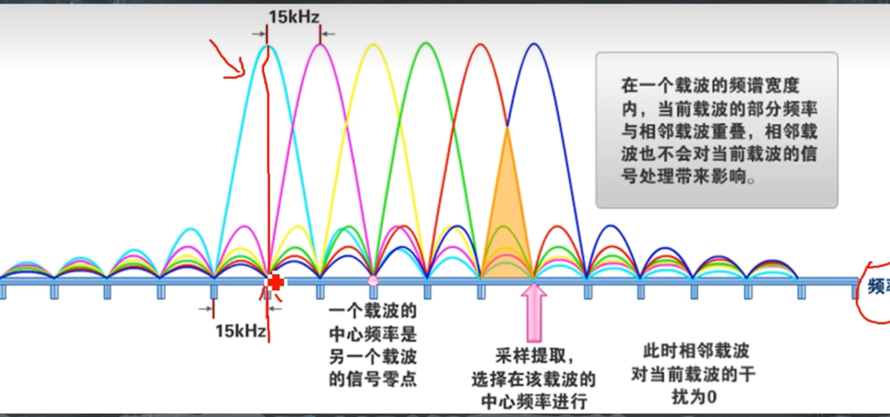

[Lec_D](assets/lect_D.pdf)
[小白也能看懂】-聊聊OFDM，子载波，傅里叶变换\_哔哩哔哩\_bilibili](https://www.bilibili.com/video/BV12z411B7y9/?spm_id_from=333.337.search-card.all.click&vd_source=2f6e531d9d833ca7fdcd8c5bb99bd1bb)
OFDM是正交频分复用（Orthogonal Frequency Division Multiplexing)
# 什么是OFDM 正交频分复用
OFDM是一种基于频域的传输技术，通过将整个信号分成多个子信号，每个子信号具有相同的带宽，但在频域上是正交的（即没有互相干扰的频率）。这种技术使得OFDM信号具有很强的抗干扰能力，因为如果其中一个子信号受到干扰，其它子信号不会受到影响。

OFDM is a frequency-domain based transmission technology that divides the entire signal into multiple sub-signals, each with the same bandwidth but orthogonal in the frequency domain (i.e. there is no frequency interference). This technology gives OFDM signals strong anti-interference ability, as if one sub-signal is interfered with, other sub-signals will not be affected.

##  关键字解释
正交 : 可区分的,两个频率正交就代表这两个频率我们是可以区分的.
频分: 分频
复用: 多个子载波进行<mark style="background: #FFB86CA6;">并行</mark>的传输

# 什么是DFT
给定的表达式表示在时间间隔(0, NT)上的N个等间距采样x(kT)的离散傅里叶变换（DFT）。<mark style="background: #FFB8EBA6;">DFT是一种数学变换，它将时域中的离散序列转换为频域中的离散序列。换句话说，它用频率分量的形式表示信号。</mark>

DFT被定义为不同频率的复指数函数之和。每个复指数函数由项e^(-jΩTnk)定义，其中n是频率分量的索引，Ω是角频率，T是采样间隔，k是采样的索引。

DFT通常用于分析信号的频率内容，以及设计数字滤波器和其他信号处理算法。逆DFT可以用于从频率分量中恢复原始信号。

DFT就是把一个信号分成多个不同的子信号
## 传统多载波

子载波之间间隔过大

## FFT与DFT
解释：DFT是一种数字信号处理中的基本算法，可以将信号从时域转换为频域。但是对于较大的信号，DFT的计算成本可能会很高，需要很长时间。FFT算法通过利用复指数的对称性，可以更有效地计算DFT。其中最常用的是Cooley-Tukey算法，它采用分治的方法将较大的DFT递归地分解为许多小的DFT。这种算法主要用于大小为2的幂次的DFT计算，计算时间与N log₂N成正比。因此，在数字信号处理中，使用FFT算法来计算DFT是非常常见的，可以大大减少计算成本和时间。

OFDM（正交频分复用）是数字通信中常用的一种调制技术，其特点是将高速数据流分成多个低速数据流，然后在不同的子载波上进行传输。每个子载波具有独立的复振幅，因此OFDM信号不是DSB（双边带）信号。OFDM信号的频谱覆盖0-B，其中B是信号带宽，最低可能的载波频率是B/2，也称为奈奎斯特频率。为了生成采样的OFDM基带信号，采样率必须加倍以包含实部和虚部。这种技术可以在数字通信中实现高速、可靠的数据传输

