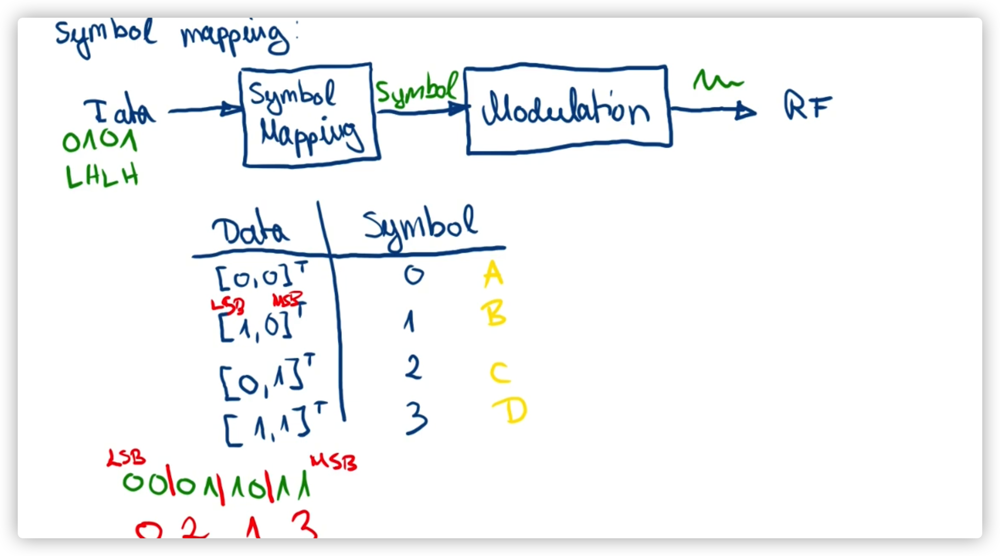
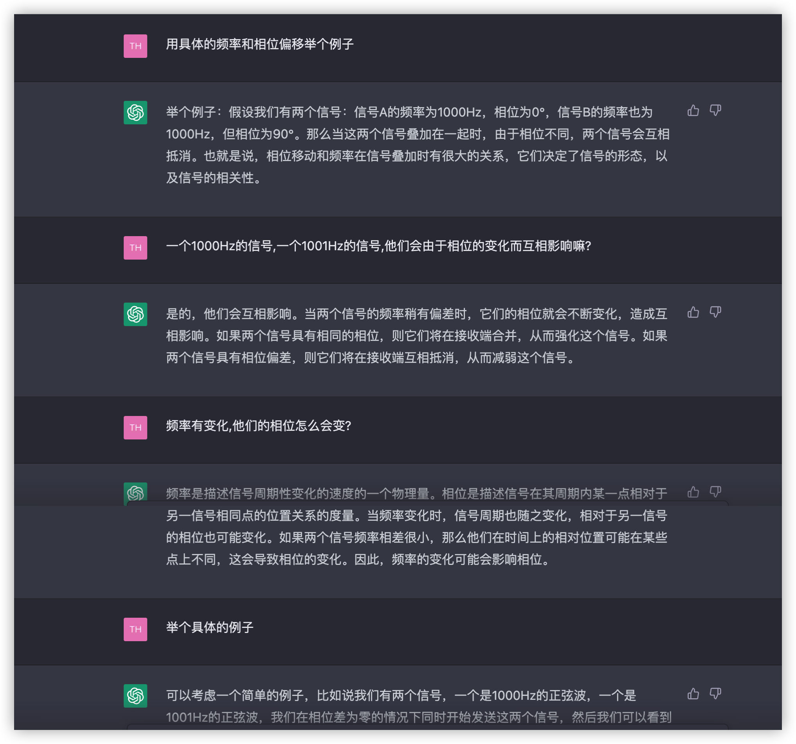
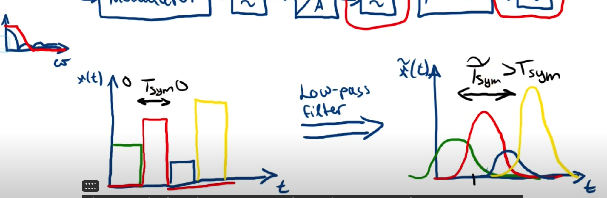

# Lec6

# Part2

## Symbol

​​

因此在qpsk中确实有4个符号,他们分别代表 00 01 10 11

## 频率和相位的关系

​​

总之相位的变化会导致两个不同频率的信号也会互相干扰 没太懂?

# Inter Symbol Interference

​​

每个符号 1 2 3 4都是由矩形窗截来的,但是实际上矩形窗的频谱是无限的,这不可能应用在载波调制上,因此我们用红色的低通滤波器去掉高频部分. 在去掉高平部分之后矩形窗很明显就不是一个完整的矩形窗了,滤除的就不可能这么干净.  
因此这个矩形窗就不完整了,由此带来了右图这就叫做码间干扰 ISI  
​

这个就是矩形窗的频谱图,应该是sin(c)

# The other Error source IQ Imbalance

‍

‍
