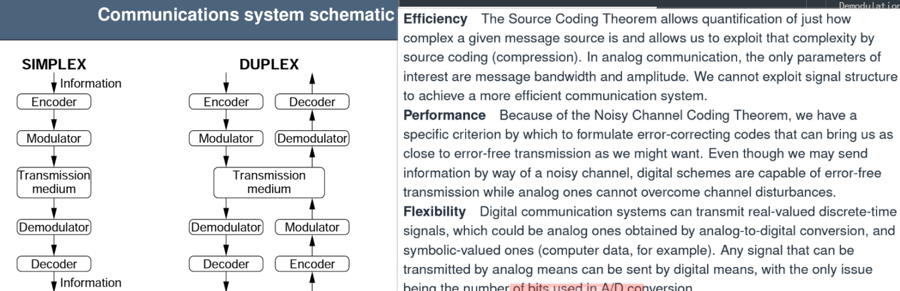
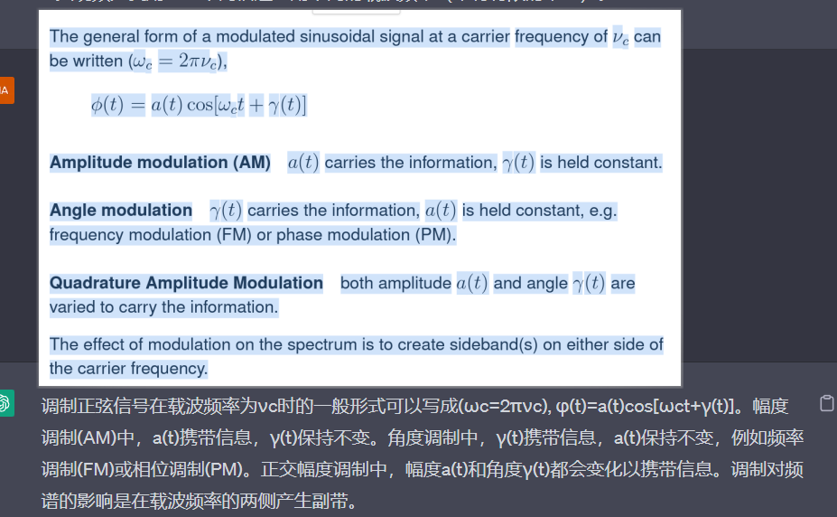
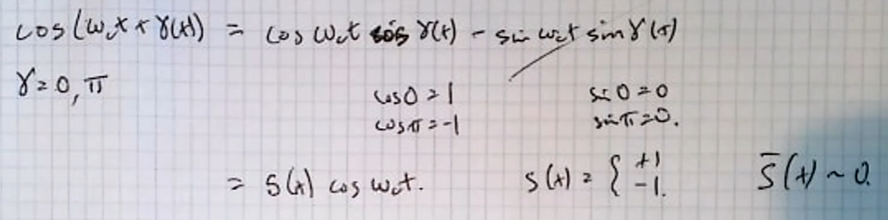
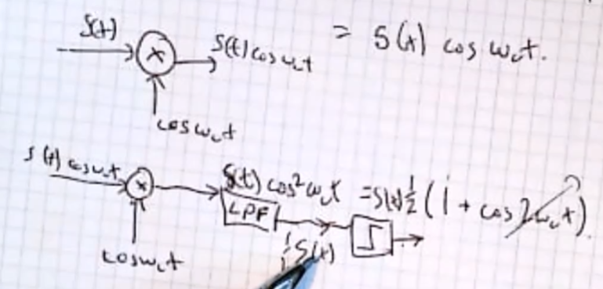
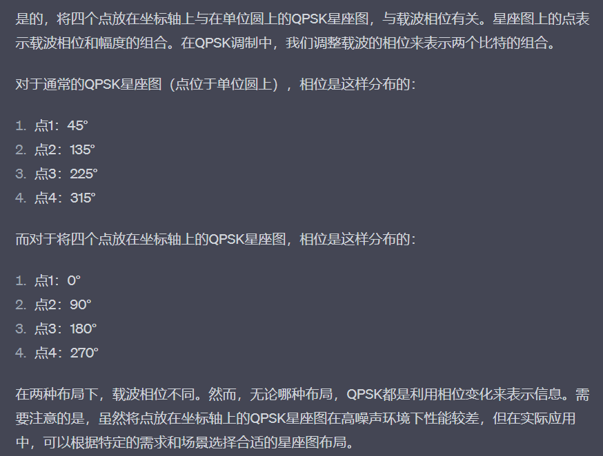

# Source coding 与 Channel Coding的区别

源编码和信道编码是数字通信中的两个基本概念，它们有不同的作用。

源编码（source coding）通常被称为压缩编码。它的主要作用是通过编码过程减少数据传输的存储或带宽需求，以减少数据的冗余和重复。它的目标是最大限度地减少数据量而不丢失数据的关键信息。源编码主要是针对源数据本身进行编码。

信道编码（channel coding）是为了解决在传输过程中因信道噪声等问题引起的传输错误问题。信道编码的目标是使发送的信息能够经过信道传输，并能够在接收端正确地恢复。它通过在发送信息之前添加一些冗余数据来实现这个目标，这些数据允许在接收端进行纠错处理，从而使数据在传输过程中具有更强的鲁棒性。信道编码主要是针对信号传输的过程进行编码。

**因此，源编码和信道编码的重点不同。源编码的重点在于数据压缩和减少数据冗余，而信道编码的重点在于提高数据传输的可靠性。两者通常需要结合使用来实现更高效、可靠的数字通信。**

Baud rate 
| bit数 | 可代表 |
| ----- | ------ |
| 1bit  |        |
| 0     | -1     |
| 1     | +1     |
| 2bit  |        |
| 00    |      -3  |
| 01    |       -1|
| 10    |      +1  |
| 11      |     +3   |
$$

\begin{equation} \begin{aligned}

T_{symbol} = 2T_{bit} \\
T \quad 表示duratuion \quad 周期 \\
1/T表示波特率: \quad \frac{1}{T_{symbol}} = \frac{1}{2T_{bit}}
\end{aligned} \end{equation}

$$

如果有kbits -> 能产生对应的 $2^k symbols$

---
 On - off  = Amplitude keying
 On - off 是一种特殊的 Amplitude Keying
 
# 归一化频率
Normalised Frequency to samping ate

“归一化频率到采样率”的意思是将信号的频率表示为采样率的比率，通常用来描述数字信号的频率特征。

在数字信号处理中，采样率是指每秒采集和记录的样本数，通常以赫兹（Hz）为单位表示。因此，如果将一个信号的频率表示为采样率的比率，则需要将该信号的频率除以采样率。这样的频率表示方式称为“归一化频率”。

**例如，如果采样率为10kHz，那么信号的归一化频率为0.2表示该信号的频率是采样率的1/5。同样，如果信号的归一化频率为0.5，则表示该信号的频率等于采样率的一半。**

因此，“归一化频率到采样率”通常是指将信号的频率表示为采样率的比率，以便更好地描述数字信号的频率特征。

$$
\begin{equation} \begin{aligned}

f_c 表示归一化后的信号的频率  f_c < 0.5 \\
奈奎斯特采样定理声明,采样频率要大于等于两倍的原信号频率
\end{aligned} \end{equation}
$$

$$
\begin{equation} \begin{aligned}
cos(w_t + \phi(H)) = cosw_ct*cos\phi(t) - sinw_ct*sin\phi(t) \\
\phi = 0,\pi
\end{aligned} \end{equation}

$$

# Modulation and Demodulation

$cosw_ct$ 就是载波信号

# Quadrature Phase Keying
正交相移键控（Quadrature Phase Keying，QPSK）是一种数字调制技术，属于相位调制的一种。它通过改变载波信号的相位来传输数字信息。

在QPSK中，每个二进制数据位被映射到一个相位角度上，这个相位角度可以是0度、90度、180度或270度中的一个。每两个二进制数据位被映射到一个载波信号上，因此QPSK可以通过不同相位角度的组合来传输更多的数据。

在QPSK中，相位角度的变化通常由正弦函数和余弦函数组成的正交信号来实现。这些信号通常被称为“I”（in-phase）和“Q”（quadrature）信号，它们的相位差为90度，表示在正交的二维空间中的坐标系。通过改变I和Q信号的相位和幅度，可以实现不同的相位角度和载波信号的变化。

QPSK是一种高效的数字调制技术，它可以在给定的频谱带宽内传输更多的数据。在数字通信中，QPSK被广泛应用于无线通信、卫星通信、数字电视和调制解调等方面。
## Modulation

$$
\begin{equation} \begin{aligned}
S(t) = S_{I(t)} + S_{Q(t)} = \\
S_Icosw_ct + S_Qcosw_ct
\end{aligned} \end{equation}
$$

## Demodulation

Interleave 交错这些解调后的信号，得到了原始信号。

进过$cosw_ct$解调后的信号：
$$
\begin{equation} \begin{aligned}
S(t)cos^2w_ct = S(t)\frac{1}{2}(1+cos2w_ct)\\
\end{aligned} \end{equation}
$$
可以看到里面的频率变为$cos2w_ct$了，是原来的两倍，因此需要LPF来滤除高频部分。

# BPSK
二进制相移键控（Binary Phase Shift Keying，BPSK）是一种数字调制技术，它属于相位调制的一种。BPSK通过改变载波信号的相位来传输数字信息。

在BPSK中，每个二进制数据位被映射到一个相位角度上，这个相位角度可以是0度或180度中的一个。其中，0度表示二进制数据位0，180度表示二进制数据位1。

BPSK的原理很简单，它只需要在发送端对数字数据进行相位调制，并将调制后的信号发送到接收端。接收端通过检测信号的相位来恢复原始的数字数据。由于BPSK只使用了两个相位角度，因此它被认为是一种低复杂度的数字调制技术。

BPSK被广泛应用于数字通信领域，例如在无线通信、卫星通信、数字电视、调制解调等方面。
# QPSK
$$
I*cos() + Q*sin() = Output
$$

# Tutorial
## Class

BPSK/QPSK/PSK：只改变相位不改变幅值
QAM：即改变相位也改变幅值
ASK : 只改变幅值

对于下面的星座图所示的每种数字调制方案：（a）描述调制方案，（b）确定每个符号的比特数，（c）说明比特率与符号（波特）率的比率，（d）确定需要的波特率以实现24 Mbit/s的比特率。
1. 4-ASK
2. 4QAM
3.  星座图为8PSK（8相移键控）调制
    -   调制方案：8PSK调制
    -   每个符号的比特数：3比特（可以将8种不同的相位组合视为3个二进制比特）
    -   比特率与符号速率的比率：3/1
    -   要实现24 Mbit/s的比特率，所需的符号速率：8 Msymbols/s
4.  星座图为16QAM（16进制振幅调制）调制
    -   调制方案：16QAM调制
    -   每个符号的比特数：4比特
    -   比特率与符号速率的比率：4/1
    -   要实现24 Mbit/s的比特率，所需的符号速率：6 Msymbols/s
下面的只是解释不是答案：

Bit rate : 每秒传输多少bit
Baud Rate : 每秒传输多少symbol

---
对于数字流010101010101...，确定以下调制波形的频谱：
- [x] (a) 开关键控制 (On-Off Keying) 
- [x] (b) 二进制相移键控 (Binary Phase Shift Keying) 
- [ ] (c) 灰码编码正交相移键控的I和Q分量。 
- [ ] (d) 对于数字流001100110011...，确定灰码编码正交相移键控的I和Q分量的调制波形频谱。
[频谱图](https://blog.csdn.net/chengbaojin/article/details/107385778)

on-off keying = amplitude shift keying

（a）

（b）

0度表示0
180度表示1

首先看,这个一个符号是由三个周期的正弦波组成的,然后再画.

- 横着画一条线，经过两个圆弧就是一个完整周期
（c）灰码编码正交相移键控的I和Q分量。 
Gray编码是一种二进制编码方式，其特点是相邻的两个数的编码只有一位不同
QPSK ： 00 01 11 10 就是Gray 编码 称为 Gray编码 QPSK或者 G-QPSK
QPSK ： 00 11 10 01 就不是Gray编码 这个就是普通QPSK

所以这里载波是左移了45°的正弦波.左移45°,左加.和IQ分量的相位无关,只和载波的相位有关!

（d）
c就是画出I Q
d就是根据给出的代码画出Signal
## 2022_Q1?

(a)
余弦波形:
一开始是最高点,则数最低点比较容易得到完整周期.
共20个最低点,因此共20个完整周期 - > 100ns,则一个完整周期5ns - > 
$f = \frac{1}{5*10^{-9}} = 0.2 *10^{9} = 2*10^8$
(b) 
16 QAM
数字: 首先有 IQ分析则数字至少为4
I 算上 幅值和相位 4种不同的波形
Q 算上 幅值和相位 4种不同的波形
4*4 = 16 ,因为幅值和相位都发生了变化.所以是16QAM
(c)
余弦波周期是$2*10^8$,每5个完整周期余弦,代表一个字符.$\frac{2*10^8}{5} = 0.4*10^8 = 4*10^7$
(d)?
(e)?

## 2021 Q2

I cos
Q sin
皮秒 纳秒 微秒 毫秒 秒 ps、ns、us、ms、s 时间单位之间的换算
1,000,000,000,000皮秒=1秒 （12个0）ps -> s
1,000,000,000纳秒=1秒         （9个0） ns -> s
1,000,000微秒=1秒                 （6个0）us -> s
1,000毫秒=1秒                        （3个0） ms -> s
(a) 
一共是200ns,共20个周期.一个周期是10ns. 
$$
f = 1/T = 1/10^{-9} = 0.1*10^9 = 1*10^8 = 10*=10^8HZ
$$
$10^8$Hz
(b) 
no pairs of repeating 指的是IQ组合起来没有相同的symbols,而不是单个的I Q没有相同的
I 只有两种相位变化
Q 只有两种相位变化
Q I只有相位上的变化,因此是PSK. IQ对应是 2 * 2 - > QPSK
QPSK
(c) 
突变之间有8 周期 4 周期 *但是没有重复字符,所以是4*.
如果是8周期,很明显里面有变的.在Q里,8个周期里.相位变了两次.这很明显是不对的.
0 - > 1 ; 180 - > 0
$$
\begin{equation} \begin{aligned}
\frac{10^8}{4} = 0.25*10^8 = 2.5*10^7 \\
Baud Rate : 每s传输多少symbol
\end{aligned} \end{equation}

$$
4个周期表示一个符号.  $2.5*10^7$bd - > 看I Q配合
4个周期表示一个符号,IQ配合没有相同的符号出现 10 10 这个是不行的
- 变化与变化之间看周期数,找最小的
(d) 
表示 00 -> 1; 01 - > 1 11 -> 2 10 ->3 这个是花在星座图上的
IQ: 10 00 01 10 11 -> 这个是我们假装收到了 这些数据.应该译为 -> 3 1 1 3 1 2

(e) ?--- 
和d一样? 不确定之后再讨论. 那这个星座图是不是就是看载波的相位画了

## 2020?

| Table | range of mobile (cellular) network technologies in current deployment |
| ----- | --------------------------------------------------------------------- |
| 2G    | GSM                                                                   |
| 2.5G  | GSM+GPRS                                                              |
| 3G    | UMTS                                                                  |
| 4G    | LTE                                                                   |
| 5G    | NR                                                                      |

Q1. 表格Q1展示了当前部署的移动（蜂窝）网络技术范围。 
(a) 声明这些网络技术中哪些具有电路交换元素。[3] 
(b) 声明这些网络技术中哪些具有分组交换元素。[3] 
(c) 指出当网络技术仅由分组交换元素组成时，对语音通话有哪些规定。[3] 
(d) 美国的两个主要网络运营商最近宣布放弃所有电路交换元素。运营商采取这一行动的动机是什么？ 
(e) 指出如果有的话，可能会影响某些用户的不利后果。[5]

---
*Answer:* 
(a) 有电路交换元素的网络技术是2G和3G。 
(b) 有分组交换元素的网络技术是2.5G，4G和5G。 
(c) 如果网络技术仅由分组交换元素组成，则可以使用VoIP（Voice over Internet Protocol）来提供语音通话。 
(d) 在美国，两个主要的网络运营商最近宣布将弃用所有电路交换元素。这样做的动机可能是为了降低网络维护成本、提高网络效率、使移动网络更好地适应未来技术的发展等。 
(e) 一些用户可能会在覆盖范围和服务质量等方面受到影响，特别是在农村地区和偏远地区，因为在这些地区的网络覆盖不够完善，可能会导致信号不稳定、通信质量不佳等问题。
## 2019

(a)

(b)
kbits per symbol  $n = 2^k    -> n QAM$ 

(c)
APSK, or Amplitude and Phase Shift Keying, is a type of modulation that combines both amplitude and phase modulation. It uses a varying number of rings in its constellation diagram, where each ring represents a specific amplitude level and phase shift. By using different numbers of rings, APSK can achieve different trade-offs between power efficiency and spectral efficiency.

QAM, or Quadrature Amplitude Modulation, is a type of modulation that uses a two-dimensional constellation diagram to encode multiple bits per symbol. It modulates the amplitude and phase of a carrier signal to represent a constellation of points in the diagram. The number of points in the constellation is determined by the number of bits encoded per symbol.

In terms of performance, APSK can provide higher power efficiency and improved bit error rate performance compared to QAM, especially in channels with high levels of interference. However, QAM is typically more spectrally efficient than APSK, allowing for higher data rates in a given bandwidth.

The choice between APSK and QAM depends on the specific requirements of the communication system, including the channel characteristics, data rate requirements, and available bandwidth.

APSK和QAM是数字通信中常见的调制技术。两者都利用不同的信号点进行调制，以传输数字信息。在选择使用APSK还是QAM时，需要考虑以下因素：

1.  频带宽度：APSK相比QAM具有更大的频带宽度效率，因为它可以使用不同幅度和相位来表示更多的符号，从而提高信道传输效率。
    
2.  可靠性：QAM的可靠性比APSK更高，因为它可以在更小的信噪比下实现相同的误码率。APSK在更高的信噪比下可能会产生更高的误码率，这可能会导致传输错误。
    
3.  多径衰落：在多径衰落环境下，APSK比QAM更具鲁棒性。这是因为APSK可以使用相位来调制信号，从而使其对相位扭曲更具鲁棒性，这在无线通信中是非常重要的。
    

因此，在选择使用APSK还是QAM时，需要权衡频带宽度效率、可靠性和鲁棒性等因素。在频带宽度较大、多径衰落环境中，使用APSK更为可取；而在信道质量较差、对传输可靠性要求较高的情况下，选择QAM更为合适。

# ASK PSK FSK QAM 优缺点

# 8 16 QAM PSK

一般不会有16PSK,到16就是16QAM了.

QAM
APSK星座图一定是几个同心圆
(a)也是一种特殊的APSK