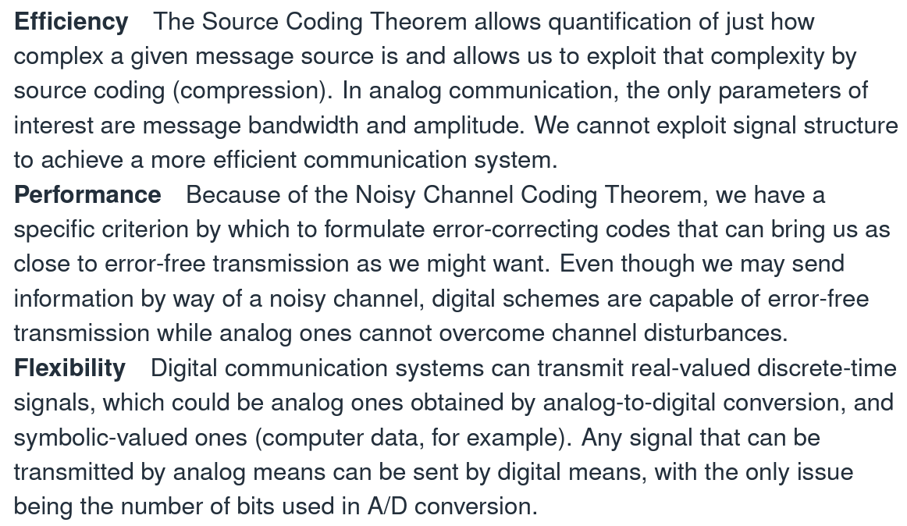

# Source coding 与 Channel Coding的区别

源编码和信道编码是数字通信中的两个基本概念，它们有不同的作用。

源编码（source coding）通常被称为压缩编码。它的主要作用是通过编码过程减少数据传输的存储或带宽需求，以减少数据的冗余和重复。它的目标是最大限度地减少数据量而不丢失数据的关键信息。源编码主要是针对源数据本身进行编码。

信道编码（channel coding）是为了解决在传输过程中因信道噪声等问题引起的传输错误问题。信道编码的目标是使发送的信息能够经过信道传输，并能够在接收端正确地恢复。它通过在发送信息之前添加一些冗余数据来实现这个目标，这些数据允许在接收端进行纠错处理，从而使数据在传输过程中具有更强的鲁棒性。信道编码主要是针对信号传输的过程进行编码。

**因此，源编码和信道编码的重点不同。源编码的重点在于数据压缩和减少数据冗余，而信道编码的重点在于提高数据传输的可靠性。两者通常需要结合使用来实现更高效、可靠的数字通信。**

Baud rate 

$$

\begin{equation} \begin{aligned}

T_{symbol} = 2T_{bit} \\
T \quad 表示duratuion \quad 周期 \\
1/T表示波特率: \quad \frac{1}{T_{symbol}} = \frac{1}{2T_{bit}}
\end{aligned} \end{equation}

$$

如果有kbits -> 能产生对应的 $2^k symbols$

---
 On - off  = Amplitude keying
 On - off 是一种特殊的 Amplitude Keying
# 归一化频率
Normalised Frequency to samping ate

“归一化频率到采样率”的意思是将信号的频率表示为采样率的比率，通常用来描述数字信号的频率特征。

在数字信号处理中，采样率是指每秒采集和记录的样本数，通常以赫兹（Hz）为单位表示。因此，如果将一个信号的频率表示为采样率的比率，则需要将该信号的频率除以采样率。这样的频率表示方式称为“归一化频率”。

**例如，如果采样率为10kHz，那么信号的归一化频率为0.2表示该信号的频率是采样率的1/5。同样，如果信号的归一化频率为0.5，则表示该信号的频率等于采样率的一半。**

因此，“归一化频率到采样率”通常是指将信号的频率表示为采样率的比率，以便更好地描述数字信号的频率特征。

$$
\begin{equation} \begin{aligned}

f_c 表示归一化后的信号的频率  f_c < 0.5 \\
奈奎斯特采样定理声明,采样频率要大于等于两倍的原信号频率
\end{aligned} \end{equation}
$$

$$
\begin{equation} \begin{aligned}
cos(w_t + \phi(H)) = cosw_ct*cos\phi(t) - sinw_ct*sin\phi(t) \\
\phi = 0,\pi
\end{aligned} \end{equation}

$$

# Modulation and Demodulation

$cosw_ct$ 就是载波信号