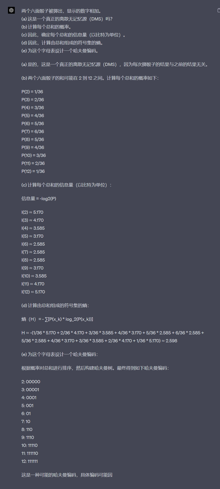

# 信息量 
$$
I_A = log_2\frac{1}{P_A} \quad = -log_2P_A
$$
对于一个概率为 $P_A$ 的事件 $A$，其信息量可以用公式 $I_A = log\frac{1}{P_A}$ 或 $I_A = -logP_A$ 来表示。这里的信息量表示的是事件 $A$ 发生所提供的信息量的大小。当 $P_A$ 越小（即事件发生的可能性越小），$I_A$ 的值就越大，表示该事件的发生提供的信息量越多。
For a binary (digital) system we use base 2, i.e. log2, giving information in bits

# 平均信息熵
$$
H = \Sigma^{N-1}_{i = 0}P_ilog_2\frac{1}{p_i}
$$
该公式是离散无记忆源的平均信息熵的计算公式。在离散无记忆源中，有N个可能的事件，每个事件发生的概率为$P_i$，该公式计算了每个事件发生时所传递的平均信息量，其单位为比特（bit）。
其中:
$log_2$表示以2为底的对数，
$P_i$表示事件i发生的概率，
$1/P_i$表示发生事件i所传递的信息量，
H表示所有事件所传递的平均信息量。
该公式中求和符号表示对所有可能的事件的信息量进行求和。

# Source Entropy
源熵是指离散随机变量的不确定性度量，表示一个信息源（信息发射器）所提供的信息量的平均值。源熵越大，意味着源提供的信息越不确定，即每个符号携带的信息量越多，需要更多的信息才能准确描述该源的行为。源熵的单位是比特（bit）或香农（Shannon，缩写为Sh），表示对该离散随机变量进行编码时，需要多少比特的信息量来表示每个符号。

# 编码 
## Huffman Code
这个可能会考需要掌握
[Huffman Coding](https://www.youtube.com/watch?v=dM6us854Jk0)

*记住,先加上最小的!*

赫夫曼编码的具体方法：先按出现的概率大小排队，把两
个最小的概率相加，作为新的概率和剩余的概率重新排
队，再把最小的两个概率相加，再重新排队，直到最后变
成1
### 例子:
3 5 7 8 11 14 23 29

## Lempel-Ziv-Welch (LZW) coding
[LZW压缩编码](https://search.bilibili.com/all?vt=31338967&keyword=LZW%E5%8E%8B%E7%BC%A9%E7%AE%97%E6%B3%95&from_source=webtop_search&spm_id_from=333.1007&search_source=5)
这个可能会考需要掌握

# Lec2

$$
M = \frac{\sqrt{S+N}}{\sqrt{N}} = \sqrt{1+\frac{S}{N}}
$$

在公式 $M = \sqrt{1 + \frac{S}{N}}$ 中，$M$ 表示在存在噪声的情况下，量化器可以分辨的不同电平的数量，也可以理解为量化器的分辨率。其中，$S$ 表示信号功率，$N$ 表示噪声功率。
Therefore the maximum entropy H is
$$
H_{max} = \sum_{i=0}^{M-1}\frac{1}{M}log_2M = log_2M =\frac{1}{2}log_2(1+\frac{S}{N})
$$
$$
C_{max} = R_{samp}H_{max} = Blog_2(1+\frac{S}{N})
$$

## 香农定理
$$
C_{max} = Blog_2(1+\frac{S}{N})
$$

$\frac{S}{N}$ 表示的就是SNR,信噪比.不是简单的SIgnal 除以 Noise.
$\frac{S}{N}$的单位为dB.    与简单的S除以N的换算关系为 $SNR = \frac{S}{N} = 10lg(\frac{P_S}{P_N})$,注意是以10为底
# Tutorial_1

$$
log_2x = (log_{10}x)/(log_{10}2)
$$
1(a)
要计算给定消息的信息量（以比特为单位），我们可以使用以下公式：

信息量 = $- log_2(P)$

其中，P是字符出现的概率。假设字母出现的概率是相等的，英文字母有26个，所以每个字母出现的概率是1/26。

给定的消息是：“the quick brown fox jumps over the lazy dog”。忽略空格，该消息包含35个字符。要计算整个消息的信息量，我们需要将每个字符的信息量相加。
$$
\begin{equation} \begin{aligned}
I_A = log_2\frac{1}{P_A} \quad = -log_2P_A \\
每个字符 消息量 log_2(\frac{1}{26}) \\
整个 消息的信息量就是: 字符数 * 每个字符携带的信息量 \\
35*log_2(\frac{1}{26}) 

\end{aligned} \end{equation}

$$
1(b)
这些值是通过对英文文本的统计分析获得的。可以通过对大量英文文本进行扫描，统计每个字母在文本中出现的频率来计算这些值。然后，这些频率可以归一化，得到每个字母的概率分布。这种方法是一种常见的语言模型建立方法，

These values are obtained through statistical analysis of English text. By scanning a large amount of English text and counting the frequency of each letter appearing in the text, these values can be calculated. Then, these frequencies can be normalized to obtain the probability distribution of each letter. 

(c)
和a一样,只不过每个字母的概率变了.
以字母x为例子:
先统计x出现的次数为3,然后3*$- log_2(P)$,然后每个字母都这么做,再加起来.

(d)
计算字母表的熵
$H = \Sigma^{N-1}_{i = 0}P_ilog_2\frac{1}{p_i}$,用这个公式把字母表过一遍就行了.

(e)
不是。离散无记忆源（DMS）指的是一个符号的出现与之前的符号无关。然而，在自然语言（如英语）中，字母并非独立出现。它们通常以特定的组合（如单词）出现，而某些字母组合的概率要高于其他组合。因此，英语并不是一个真正的离散无记忆源。

$8.323\%*2$

---
2

构建哈夫曼树的顺序而有所不同。但是，不同的哈夫曼编码应具有相同的平均码长，这是由于其构建原理决定的。
通过使用这个哈夫曼编码对由两个六面骰子总和组成的符号集进行编码，我们可以获得接近熵的平均编码长度，从而实现高效的数据压缩。请注意，实际应用中，哈夫曼编码通常应用于更大的数据集，以便充分利用概率分布特征以实现更高的压缩效果。

PC不在码表里,先加入码表,再编p的码到code,p指向C
pc在码表里,不加码表,不写code,但是p指向pc
# Lec2
An SD terrestial digital TV requires a bit rate of 24 Mbit s−1. If the power to noise ratio is 30 dB, what bandwidth is required?
$$
\begin{equation} \begin{aligned}
C = Blog_2(1+\frac{S}{N})\\
\frac{S}{N}就是SNR, 单位就是dB
\end{aligned} \end{equation}
$$

# Lec3
奇校验 : 1的个数为奇数为0
偶校验 : 1的个数为偶数为0

在一个包含n个比特的数据块中，有k个比特出现错误的概率由概率质量函数给出:
$$
\begin{equation} \begin{aligned}
Pr(X = k) = (^n_k)p^k(1-p)^{n-k}\\
p is bit error ration(BER), binomial coefficient (^n_k) = \frac{n!}{(n-k)!}
\end{aligned} \end{equation}
$$

# Hamming code
n - k  = r
n 码的总长度 k 有效字符的长度 r 纠错码的长度
block length $2^r -1$ 这个是汉明码的总长度
message length $k=2^r-r-1$ 这个是汉明码有效位的长度
code-rate efficiency $\frac{k}{n} = 1-\frac{r}{2^r-1}$
(7,4) - > n = 7 r = 3 k = 4,所以(7,3)码是不可能出现的
## 如何得到生成矩阵G和校验矩阵H

(7,4)码
|            |     |     |     |     |     |     |     |     |
| ---------- | --- | --- | --- | --- | --- | --- | --- | --- |
| 位置       | 1   | 2   | 3   | 4   | 5   | 6   | 7   |     |
| 二进制码表 | 1   | 1   | 1   | 1   | 1   | 1   | 1   |     |
|    G第一行        | 1   | 0   | 0   | 0   | 1   | 1   | 0   |     |
|    表示的有效位位置        |   3  |   5  |   6  |  7   | 1    |  2   |   4  |     |
12 4 位置是校验位
3 5 6 7位置是有效位置
1. 左边先写4*4的单位矩阵.
2. 数据位3,与校验位1 2 有关. 数据位3的位置上是1,为了分别与1 2 凑成偶数个1,所以1 2 熵也写1,就变成了: 1000 110
一共7个码字,4个有效位,3个校验位.
生成矩阵 :

这里也需要再看看:怎么得到的H矩阵

## Hamming DIstance
海明距离 : 在信息理论中，两个相等长度字符串之间的海明距离指的是对应位置上符号不同的数量。

最小海明距离 : 一个码的最小海明距离是任意两个不同码字之间的最小海明距离

侦测到e个错误: 最小汉明距离至少为e+1; 纠正e个错误,最小汉明距离至少为2e+1

hamming code的最小海明距离一定是3,这是由于hamming code的特性决定的.所以汉明码的纠错能力就是1,不会再改变了.

## Hamming Code
H parity check code matrix 奇偶校验矩阵
G Generator Matrix  生成矩阵
syndrome 校验和
检验单bit错误的步骤和例子

纠正单bit错误的例子:

$z = H \cdot r^T = H \cdot e^T_i$   

# Low-density parity-check code，LDPC码）
Low-density parity-check code，LDPC码） 是最接近香农极限的编码.

模2计算就是异或:相同为0,想异为1

# Lec4
To generate a (7,4) cyclic code we need a generator polynomial of degree (n − k)=3, which has to divide $(x^7 + 1)$. Since, $x^7 + 1 = (x + 1)(x^3 + x^2 + 1)(x^3 + x + 1)$ we could choose either $(x^3 + x^2 + 1) or (x^3 + x + 1)$. We will use $g(x) = (x^3 + x^2 + 1)$ and multiply it by all P(x) polynomials of the form $P(x) = p_1x^3 + p_2x^2 + p_3x + p_4$ where the pis can be 0 or 1. This generates 16 code word polynomials from c(x) = P(x)g(x) and hence the complete set of code words.

为了生成一个(7,4)循环码，我们需要一个生成多项式，其次数为(n-k)=3，该多项式必须能够整除$(x^7 + 1)$。因为$x^7 + 1 = (x + 1)(x^3 + x^2 + 1)(x^3 + x + 1)$，我们可以选择$(x^3 + x^2 + 1)或(x^3 + x + 1)$。我们将使用$g(x) = (x^3 + x^2 + 1)$，并将其与所有形式为$P(x) = p_1x^3 + p_2x^2 + p_3x + p_4$的P(x)多项式相乘，其中pis可以是0或1。这将通过c(x) = P(x)g(x)生成16个码字多项式，从而生成完整的码字集。

这段话解释了如何生成一个(7,4)循环码。首先，我们需要找到一个生成多项式g(x)，它的次数是(n-k)。我们从$x^7 + 1$的因式中选择一个合适的生成多项式。接下来，将生成多项式与所有可能的P(x)多项式相乘，得到一组码字多项式c(x)。这样，我们就得到了一个(7,4)循环码的完整码字集。 

## BCH
For any m and t, there exists a BCH code with n = 2m − 1, (n − k) ≤ mt and dmin = 2t + 1.  

For example, t=2, m=4 provides a (15,7) BCH code with a generator polynomial corresponding to 111010001. (15,7): 7 = 15-mt = 15-8 = 7

# Tutorial_2

1.
$$
\begin{equation} \begin{aligned}
C_{max} = Blog_2(1+\frac{S}{N}) \\
SNR = \frac{S}{N} = 10lg(\frac{P_S}{P_N})
\end{aligned} \end{equation}
$$
$\frac{S}{N}$ 表示的就是SNR,信噪比.不是简单的SIgnal 除以 Noise.
$\frac{S}{N}$的单位为dB.    与简单的S除以N的换算关系为 $SNR = \frac{S}{N} = 10lg(\frac{P_S}{P_N})$,注意是以10为底

2
(a)
注意从右向左为低位到高位

| data code(7 6 5 3) | parity code(421) | encoded data(7654321) |
| ------------------ | ---------------- | --------------------- |
| 0000               | 000              | 0000000               |
| 0001               | 011              | 0000111               |
| 0010               | 101              | 0011001               |
| 0011               | 110              | 0011110               |
| 0100               | 110              | 0101010               |
| 0101               | 101              | 0101101               |
| 0110               | 011              | 0110011               |
| 0111               | 000              | 0110100               |
| 1000               | 111              | 1001011               |
| 1001               | 100              | 1001100               |
| 1010               | 010              | 1010010               |
| 1011               | 001              | 1010101               |
| 1100               | 001              | 1100001               |
| 1101               | 010              | 1100110               |
| 1110               | 100              | 1111000               |
| 1111               | 111              | 1111111               |

Hamming(7, 4)的生成矩阵G是
$$
G=
\begin{bmatrix}
1000&111\\
0100&110\\
0010&101\\
0001&011\\
\end{bmatrix}
$$
其校验矩阵H是
$$
H=
\begin{bmatrix}
1110&100\\
1101&010\\
1011&001\\
\end{bmatrix}
$$
注意干扰可以写成e(x) = 0000010，即一个1表示干扰位置在第二位上，其余全零的形式。如果原码为m(x)=1100101，则m(x)经过干扰e(x)，应为1100111。
(b)

用这个校验矩阵

001 第一位有错
010 第二位有错
011 第三位有错
...
111代表第7位有错

(c)
改一位 得到然后乘以校验矩阵

(d)

把7换成4

(e)?
$$
\begin{equation} \begin{aligned}
\frac{16*15}{16*2^7}\\
16种能变成其他2^7种
\end{aligned} \end{equation}
$$

(f)
解码存在错误
因为只有一个错误是能够检测并纠正的,不会在解码中体现出来
存在错误 = 1 - 无错误 - 只有一个错误 = $1 - (1-p)^7- C_1^7p^1(1-p)^6$ 

3
(a)
e表示错误  最小汉明距离
检错 e+1
纠错 2e+1
4
(b)
3 e+1 = 4 e =3
(c) 2e+1   e = 1 3 e =2 5 5>4 所以还是只能纠错1

(d)
$$
G=
\begin{bmatrix}
1000&1101\\
0100&1011\\
0010&0111\\
0001&1110\\
\end{bmatrix}
$$

$$
H=
\begin{bmatrix}
1101&1000 \\
1011&0100\\
0111&0010\\
1110&0001\\
\end{bmatrix}
$$

# Tutorial3

## 模2加法
0＋0＝0 0＋1＝1 1＋0＝1 1＋1＝0 就是异或
| 7   | 6   | 5   | 4   | 3   | 2   | 1   | 这才是正确的位数表示 | 
| --- | --- | --- | --- | --- | --- | --- | -------------------- |
| 1   | 1   | 1   | 1   | 1   | 1   | 1   |                      |
[如何求循环码的生成矩阵](https://www.bilibili.com/video/BV1L54y1Q7LF/?spm_id_from=333.337.search-card.all.click&vd_source=2f6e531d9d833ca7fdcd8c5bb99bd1bb)

## 生成矩阵的例子
(7,4) 循环码的一个码字为 0011101,请写出他的生成矩阵 : 
c(x) = $x^4+x^3+x^2+1$ = ($x^3+x+1$)($x+1$),所以$g(x) = x^3+x+1$

(7,4) 4行7列

$g(x) = x^3+x+1$ -> 000 1011
g(x)改写成 -> 写在最下面,然后左移. 就是循环码的生成矩阵,然后用矩阵的初等变化得到最终的生成矩阵.
初等变幻: 
矩阵的任意一行加减其他行,矩阵不变.  这里的加减是模2除法,也就是异或.

1.
| 错误的码字 | 校验和 | 第几位有错 |     |     |
| ---------- | ------ | ---------- | --- | --- |
| 0000 001   | 001    | 第一位有错 |     |     |
| 0000 010   | 010    | 第二位有错 |     |     |
| 1000 000   | 111    | 第七位有错 |     |     |
生成多项式的最高次幂是等于那个校验位的个数,也等于校验矩阵的行数
2.
(a) 写(6,4)循环码
1. 写出生成矩阵
2. 简化生成矩阵
3. 根据生成矩阵写出码表
(6,4)循环码的单位矩阵应该是 4×4
---
Cyclic code (6, 4), g(x)= x^2^+x+1

先写出生成矩阵G，然后化简成系统生成矩阵，再根据该矩阵获取全部的编码表，使用相应行进行亦或运算即可。
$$
G=
\begin{bmatrix}
111000\\
011100\\
001110\\
000111\\
\end{bmatrix}
=
\begin{bmatrix}
1000&11\\
0100&10\\
0010&01\\
0001&11\\
\end{bmatrix}
$$

| data | parity | codeword |
| ---- | ------ | -------- |
| 0000 | 00     | 000000   |
| 0001 | 11     | 000111   |
| 0010 | 01     | 001001   |
| 0011 | 10     | 001110   |
| 0100 | 10     | 010010   |
| 0101 | 01     | 010101   |
| 0110 | 11     | 011011   |
| 0111 | 00     | 011100   |
| 1000 | 11     | 100011   |
| 1001 | 00     | 100100   |
| 1010 | 10     | 101010   |
| 1011 | 01     | 101101   |
| 1100 | 01     | 110001   |
| 1101 | 10     | 110110   |
| 1110 | 00     | 111000   |
| 1111 | 11     | 111111   |

(b)
3 
2e+1

(d)
是 前向纠错码（Forward Error Correction，FEC）和后向纠错码（Backward Error Correction，BEC）是纠错编码的两种主要方式。

前向纠错码是在数据传输前通过编码技术添加一定的冗余信息，使得接收方在接收到数据时，可以通过解码技术检测和纠正一定数量的传输错误，从而提高数据传输的可靠性。前向纠错码需要在发送端对数据进行编码处理，在接收端进行解码处理。

后向纠错码则是在数据接收过程中通过检测和纠正传输错误，提高数据传输的可靠性。后向纠错码需要在接收端对数据进行检测和纠正处理，需要大量的处理时间和计算资源。

因此，前向纠错码和后向纠错码的主要区别在于，前向纠错码在数据传输前通过编码技术添加冗余信息，提高了数据传输的可靠性；而后向纠错码在数据接收后通过检测和纠正传输错误，提高了数据传输的可靠性，但需要大量的处理时间和计算资源。

3.

生成多项式的最高次幂是等于那个校验位的个数,也等于校验矩阵的行数
n-k是 生成多项式的最高次幂
选
$(x+1)(x^3+x^3+1)$或者$(x+1)(x^3+x+1)$都行.

4.

5.

# conclusion
生成多项式的最高次幂是等于那个校验位的个数,也等于校验矩阵的行数

生成矩阵的行数是嗯~信息位的个数