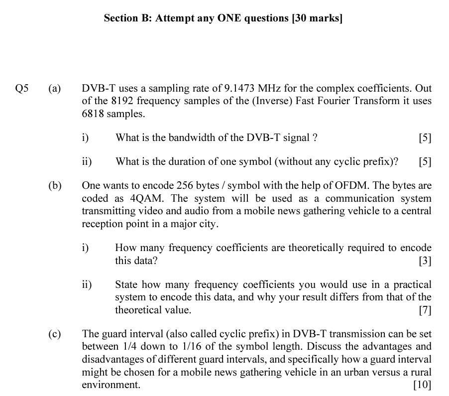

Orthogonal Frequency Division Multiplexing (OFDM
频分复用（Frequency Division Multiplexing，FDM）是一种将多个信息信号同时传输到同一个信道的技术。在FDM中，不同的信息信号被调制到不同的载波频率上，然后这些载波信号通过同一个信道传输。接收端可以通过分离这些不同的载波信号并进行解调来还原出原始信息信号。FDM在广播电视、有线电视、卫星通信等领域得到了广泛应用，可以提高信道利用率，减少信道占用数量，实现信息的高效传输。

## 什么是OFDM
OFDM是一种基于频域的传输技术，通过将整个信号分成多个子信号，每个子信号具有相同的带宽，但在频域上是正交的（即没有互相干扰的频率）。这种技术使得OFDM信号具有很强的抗干扰能力，因为如果其中一个子信号受到干扰，其它子信号不会受到影响。

OFDM is a frequency-domain based transmission technology that divides the entire signal into multiple sub-signals, each with the same bandwidth but orthogonal in the frequency domain (i.e. there is no frequency interference). This technology gives OFDM signals strong anti-interference ability, as if one sub-signal is interfered with, other sub-signals will not be affected.

正交 : 可区分的,两个频率正交就代表这两个频率我们是可以区分的.
频分: 分频
复用: 多个子载波进行<mark style="background: #FFB86CA6;">并行</mark>的传输

# Tutorial
## 2021 Q4

(a)
$$
\begin{equation} \begin{aligned}
C = Blog_2(1+\frac{S}{N})\\
SNR = 8.45dB = 10lg{\frac{S}{N}} --> \frac{S}{N} = 7 \\
C = 36Mbps (bit.per.second) . bit . rate
\end{aligned} \end{equation}
$$

(f)

即使一些子载波不携带数据，拥有2的幂次方的总子载波数量仍然有优势，因为OFDM是在频域上实现的，其中频带被分成子载波，每个子载波用于传输信息。当使用2的幂次方的子载波时，可以更容易地实现快速傅里叶变换（FFT），从而提高OFDM的效率。此外，使用2的幂次方的子载波也可以更好地支持信道编码和解码。因此，OFDM系统通常使用2的幂次方的子载波数量。

Even if some subcarriers do not carry data, having a total number of subcarriers that is a power of 2 is still advantageous because OFDM is implemented in the frequency domain, where the frequency band is divided into subcarriers, with each subcarrier used for transmitting information. When using a power of 2 for the number of subcarriers, it is easier to implement the fast Fourier transform (FFT), which improves the efficiency of OFDM. Additionally, using a power of 2 for the number of subcarriers also better supports channel encoding and decoding. Therefore, OFDM systems typically use a number of subcarriers that is a power of 2.

(g)
对于基于双边带调制的数字通信系统的传输通道，其可用带宽为12 MHz。这个OFDM示例的子载波间距是多少？
子载波间距是频率 suncarrier spacing
OFDM系统的子载波间距可以使用以下公式进行计算：

子载波间距 = 可用带宽 / 子载波数

在OFDM系统中，每个子载波的带宽为子载波间距的倒数，因此子载波间距越小，可以容纳的子载波数量越多，从而提高系统的数据传输率。

根据上述公式，对于具有12 MHz可用带宽的OFDM系统，假设使用4096个子载波，则其子载波间距为：
子载波间距是频率 suncarrier spacing
子载波间距 = 12 MHz / 4096 = 2.93 kHz

因此，这个OFDM示例的子载波间距为2.93 kHz。

(h)
In this example, the subcarrier spacing is 2.93 kHz.

The relationship between the subcarrier spacing and the symbol duration is given by:

Symbol duration = 1 / Subcarrier spacing

Symbol duration = 1 / 2.93 kHz = 341.85 ns

Therefore, the minimum useful symbol length for this OFDM example is 341.85 nanoseconds.
这里我们不考虑guard interval

(i)
在OFDM系统中，子载波间距是相邻子载波之间的频率差异，通常被选择为子载波之间正交，不相互干扰。OFDM子载波间距和OFDM系统的波特率有以下关系：

波特率 = 子载波间距 x 每个子载波携带的比特数

在这个公式中，每个子载波携带的比特数是由调制方案和星座映射方式决定的。例如，在QPSK星座映射下，每个子载波携带2比特的信息。因此，如果使用4096个子载波进行QPSK星座映射，每个OFDM符号携带的比特数为4096 x 2 = 8192比特。

使用前面提到的子载波间距2.93 kHz和每个OFDM符号携带8192比特的信息，我们可以计算OFDM系统的波特率：

波特率 = 2.93 kHz x 8192 = 23.9798 Mbps

因此，对于这个例子，使用4096个子载波和QPSK星座映射的OFDM系统的波特率为23.9798 Mbps
(j)
我们需要在符号间加入gurard interval来分割每个符号. gurard interval的时长一般为symbol时长的$\frac{1}{4}$ 

(k)
由于j问,所以这里的速率应该是原来的速率的$\frac{4}{5}$ 

# 2020 Q5

## 2019 Q6

## 2022_Q5

(f)
$$
\begin{equation} \begin{aligned}
\frac{5M}{1024} = 4883HZ . subcarrierSpacing = baudRate\\
\frac{9M}{4883*1024} = 2 \\
所以是QPSK
\end{aligned} \end{equation}
$$

# Conclusion
滚降滤波器脉冲频谱图:
函数图像必定经过($\frac{1}{2T},0.5$)