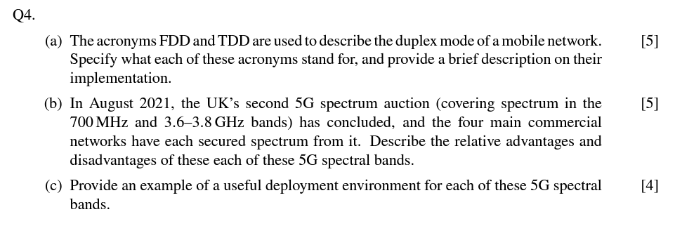
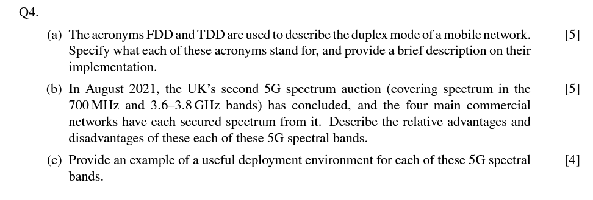

2022 Q4

(a)

FDD 和 TDD 是用于描述移动网络双工模式的缩写词。 FDD 代表 Frequency Division Duplexing，TDD 代表 Time Division Duplexing。在 FDD 中，上行和下行通信使用不同的频率进行，因此需要两个频带，一个用于上行通信，另一个用于下行通信。而在 TDD 中，上行和下行通信在同一个频带上交替进行，使用不同的时间片。

(b)

在2021年8月，英国的第二次5G频谱拍卖（覆盖了700MHz和3.6-3.8GHz频段的频谱）已经结束，四个主要商业网络各自从中获得了频谱。这些5G频谱带的相对优缺点如下：

-   700MHz 频段：具有良好的穿透力和广阔的覆盖范围，适用于提供广泛的室内和室外覆盖，但其带宽较窄，限制了其在高速移动和高密度区域内的性能。
    
-   3.6-3.8GHz 频段：具有较高的带宽，可以支持更高的数据传输速率，但其穿透力较差，覆盖范围较窄，需要在更多的基站上部署以提供良好的覆盖和性能。
    

(c)

以下是每个5G频谱带的一个有用的部署环境示例：

-   700MHz 频段：适用于提供广泛的城市和农村覆盖，以及在建筑物和其他障碍物后面提供更好的室内覆盖。
    
-   3.6-3.8GHz 频段：适用于提供高速移动和高密度区域内的服务，例如城市中心和大型体育场馆。

2021 Q4

(a)

对于以下移动网络系统：GSM、UTMS、LTE和5G eMBB

GSM 和 UMTS 包含电路交换元素和分组交换元素，而 LTE 和 5G eMBB 只包含分组交换元素。

(b)

LTE 和 5G eMBB 都采用 OFDM（正交频分复用）的形式。

(c)

GSM 和 UMTS 使用 TDMA（时分多址）技术，将带宽分成时间片以便多个用户分享同一频段。在某些情况下，它们也使用 FDMA（频分多址）来实现频段共享。

(d)

在LTE系统中，语音通信可以通过 VoLTE（Voice over LTE）技术传输。此外，也可以使用 CSFB（Circuit Switched Fall Back）技术将LTE网络和电路交换技术相结合，以便传输语音通信。