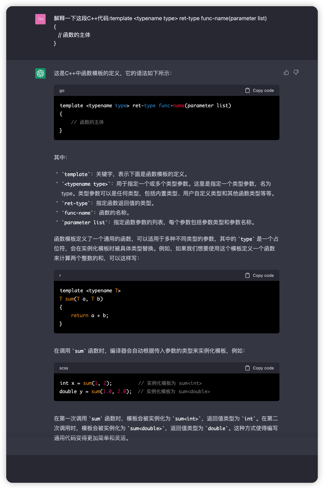

 

# C++

[C++](https://www.runoob.com/cplusplus/cpp-tutorial.html)

[进程与线程](https://www.bilibili.com/video/BV1u5411N7PB/?spm_id_from=333.337.search-card.all.click&vd_source=2f6e531d9d833ca7fdcd8c5bb99bd1bb)

常用网站

https://en.cppreference.com

https://www.cplusplus.com

https://www.tutorialspoint.com/cplusplus

https://www.learncpp.com

https://[github]().com/fffaraz/awesomecpp

https://stackoverflow.com

# g++ 命令行编译器

​​

#  #if 语句 测试语句

# 全局变量与局部变量

在程序中，局部变量和全局变量的名称可以相同，但是在函数内，局部变量的值会覆盖全局变量的值。下面是一个实例：

**当局部变量被定义时，系统不会对其初始化，您必须自行对其初始化。定义全局变量时，系统会自动初始化为下列值：**


---

## mutable 存储类

‍

## thread_local 存储类

# 函数参数

引用传值

向函数传递参数的**引用调用**方法，把引用的地址复制给形式参数。在函数内，该引用用于访问调用中要用到的实际参数。这意味着，修改形式参数会影响实际参数。

指针传值

也会影响到实际参数

# 引用

[引用](https://www.runoob.com/cplusplus/returning-values-by-reference.html)

通过使用引用来替代指针，会使 C++ 程序更容易阅读和维护。C++ 函数可以返回一个引用，方式与返回一个指针类似。

当函数返回一个引用时，则返回一个指向返回值的隐式指针。这样，函数就可以放在赋值语句的左边。例如，请看下面这个简单的程序：

一般来说引用是改变不了被引用变量的值的.

但是当函数返回引用后,其实是返回的一个隐式指针,是可以改变被引用变量

# 结构体

[结构体](https://www.runoob.com/cplusplus/cpp-data-structures.html)

## 定义单个变量

**type_name** 是结构体类型的名称，**member_type1 member_name1** 是标准的变量定义，比如 **int i;** 或者 **float f;** 或者其他有效的变量定义。在结构定义的末尾，最后一个分号之前，您可以指定一个或多个结构变量，这是可选的。下面是声明一个结构体类型 **Books**，变量为 **book**：

```c++
struct Books
{
   char  title[50];
   char  author[50];
   char  subject[100];
   int   book_id;
} book;
```

~~~c++
struct Books
{
	char  title[50];
	char  author[50];
	char  subject[100];
	int   book_id;
} book;

~~~

## 定义多个变量

```c++
struct Books
{
   char  title[50];
   char  author[50];
   char  subject[100];
   int   book_id;
};
 
//这样申明是对的
   Books Book1;        // 定义结构体类型 Books 的变量 Book1
   Books Book2;  
// 但是声明结构体指针变量的时候需要这样声明
struct Books *struct_pointer;//多了一个struct
struct_pointer->title;//应该这样访问结构题指针
```


有一点有问题,那就是既然不用typdef也能直接这样定义变量,那为什么还要typdef?

是不是使用了typdef在定义结构体指针的时候能够节省struct所以会比较方便?

# 类&对象

## 成员函数定义

成员函数可以在外面定义. 用**范围解析运算符 :: 当然也可以在内的里面定义,即便这个函数没有被inline声明,他也是内联函数.**

## 关键字

成员和类的默认访问修饰符是 private。即在不写的情况下是private

protected 只有一点和private不一样,即子类是可以访问和操作被protected保护的函数的.

```c++
#include <iostream>
using namespace std;
 
class Box
{
   protected:
      double width;
};
 
class SmallBox:Box // SmallBox 是派生类
{
   public:
      void setSmallWidth( double wid );
      double getSmallWidth( void );
};
 
// 子类的成员函数
double SmallBox::getSmallWidth(void)
{
    return width ;
}
 
void SmallBox::setSmallWidth( double wid )
{
    width = wid;
}
 
// 程序的主函数
int main( )
{
   SmallBox box;
    Box box1;
    box1.width = 2;//错误
   // 使用成员函数设置宽度
   box.setSmallWidth(5.0);
   cout << box1.width << endl;
   cout << "Width of box : "<< box.getSmallWidth() << endl;
 
   return 0;
}
```

但是想用box1.width访问是错误的.他只是能够被子类访问而已.

可以这么理解:

private proteced关键字修饰的变量只允许这些变量在类的内部被访问.

即box1.width就算是在类额度外部被访问了. 但是用类的函数就不算在外部被访问,因为类的函数是在类的内部的,没有脱离类的内部的范围

‍

# 继承

一个派生类继承了所有的基类方法，但下列情况除外：

* ?基类的构造函数、析构函数和**拷贝构造函数。**
* 基类的重载运算符。
* ?基类的友元函数。

## 重载运算符

重载运算符是指对原来的运算符的操作进行重新定义.

比如 object1 + object2 原来是不对的,因为+是不能操作对象相加的.

但是你可以在object class中重载+这个运算符,指定两个对象相加的时候应该如何操作.

‍

# 多态

[多态](https://www.runoob.com/cplusplus/cpp-polymorphism.html)

?早绑定问题,没有太理解

# ?数据抽象数据数据封装

分不清这两个感觉是一回事.

1

# 接口

有虚函数和纯虚函数之分

类中至少有一个函数被声明为纯虚函数,则这个类就为抽象类

抽象类不能被实例化,必须被子类继承并实现所有的接口,才能实例化.

‍

# 模版



老师在编程中让我们使用的vector应该就是其中的一种针对于数组的模版这个模版可以自动扩展和回收数组.

‍

# Vector
[C++ vector 容器浅析 | 菜鸟教程](https://www.runoob.com/w3cnote/cpp-vector-container-analysis.html)
~~~c
#include <string.h>
#include <vector>
#include <iostream>
using namespace std;
 
int main()
{
    vector<int>obj;
    for(int i=0;i<10;i++)//push_back(elem)在数组最后添加数据 
    {
        obj.push_back(i);
        cout<<obj[i]<<",";
    }
 
    obj.clear();//清除容器中所以数据
    for(int i=0;i<obj.size();i++)
    {
        cout<<obj[i]<<endl;
    }
 
    return 0;
}
~~~
# 多线程之间传递变量
[【C++多线程】传递参数 - Chen沉尘 - 博客园](https://www.cnblogs.com/chen-cs/p/13056703.html)


# auto

auto是遍历,这个只是item只是单纯地copy,如果想改变这个值我们需要使用&取地址符,来改变forecastMap中的函数
# 多线程
## Strut 和 Class继承
[C++ 结构体(struct)的继承\_c++结构体继承\_wangx\_x的博客-CSDN博客](https://blog.csdn.net/wangx_x/article/details/122871368)

struct默认public继承
class默认private继承

但无论哪种继承方式，上面两点都没有改变：

-   1.private 成员只能被本类成员（类内）和友元访问，不能被派生类访问；即使是他的对象也不能访问
~~~c++
private int c;
object.c = 10;//这是错误的
set_c(10);//这是对的
~~~
    
-   2.protected 成员可以被派生类访问。

## join 与 detach
[C++ 多线程join()和detach()的理解\_c++多线程detch怎么销毁\_皮皮#2500的博客-CSDN博客](https://blog.csdn.net/qq_41452267/article/details/105439084)
join
主线程等待线程结束再推出

detach
主线程不等待其他线程结束

但是无论如何,在主线程结束之前都应该调用其中的一种来决定,线程的执行方式.
~~~ c++
#include <iostream>
#include <thread>
using namespace std;

void func()
{
   for(int i = -10; i > -20; i--)
    {
        cout << "from func():" << i << endl;
    }
}

int main()			//主线程
{
	cout << "mian()" << endl;
    cout << "mian()" << endl;
    cout << "mian()" << endl;
	thread t(func);	//子线程
	t.join();		//等待子线程结束后才进入主线程
	return 0;
}
~~~