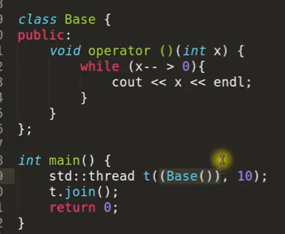
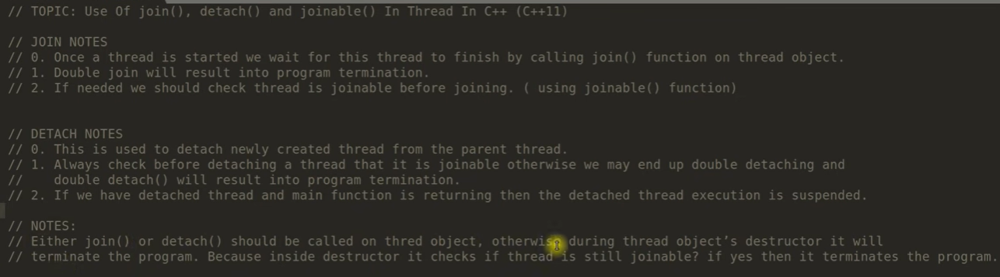
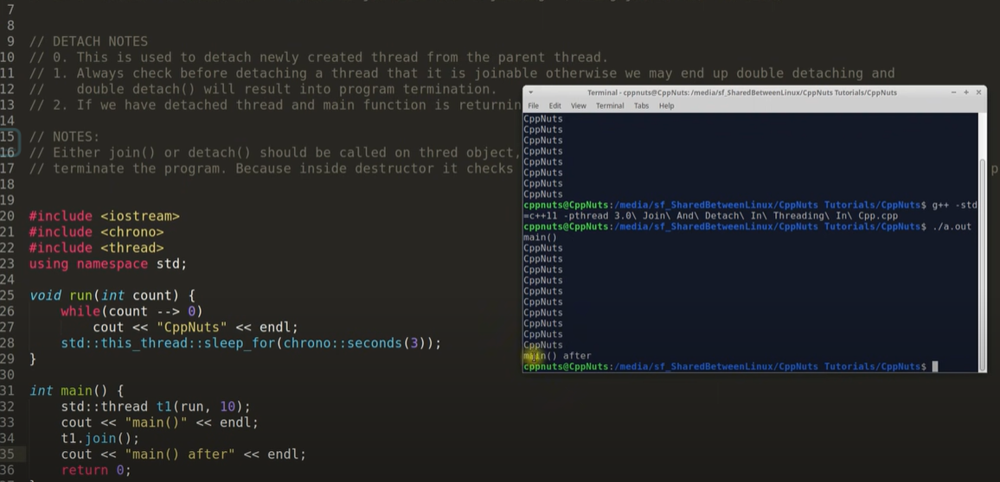
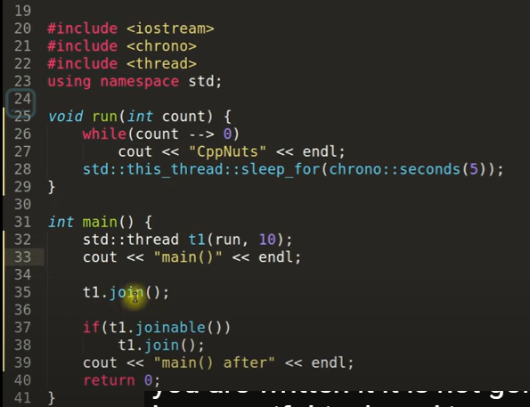
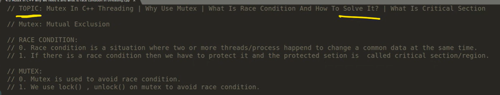
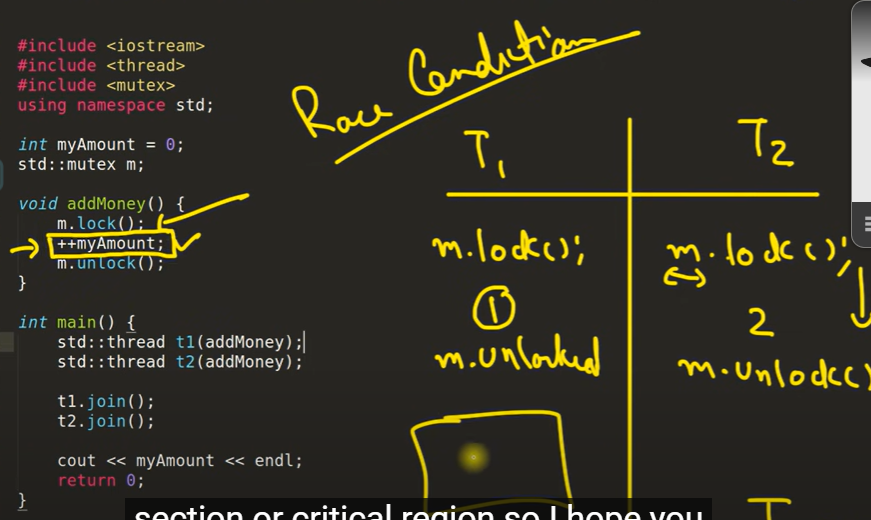
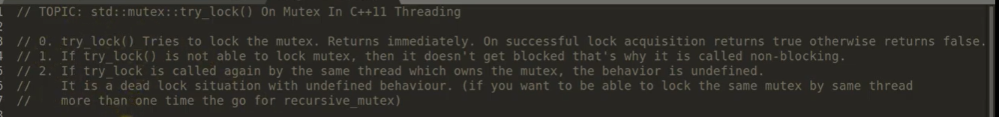
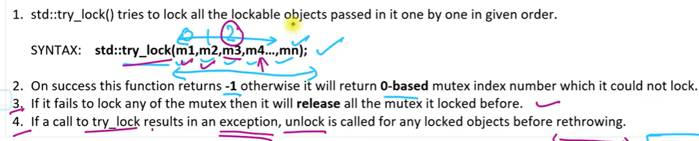

[C++多线程编程 - 掘金](https://juejin.cn/post/6951588297462251557)
[C++ ,ultithread - YouTube](https://www.youtube.com/results?search_query=C%2B%2B+%2Cultithread)

# 1 Introduction

thread只是一个对象,他其中应该包含这些东西.

函数指针:

# 2 Types To Create Threads In C++11
-  [Lumda 表达式](https://www.jianshu.com/p/a200a2dab960)
- 仿函数(_functor_)，就是使一个类的使用看上去像一个函数。其实现就是类中实现一个operator()，这个类就有了类似函数的行为，就是一个仿函数类了。

## 种类
Five different types for creating threads. 
1. Function Pointer -- this is the very basic form of creating threads. 
2. Lambda Function 
3. Functor (Function Object) 
4. Non-static member function
5. Static member function

# 3 Join And Detach With Joinable

~~~text
我们应该在程序中使用join或者detach. 因为线程的析构函数destrctor会检测线程是否是joinable,如果是的话,他就会终止程序.
~~~

main thread will wait at t1.join();

~~~c++
if(thread_1.joinable())
	thread_1.join()
~~~

## detach
OS 需要时间来创建分支线程.但是当分支线程刚创建好,还没来得及执行 main thread就执行结束了.

# 4 Mutex / Mutual Exclusion

## How to use mutx to solve race condition

~~~c++
#include <iostream>

#include <thread>

#include <mutex>

using namespace std;

  

int myAmount = 0;

std ::mutex m;

  

void addMoney()

{

    m.lock();

    ++myAmount;

    m.unlock(); // 这这种锁一次只能锁定一个变量

}

  

int main()

{

    std::thread t1(addMoney);

    std::thread t2(addMoney);

  

    t1.join();

    t2.join();

  

    cout << myAmount << endl;

    return 0;

}
~~~

# 5 Mutex Try Lock

## 6 try_lock 与 lock
try_lock和lock都是互斥锁的方法，它们的主要区别在于锁的获取方式和行为。

lock方法是一种阻塞锁，当一个线程尝试获取锁时，如果锁已经被其他线程占用，那么该线程将被阻塞，直到锁可用为止。这意味着当一个线程获取了锁后，其他线程将无法获取该锁，直到持有该锁的线程释放它。

try_lock方法是一种非阻塞锁，当一个线程尝试获取锁时，如果锁已经被其他线程占用，try_lock方法将立即返回false，而不是阻塞线程。如果锁未被其他线程占用，则try_lock方法将获取锁并返回true。这使得在某些情况下，当无法立即获取锁时，线程可以执行其他任务，而不必等待锁可用。

因此，lock和try_lock方法之间的选择取决于特定的应用场景。如果需要确保在任何情况下都能够获取锁并且没有其他线程占用它，则可以使用lock方法。如果需要在尝试获取锁时避免阻塞线程并且可以处理锁不可用的情况，则可以使用try_lock方法。

## try_lock(m1,m2,m3)

1. ---
2. 如果全部上锁成功返回-1, 失败则返回第几个失败
3. 只要其中有一个失败就会让之前上锁的重新解锁
	顺序应该是: 上锁m1 m2上锁失败, 释放 m1 返回 1.
4. 只要有异常情况,都是先解锁再抛出错误.

