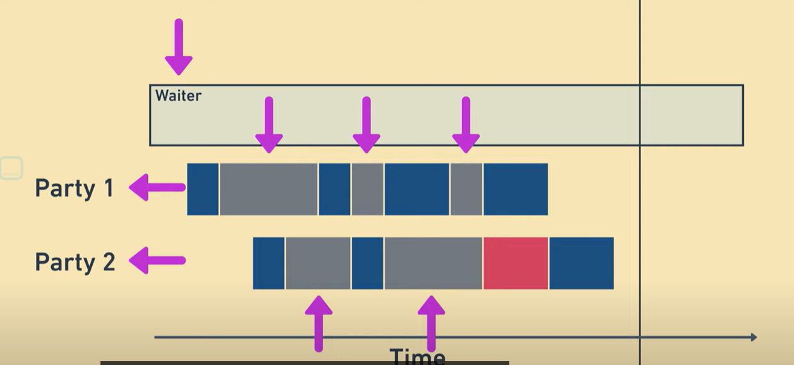
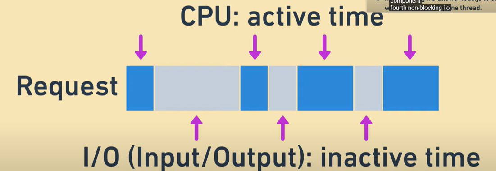
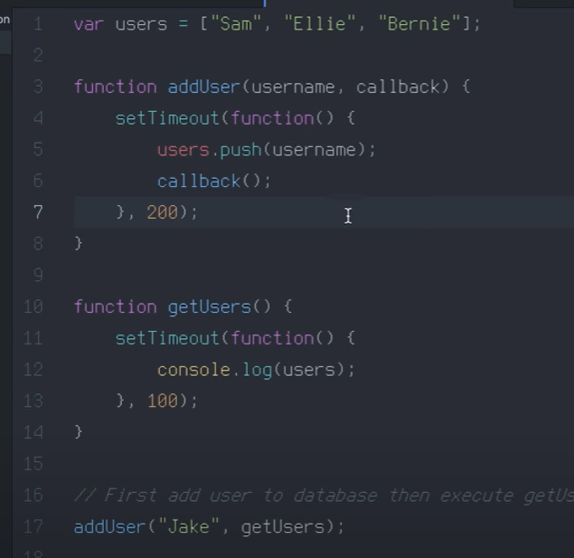

#回调函数与实时性的理解
#回调函数解释
[回调函数](https://blog.csdn.net/Chen4852010/article/details/121011704)

## 阻塞IO
阻塞IO是指在执行一个IO操作（如读取文件、发送网络请求等）时，调用线程会一直等待，直到IO操作完成并返回结果。在这个等待过程中，调用线程会被阻塞，不能执行其他任务。阻塞IO通常会导致程序响应变慢，因为IO操作可能需要花费很长时间。

例如，如果一个程序需要从磁盘读取一个大文件，使用阻塞IO的方式会导致程序在读取文件时一直停滞不前，不能处理其他任务，直到文件读取完成。这可能会导致程序响应变慢，特别是在处理大量IO操作时。

为了解决这个问题，可以使用非阻塞IO或异步IO。非阻塞IO允许调用线程在IO操作执行的同时继续执行其他任务，而<mark style="background: #FFB8EBA6;">异步IO则通过回调函数或异步事件处理器来处理IO操作的结果</mark>，以避免线程阻塞。

---
<mark style="background: #FFB8EBA6;">举例: </mark>
阻塞调用是指调用结果返回之前，当前线程会被挂起。调用线程只有在得到结果之后才会返回。  
非阻塞调用指在不能立刻得到结果之前，该调用不会阻塞当前线程。

还是上面的例子，  
你打电话问书店老板有没有《分布式系统》这本书，你如果是阻塞式调用，你会一直把自己“挂起”，直到得到这本书有没有的结果，如果是非阻塞式调用，你不管老板有没有告诉你，你自己先一边去玩了， 当然你也要偶尔过几分钟check一下老板有没有返回结果。  
在这里阻塞与非阻塞与是否同步异步无关。跟老板通过什么方式回答你结果无关。

---
## 异步IO
#异步I/O
#回调函数将阻塞I/O调用转换为非阻塞I/O #这个行为是不是称之为异步IO?

<mark style="background: #FFF3A3A6;">是的，使用回调函数将阻塞I/O调用转换为非阻塞I/O的行为被称为异步I/O。在异步I/O模型中，程序可以在I/O操作完成之前继续执行其他任务，这样可以提高程序的效率和响应性。相比之下，同步I/O模型中的阻塞I/O调用会阻塞程序的执行，直到操作完成才能继续执行后续任务。</mark>

# Non blocking IO
#非阻塞IO
这里我把线程 比作 waiter
一个请求可以被分为CPU work 和 I/O work

CPU work : 需要线程一直在这里  点餐
I/O work: 只是简单的输出 ,线程可以去忙别的事情  顾客吃东西

他与非阻塞IO的区别就是在系统输入输出的时候是否需要等待

# 自己解释的回调函数

就是将A类中的需要B函数的返回结果的操作分离出去给fucB,然后A继续向下执行.

1.为什么要有回调函数
	1.A函数调用B函数，需要得到B函数返回的结果后，才能往下执行，
	这样必须等到B函数执行完，才能执行下面的操作
	2.如何解决，就是把A函数中，需要得到B函数结果的操作，给funB执行，
	这样funcA就可以执行下面不需要B结果的操作
	3.如何解决：
		在A类中 将 操作片段 x ,封装成一个回调函数，并且准备一个回调接口类包装这个函数
		然后，传给需要执行回调函数的funcB,new 回调接口（）{回调函数的实现}这样funcB就可以拿到，这个回调函数
		同样funcA后面的操作也可以执行了，只需要将 funcB 异步出去即可

2.回调函数和回调接口类的关系
	1.回调函数存在于那个 接口中，那么这个接口就是 回调接口类
	2.有回调函数，就有回调接口类
	3.创建这个 回调接口类的 实现类，给需要执行回调的函数即可
