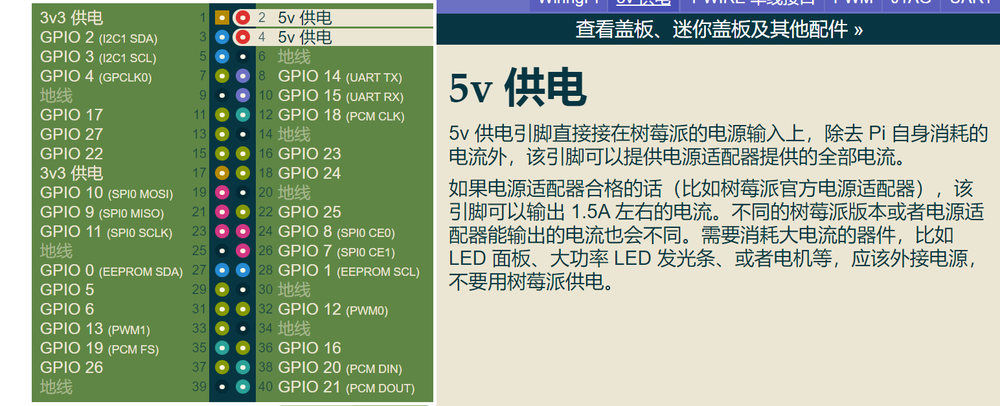
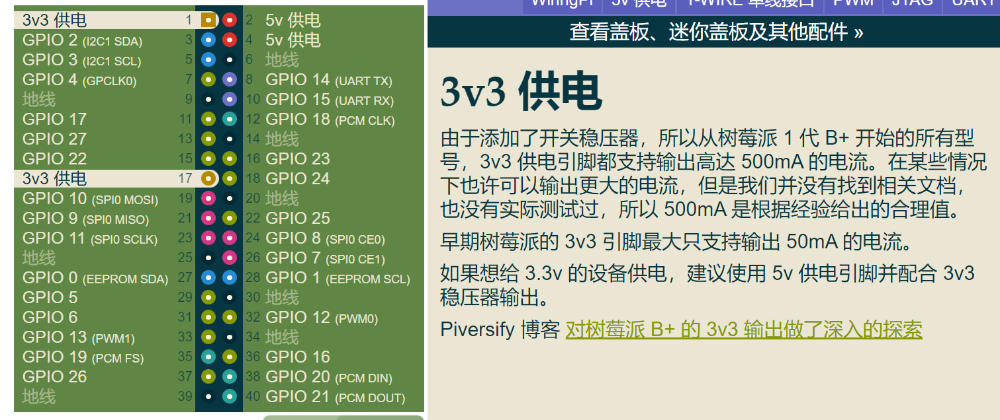

[评分细则](assets/Continuous_Assessment_Work_Realtime_v16.pdf)
1. 首先得把代码写好, 调试好
2. 然后是得制作好模型,再把机器装到模型机上测试
	制作样机:需要延长线,因为本来的杜邦线是不够让样机的各个部位装到合适的位置的. 需要焊接实验室的电线用以延长杜邦线的长度,将器件装到合适的位置.

# 编程建议
- [ ] 所有的数组都用vector 而不是单纯的 int a[]
- [ ] 
那么每天次倒水计时器准时计时 几秒

# 可能会导致零分
1. program goes into wait state and becomes unresponsive

2. using wait statements to establish timing instead of switching threads or load balancing

3. not using callbacks to process events

4. trivial work selling just with public relations but no substance

5. no indication of version control

6. not using C++ as the main coding language (remember scripting is only allowed for web services and apps)

- [ ] 在最后清空main 主分支,然后使用merge 合并分支里的内容.
- [ ] 每次都push一下自己更改的代码然后commit的时候一定要写详细注释.

# Report should contains
- [ ] 确定引脚的电路图
- [ ] 一张使用altium design画的schematic 
- [ ] 最好还能有一份 ciurcuit网站的图
- [ ] 详细解释
	1. github分支
	2. ins的详细介绍
	3. 如何分工
	4. 以及上面的会导致零分几点都要在报告中提到.

# Plan
- [ ] 确定电路图
- [ ] 确定最终程序需要的功能.
- [ ] 查看assessment requirements
[由树莓派引脚定义](https://pinout.vvzero.com/pinout/3v3)

# 评分细则
---

15% 的分数用于作品的推广：项目在 GitHub 上是否被适当地展示，以吸引潜在用户的注意？硬件/软件是否以一种其他人可以重现的方式进行描述？项目是否在社交媒体上进行了宣传，并且是否被 hackaday 等在线出版物所报道？是否已创建社交媒体帐户，并在其周围营造了轰动效应？该项目是否拥有许可证？

这段话是关于作业的评分标准，其中15%的分数用于评估学生在推广作品方面的表现。评分标准主要包括以下几个方面：

-   GitHub 展示：学生需要在 GitHub 上展示自己的项目，使其能够吸引潜在用户的注意。
-   描述方式：学生需要以一种易于理解和重现的方式描述项目的硬件和软件方面。
-   社交媒体宣传：学生需要在社交媒体上宣传自己的项目，并尽可能争取到更多的关注和报道。
-   许可证：学生需要为自己的项目选择一个合适的许可证，以确保其合法性和可重现性。

总之，这个标准要求学生在完成作业的过程中，不仅要注重技术实现方面，还需要关注作品的宣传和推广。这有助于学生在实践中锻炼自己的市场营销和推广能力，提高项目的知名度和影响力。

---
作品的最终提交将占总分的25%，其中基于使用版本控制、提交、分支、创建发布版本、测试和项目规划等方面进行评分。评分将根据展示的明确劳动分工和工作文档进行评定。是否已将 Git 用作版本控制系统，还是只是将其用于上传代码？是否已使用 Git 进行修订、跟踪缺陷并制定发布策略？是否已使用问题跟踪器系统？是否已使用单元测试？

这段话是关于作业的评分标准，其中25%的分数用于评估学生在项目管理和版本控制方面的表现。评分标准主要包括以下几个方面：

-   Git 的使用：学生需要在项目开发过程中，充分利用 Git 作为版本控制系统，进行代码的提交、修订和管理。
-   发布策略：学生需要制定合适的发布策略，保证代码的稳定性和可靠性。
-   问题跟踪器系统：学生需要使用问题跟踪器系统，及时跟踪和解决项目中出现的问题和 bug。
-   单元测试：学生需要使用单元测试，对代码进行测试，保证其质量和可靠性。

总之，这个标准要求学生在项目管理和版本控制方面做得越好，就能够获得越高的评分。通过使用合适的工具和方法，学生可以更好地规划和管理自己的项目，保证其质量和可靠性，同时也有助于提高学生的团队合作和协调能力。

---

作业最终提交的25%的分数将评估软件的实时响应性以及如何实现它。这包括检查事件处理是否通过唤醒线程来实现，并通常使用 "mers、signals、threads 和/或内核空间中断驱动编码等事件驱动代码，而不是使用轮询或其他不太适合的方法。

这段话是指在评估作业时，其中25%的分数将用于考核学生的实时响应性表现。评分标准主要包括以下几个方面：

-   事件处理方式：学生需要使用适当的方法来处理事件，而不是使用轮询等不太适合的方法。
-   线程唤醒：学生需要通过唤醒线程来处理事件，从而实现实时响应性。
-   事件驱动代码：学生需要使用适当的事件驱动代码，如 "mers、signals、threads 和/或内核空间中断驱动编码等，来实现实时响应性。

---

作业最终提交的25%的分数将基于代码的结构方式，即将代码分成类，实现数据封装，以可靠的方式使用数据结构，安全地接收和释放数据，从而保证高可靠性和易维护性。

这段话主要是指，在评估作业时，其中25%的分数将用于考核代码结构方面。评分标准主要包括以下几个方面：

-   类的划分：学生需要将代码划分成类，以实现数据封装。
-   数据结构：学生需要以可靠的方式使用数据结构，以确保代码的安全性和可靠性。
-   数据的接收和释放：学生需要以安全的方式接收和释放数据，以避免潜在的错误。
-   可靠性和易维护性：学生需要保证代码的高可靠性和易维护性，以便更好地维护和修改代码。

---
