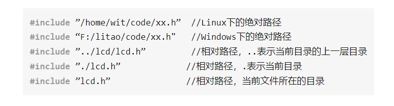
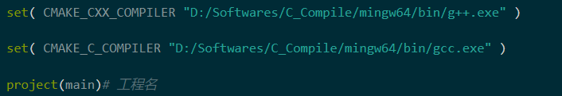

# 安装vscode
sudo apt update   #检查更新
sudo apt upgrade  #进行更新
sudo apt install code -y  #安装VScode

# C语言头文件路径解析

[嵌入式C语言自我修养 15：C语言头文件路径剖析 - 知乎](https://zhuanlan.zhihu.com/p/159432310)
[5分钟理解make/makefile/cmake/nmake - 知乎](https://zhuanlan.zhihu.com/p/111110992)
# windows下Cmake错误
## 错误一
```text
'nmake' '-?'

  failed with:

   系统找不到指定的文件。
```
nmake file 错误

[CMake on Windows Tutorial 1 - 知乎](https://zhuanlan.zhihu.com/p/497839595)
这个是生成器问题

我这里默认使用了mingw生成器,因此在执行cmake .. 时应该再加上-G "MinGW Makefiles
变为
~~~text
cmake .. -G "MinGW Makefiles" #这样写就对了
~~~

## 错误2
#make : 无法将“make”项识别为 cmdlet、函数、脚本文件或可运行程序的名称。
因为mingw-make.exe 的文件命名问题
<mark style="background: #FFB8EBA6;">这个图片其实是错误的应该将 make 改为mingw32-make就行了</mark>

## 错误3
Multiple definitions error in C++
这是因为再cmakelist中也包含了#include<.cpp>文件,实际上只要你在源文件中包含了其他的源文件.那么你在cmakelist中就不用再包含其他的源文件.

# Cmake
[Cmake_手册](https://gavinliu6.github.io/CMake-Practice-zh-CN/#/common-var)
[Cmake Instrcutors](assets/CMake%20Practice.pdf)
[Cmake_最基本用法](https://www.bilibili.com/video/BV1Po4y1y7nV/?spm_id_from=333.880.my_history.page.click&vd_source=2f6e531d9d833ca7fdcd8c5bb99bd1bb)
1. 根据系统安装Cmake  安装编译器
[C/C++头文件的引用问题（#include使用）\_c引用c++头文件\_保护大苹果和橙子的博客-CSDN博客](https://blog.csdn.net/vito_7474110/article/details/81911990)
## makelist和src在同一文件夹下
## demo1
单个源文件

cmake  . 在makelist当前目录下打开 .表示当前目录


## demo2
多个源文件


. 表示当前工程文件
变量名 ${} 这个来表示

## demo3  我们使用的目录结构
src build include 


```cmake
cmake_minimun_required(VERSION 3.10)

project(main)# 工程名

include_directories(include) #包含头文件目录

# set(SOURCE main.cpp)

file(GLOB SOURCE "src/*.cpp" "main.cpp")# 源文件下所有的 cpp文件 和主程序

add_executable(main ${SOURCE})
```
cmake .. 是上级文件 .. 上级文件 cmake执行上级文件
cd build中 执行cmake ..
make


## 遇到的问题
CMake Error: CMAKE_C_COMPILER not set, after EnableLanguage
CMake Error: CMAKE_CXX_COMPILER not set, after EnableLanguage
-- Configuring incomplete, errors occurred!

[c++ - CMAKE\_C\_COMPILER not set, after EnableLanguage - Stack Overflow](https://stackoverflow.com/questions/70524164/cmake-c-compiler-not-set-after-enablelanguage)


## 如何查看GCC GCC++的版本号
gcc --version
g++ --version

# Cmake Problem
[Cmake Problem](assets/截图_20230225141640.png)
[Problem2](assets/截图_20230225142718.png)
ld means link error


# vscode联合编译出错
其他的都是是虚拟的文件夹
联合编译确实需要重新配置

[VScode如何编译多个.C文件\_vscode编译多个c文件\_CaptainSCH的博客-CSDN博客](https://blog.csdn.net/piaoyulengse/article/details/120631819)

