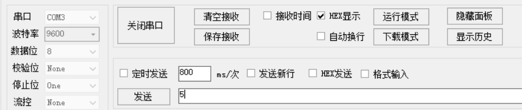
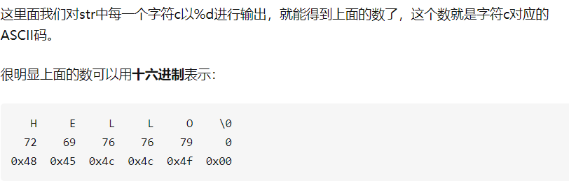

[pigpio library](http://abyz.me.uk/rpi/pigpio/cif.html)
[树莓派快捷键](https://blog.csdn.net/weixin_38556197/article/details/109268095)
[树莓派文件系统查看与清理垃圾箱](https://blog.csdn.net/kyokozan/article/details/79018307)

~~~c
//-----------------
set_mode(0, 2, PI_OUTPUT)
gpio_write(0, 2, 1)
~~~

# 编译
## 命令行

~~~c
g++ -Wall -pthread -o executeable_name project_name.cpp -lpigpio -lrt
//这个是用于只有单个源文件的.
~~~

## CMakeLists
~~~cmake
cmake_minimum_required(VERSION 3.10.0)

#set( CMAKE_CXX_COMPILER "D:/Softwares/C_Compile/mingw64/bin/g++.exe" )  

#set( CMAKE_C_COMPILER "D:/Softwares/C_Compile/mingw64/bin/gcc.exe" )  

project(main)# 工程名 

find_library(WIRINGPI_LIBRARIES NAMES wiringPi)

find_library(PIGPIO_LIBRARIES NAMES pigpio)

include_directories(include) #包含头文件目录

# file(GLOB SOURCE "src/*.cpp" "main.cpp")# 源文件下所有的 cpp文件 和主程序

add_executable(main "main.cpp" "../src/hcsr04.cpp" "../src/TimeUtils.cpp" )

target_link_libraries(main ${WIRINGPI_LIBRARIES})

target_link_libraries(main ${PIGPIO_LIBRARIES})

# 需要执行的cpp才写在这里面 class这种不需要执行的cpp就不用写在这里面
~~~

# Generate PWM Pulse

# 串口
[树莓派串口在图形界面的设置](https://zhuanlan.zhihu.com/p/106904186)
[完美解释读数据需要延迟](https://blog.csdn.net/zouxin_88/article/details/109724688)
- [x] 发一个字节
- [x] 收一个字节
- [x] 发多个字节
- [ ] 收多个字节
~~~c++
int main()
{
    if(gpioInitialise() < 0){cout << "GPIO initializing failed. Try again asshole." << endl;}
    int USBHandle = serOpen("/dev/ttyS0",115200,0);
    cout << "USBHandle = " << USBHandle<< endl;

    roombaWake();

    serClose(USBHandle);
    gpioTerminate();
    return 0;
}
void roombaWake()
{
    int R1 = 23;
    gpioSetMode(23, PI_OUTPUT);
    gpioWrite(R1, 0);
    gpioSleep(PI_TIME_RELATIVE,0,1000);
    gpioWrite(R1, 1);
    gpioSleep(PI_TIME_RELATIVE,0,100);

    cout << "relay click?" << endl; //so I know that roombaWake() is in fact being called
 
}

~~~

cout << serilaRead(x)
是以十进制形式展示字符

发也要发hex 例如 06

~~~text
发数据: 对

收数据: 错
	错在: 先收到正确的数据,接下来的数据就出错了
	例如: 一直发06 一开始收到06 后来收到三个 234 再收到06
这是因为
~~~

~~~c++
while(1){
	if(flag)
	{
		cout<<read();
		delay(1ms);
	}
}
/*这个出错的主要原因就是: 

一直读其实从缓冲区读也需要时间的,没读完又读下一个会产生错误,本身这样是没事的. 加上延时就好. 之前缓冲区的数据没读完就会一直产生错误. 这个从缓存器里面读取数据是一个硬件操作,这本身是需要时间的.虽然很短.

其实就是标志位使用错误 available 使用错误
*/
~~~

## 串口软件的使用

不勾选 使用HEX发送

就是 发生ASCII码,其实也就是10进制数据.

勾选 使用HEX码就是发送16进制

06 - > 就相当于6

ASCII  H 就是ASCII码 H
HEX    发H其实是发48
因为H的ASCII码是 72

### 中文输入法安装
~~~linux
sudo apt-get install fcitx fcitx-pinyin fcitx-googlepinyin
sudo reboot
~~~