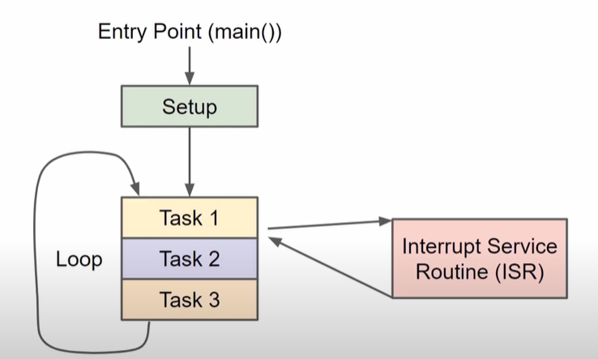
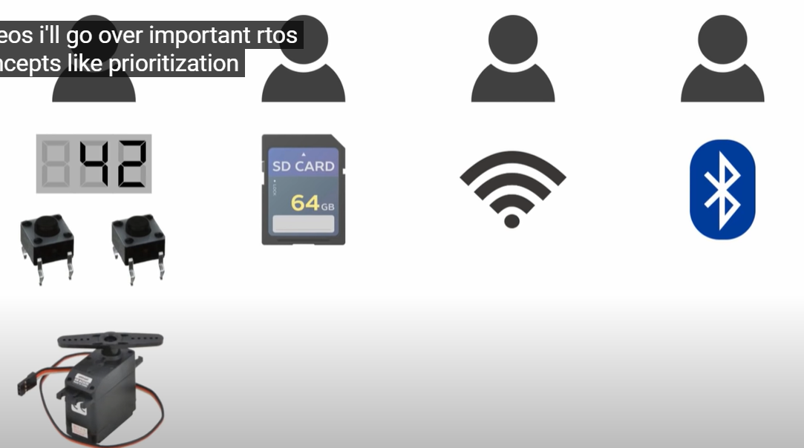

一个具有两个C++类的实时系统。类之间的通信是通过回调（而不是getter）来实现的，用于接收传入事件，而使用setter来发送控制事件。控制输出本身从事件中接收其时间，以便尽快遍历循环。

这段话描述了一个实时系统，该系统由两个C++类组成。这些类之间的通信是通过回调函数实现的，而不是使用getter或setter方法。回调函数用于接收传入事件，而setter用于发送控制事件。控制输出本身从事件中接收其时间，以便尽快遍历循环。换句话说，这个系统使用回调函数来通知其它类发生了什么事情，而不是查询获取信息。这种方法使系统能够快速响应事件并实现尽可能快的循环。

例子:

假设我们有一个实时系统，其中包含两个类：一个是传感器类，另一个是控制器类。传感器类通过回调函数将传感器数据传递给控制器类，控制器类使用setter方法向传感器发送控制命令，例如控制机器人运动方向。

具体来说，当传感器类检测到环境中的变化时，它将调用控制器类中的回调函数并传递传感器数据。然后，控制器类使用setter方法将控制命令发送回传感器，以便它可以控制机器人的运动方向。控制输出本身将通过事件接收其时间，以便在最短时间内遍历循环并使机器人响应环境中的变化。

这种方式可以实现实时响应并减少系统的延迟，因为回调函数可以在事件发生时立即调用，而不必等待查询。

<mark style="background: #FFB8EBA6;">这种方式可以实现实时响应并减少系统的延迟，因为回调函数可以在事件发生时立即调用，而不必等待查询。 所以这个是系统中实时的体现?</mark>

是的，这种方式可以实现系统的实时性，因为回调函数可以在事件发生时立即调用，而不必等待查询。系统可以根据传感器数据实时地生成控制命令并将其发送回传感器，从而使系统能够快速响应环境变化并执行所需的操作。

相比之下，使用查询（getter）方法进行通信可能会导致延迟，因为必须等待另一个类或组件的响应才能继续执行代码。这可能会导致系统的响应速度变慢，并且在实时应用中可能会产生错误。因此，使用回调函数进行通信可以提高系统的实时性和响应速度。

事件发生时自动调用

在一个while forever loop中轮询.
Task2 是一个 返回温度的 sensor 需要两秒

Task3 是一个 显示屏的 函数

Taks2

