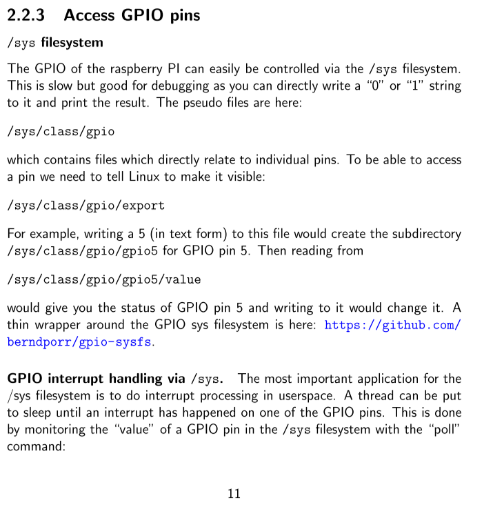

[RealTimeEmbeddedCoding](assets/realtime_embedded_coding%20zh.pdf)
39Pages
# Introduction
## Interface Segregation principle: 
Keep functionality separate and aim to divide it up in di↵erent classes. Imagine you have a universal IO class with SPI and I2C but your client really just needs SPI. Then the client is forced to deactivate I2C or in the worst case the class causes collateral damage
without the client knowing why.
<mark style="background: #FFB86CA6;">意思是你的IO口的IIC和SPI功能别写在一块.比如这个IO class 可以同时操控IIC或者SPI,但是你操控IIC的时候不能影响SPI. </mark>  还是不太懂

## 阻塞IO
阻塞IO是指在执行一个IO操作（如读取文件、发送网络请求等）时，调用线程会一直等待，直到IO操作完成并返回结果。在这个等待过程中，调用线程会被阻塞，不能执行其他任务。阻塞IO通常会导致程序响应变慢，因为IO操作可能需要花费很长时间。

例如，如果一个程序需要从磁盘读取一个大文件，使用阻塞IO的方式会导致程序在读取文件时一直停滞不前，不能处理其他任务，直到文件读取完成。这可能会导致程序响应变慢，特别是在处理大量IO操作时。

为了解决这个问题，可以使用非阻塞IO或异步IO。非阻塞IO允许调用线程在IO操作执行的同时继续执行其他任务，而<mark style="background: #FFB8EBA6;">异步IO则通过回调函数或异步事件处理器来处理IO操作的结果</mark>，以避免线程阻塞。

# Chapter 2 Writing C++ device driver classes
## SPI

## IIC
You can scan a bus with i2c detect (part of the i2c-tools package)

老师的建议是下载这个库,来使用IIC.但是如果wiringpi能够使用的话就没有必要下载这个库了,有必要,老师建议.
~~~c
sudo apt-get install libpigpio-dev
~~~
都没有为c++写专门的库,c++用的就是c的库.
## GPIO
[WiringPi VS pigpio](https://ericgoebelbecker.com/post/raspberry-pi-robot-programming-motors/)
[pigpio library](https://abyz.me.uk/rpi/pigpio/index.html)
[各种语言使用各种库操作gpio例程 仅包含PIO](https://elinux.org/RPi_GPIO_Code_Samples)
[pigpio library 各种使用GPIO的例程](http://abyz.me.uk/rpi/pigpio/examples.html#C++%20code)
[Official pigpio library](http://abyz.me.uk/rpi/pigpio/cif.html)
老师的建议是使用pigpio
1. wirlingpi 的作者已经停止更新
2. 不像wiringpi使用函数 pigpio是使用类来操作端口的,这样的话在操作的时候就方便对不同的端口给予不同的类名,从而达到区分端口的作用.
~~~c++
//wiringpi
import time
import wiringpi

wiringpi.wiringPiSetup()

wiringpi.digitalWrite(26, 1)
time.sleep(.5)
wiringpi.digitalWrite(26, 0)
wiringpi.digitalWrite(26, 1)
time.sleep(.5)
wiringpi.digitalWrite(26, 0)

// pigpio
import time
import pigpio

pi = pigpio.pi()
pi.set_mode(12, pigpio.OUTPUT)

pi.write(12, 1) 
time.sleep(.5)
pi.write(12,0)
pi.write(12, 1) 
time.sleep(.5)
pi.write(12,0)

~~~
## /sys文件系统
这个是就是说树莓派所有的硬件都可以通过这个来操控,但是由于他不是编程语言,所以不能用来写树莓派程序.
`/sys` 文件系统是 Linux 内核提供的一种虚拟文件系统，用于提供有关系统硬件和设备的信息以及控制这些硬件和设备的操作。

/sys 文件系统是一种包含众多目录和文件的虚拟文件系统，其中包含有关硬件和设备的信息。在 Linux 系统中，每个设备都可以在 `/sys` 文件系统中以文件的形式表示。例如，硬盘可以在 `/sys/block/sda` 目录下找到，网卡可以在 `/sys/class/net/eth0` 目录下找到。

通过/sys 文件系统，用户可以获取系统硬件和设备的详细信息，例如，硬件的供应商、型号、状态等等。此外，用户还可以通过/sys 文件系统控制硬件和设备，例如，打开或关闭网卡、修改系统时钟频率等等。

在树莓派上，用户可以使用/sys 文件系统来控制 GPIO 引脚，通过在/sys 文件系统中创建和修改虚拟文件，例如 `/sys/class/gpio/export`、`/sys/class/gpio/gpioXX/direction` 和 `/sys/class/gpio/gpioXX/value`，来控制 GPIO 引脚的输入和输出。

## GPIO Interrupt
A thread can be put to sleep until an interrupt has happened on one of the GPIO pins. This is done by monitoring the “value” of a GPIO pin in the /sys filesystem with the “poll” command
## Callback 回调函数[获取数据]
[C 语言回调函数详解 | 菜鸟教程](https://www.runoob.com/w3cnote/c-callback-function.html)
- [ ] [老师的回调参数写法,以及如何注册](https://github.com/berndporr/rpi_AD7705_daq)
- [ ] [第二种办法](https://github.com/berndporr/rpi_ads1115 )
<mark style="background: #FF5582A6;">回调函数就是函数指针的用法</mark>
~~~c
#include<stdio.h>  
  
int Callback_1() // Callback Function 1  
{  
    printf("Hello, this is Callback_1 ");  
    return 0;  
}  
  
int Callback_2() // Callback Function 2  
{  
    printf("Hello, this is Callback_2 ");  
    return 0;  
}  
  
int Callback_3() // Callback Function 3  
{  
    printf("Hello, this is Callback_3 ");  
    return 0;  
}  
  
int Handle(int (*Callback)())  
{  
    printf("Entering Handle Function. ");  
    Callback();  
    printf("Leaving Handle Function. ");  
}  
  
int main()  
{  
    printf("Entering Main Function. ");  
    Handle(Callback_1);  
    Handle(Callback_2);  
    Handle(Callback_3);  
    printf("Leaving Main Function. ");  
    return 0;  
}
~~~

~~~c++
#include <iostream>
#include <vector>

// 回调函数类型
using Callback = void (*)(int);

// 遍历整数数组并对每个元素执行回调函数
void traverse(const std::vector<int>& arr, Callback callback) {
    for (int i : arr) {
        callback(i);
    }
}

// 回调函数实现
void print(int num) {
    std::cout << num << std::endl;
}

int main() {
    std::vector<int> arr = {1, 2, 3, 4, 5};
    traverse(arr, print); // 使用回调函数打印数组中的每个元素
    return 0;
}

~~~

## 难点
---
<mark style="background: #FFB86CA6;">SPI和IIC中的这两个没看懂,为什么需要用file</mark>

ioct1是什么函数?

---
老师在pdf中提到了gpio的操作方法

<mark style="background: #FFB86CA6;">难道他是不想让我们用第三方库而是想让我们自己写库吗?</mark>

---
什么是sys 文件系统
/sys filesystem

---
线程中断的关系,我们能够使用中断吗?
线程就是中断,可以同时使用,还是说我们这个实验只能使用线程不能使用中断?

# Chapter 3 Thread
## 进程和线程的区别
进程和线程是操作系统中的两个重要概念，它们之间的区别如下：

1.  定义：进程是操作系统资源分配的最小单位，是一个正在执行中的程序，具有独立的内存空间和系统资源；线程是进程内的一个独立执行单元，也称为轻量级进程，它可以共享进程的资源。
    
2.  调度：进程需要操作系统调度，使用 CPU 的时间片轮流执行；线程也需要操作系统调度，但是它们共享所属进程的时间片，多个线程可以同时执行。
    
3.  并发性：进程间相互独立，各自拥有独立的内存空间和系统资源，可以并发执行；线程共享所属进程的资源，因此它们之间的并发性更高。
    
4.  内存：进程拥有独立的地址空间，进程间的通信需要通过进程间通信(IPC)来实现；线程共享所属进程的地址空间，因此它们之间可以直接访问进程的共享内存。
    
5.  开销：进程的创建和销毁开销较大，因为每个进程都需要独立的系统资源；线程的创建和销毁开销较小，因为它们共享所属进程的资源。
    

综上所述，进程和线程都是并发执行的基本单位，但是它们在内存、调度、并发性、开销等方面存在一些区别。在设计程序时需要根据具体的需求来选择进程或者线程。
