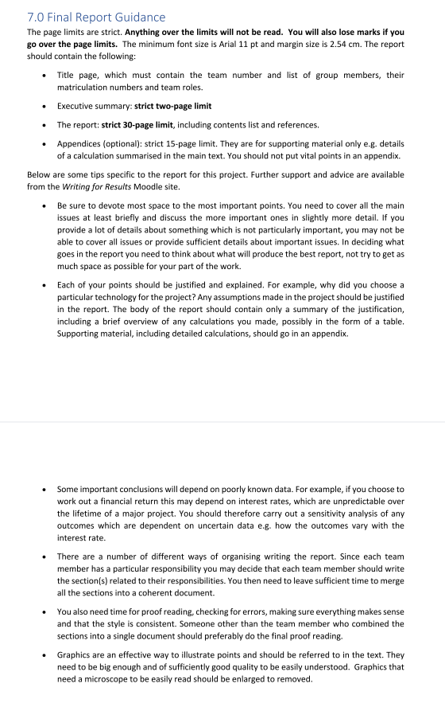

# What the report should contains

这个是老师的要求,我们找材料的时候应该找这7方面的材料:
This is the teacher's requirement. When we look for materials, we should search for materials from these 7 aspects:

efficiency
cost
impact
sustainability ......

# Plan to 17 March
还是先找材料,但是我们每周就是开会看看大家找的材料确保最后大家找的材料是可以使用的,没有做无用功.

We should still start by looking for materials, but every week we will have a meeting to review the materials that everyone has found to ensure that the materials are useful and that no effort has been wasted.

# School Library
这是图书馆官网的网址我们可以在上面查找我们需要的材料.当然其他网站的资料也可以.
This is the website address of the library's official website where we can search for the materials we need. Of course, we can also use materials from other websites.
[University of Glasgow - MyGlasgow - Library](https://www.gla.ac.uk/myglasgow/library/)

# Report Requirements

# 不想看英文文档?
可以把找到的英文文档发给我,我开了翻译网站的会员可以给大家翻译成中英文对照版本的.

# Report Content Lists [To be changed]
~~~text
Title Page 封面页 1 Page

Executive Summary 1 - 2 Page

Content Tables 目录 1 - 2 Pages

Absract / Introduction 摘要 ? 是不是和 Executive Summary 一样?

Improve Energy Efficiency 7 Pages
	Improve the efficiency of eletric energy utilization
		How to do
		Advantages
		Chanllenges
	Increase the cable cross_sectional area
		How to do
		Advantages
		Chanllenges
	Increase Power Factor
		How to do
		Advantages
		Chanllenges
	

Promote Renewable Energy 7 Pages
	Solar Power
		How to do
		Advantages
		Chanllenges
	Wind Energy
		How to do
		Advantages
		Chanllenges
		
Engineering Challenge 7 Pages
	 Challenge_1
​		Whats it is
​		How it rise up
​		How to deal with it

​	 Challenge_2
​		Whats it is
​		How it rise up
​		How to deal with it

Conclusion 1 to 2Pages

Appendix 附录