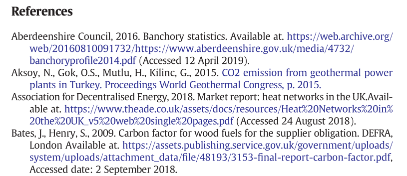

GHG Green House Gas 温室气体
如何整理查到的材料:
我们论文的引用格式使用APA 7th格式 这个格式和APA兼容
大家在找资料时一定要保存好出处.
17号我们开始写自己的部分,或者大家可以现在就开始写自己的部分
If you want you can write your parts now.
So make sure you know where the documents come from.
[APA references Example](https://www.simpletense.com/blog/citation-styles/)
To unify the format:
References format, we use APA 7th like this:

And I will give a PDF to be the References format template. You can see the references format in that PDF.

For references, We will use APA 7th.
It will be very easy for us to use APA 7th references if will use some tools such as <mark style="background: #FFB8EBA6;">endnote </mark>to help us do that.
The install package of Endnote and how to use it will be shown in the short vedio.

# The outline for Report
~~~text
Cover Page 封面页

Content Tables 目录

Absract / Introduction 摘要 

Improve Energy Efficiency
	Improve the efficiency of eletric energy utilization
		How to do
		Advantages
		Chanllenges
	Increase the cable cross_sectional area
		How to do
		Advantages
		Chanllenges
	Increase Power Factor
		How to do
		Advantages
		Chanllenges
	

Promote Renewable Energy
	Solar Power
		How to do
		Advantages
		Chanllenges
	Wind Energy
		How to do
		Advantages
		Chanllenges
		
Engineering Challenge
	 Challenge_1
​		Whats it is
​		How it rise up
​		How to deal with it

​	 Challenge_2
​		Whats it is
​		How it rise up
​		How to deal with it

Conclusion

Appendix 附录
~~~