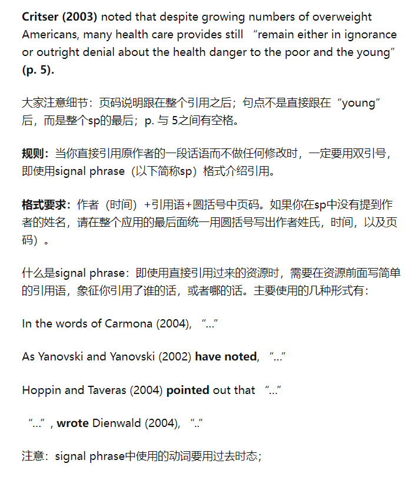

$$u = u_{ref}((\frac{z}{z_{ref}})a)$$

# 关于在文中引用APA格式
## 图片引用

图片引用先暂时这样我还没搞清楚

## 在文中引用作者的话
~~~text
如果是改写作者的话,比如这话虽然是作者说的但是你改写了.
不用对这段话加引号: "xxxxx"

如果这段话就是作者的原话 你需要加上引号 " xxxxxx ":
Rezk and Eltamaly (2015) focused on the response and accuracy of various MPPT algorithms under rapidly changing climatic conditions.

According to a research which focused on the response and accuracy of various MPPT algorithms under rapidly changing climatic conditions (Rezk and Eltamaly, 2015).

Rezk and Eltamaly (2015) said : "  原话 ------------- "

--------作者超过两个---------
Majdi et al. (2021) also clearly pointed out in the article that today’s solar panel maintenance usually adheres to the concept of replacing it when it breaks.
~~~