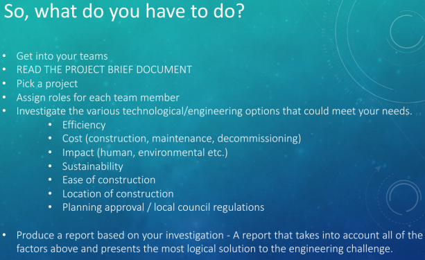

[University of Glasgow - MyGlasgow - Library](https://www.gla.ac.uk/myglasgow/library/)
重新更新了报告的要求,我们的最终报告应该就按照这个来写.
我们的引用格式是APA

每个人大概只要写3-4页就可以了,放点图片文字就可以写的很少,但是下面的七个因素应该在网上查资料,至少在报告中有所提到. 

Improve Energy Efficiency 中的challenge会被单独拿出来放在engeneering challenge部分,用来写这些challenge的解决方法,所以Improve Energy Efficiency 中的challenge会部分可以不写解决办法,只写遇到哪些工程挑战.

最好能在24号的时候我们大家合一次报告,然后开始商量一起需要写的部分. 统一一下格式.

We have updated the requirements for the report, and our final report should be written according to these new requirements. Our citation format is APA.

Each person only needs to write about 3-4 pages, which can be shortened with the use of images and text. However, the following seven factors should be researched online and at least mentioned in the report.

The challenges in improving energy efficiency will be singled out and placed in the engineering challenge section, where the solutions to these challenges will be discussed. Therefore, the challenges in improving energy efficiency can be briefly mentioned without solutions, only describing the engineering challenges encountered.

It would be best if we could combine our reports and discuss which parts we need to write together. Let's also standardize the format.

~~~text
这个是老师的要求,我们找材料的时候应该找这7方面的材料: 
This is the teacher's requirement. 
When we look for materials, we should search for materials from these 7 aspects: 

Efficiency 
Cost（construction,maintenance,decommissioning）
Impact（human,environmentaletc.）
Sustainability
Ease of construction
Location of Construction
Planning approval / Local council regulatuons

------Produce a report based on your investigation-A report that takes into account all of the factors above and presents the most logical solution to the engineering challenge.-----

老师说我们需要写上面提到的所有因素,但是我觉得我们估计调查不到这么多,我们选几个写就好了.
The teacher said we need to write down all the factors mentioned above, but I think we probably won't be able to investigate so many, so let's just choose a few to write about.
~~~

This is the outline of our Report:

Our mentor said : It is a reasonalbe outline. So we can now write the repor according to this outline.
~~~text
How to write the part Chanllenges : 

在这个部分我们写会遇到的挑战,比如和别的比起来造价过高, 材料难获取, 不好实施...etc
我们从这里面选两个Chanllenges放到最后面的 Engineering Challenge 里面.
比如: 节约能源需要统计能源,查看能源消耗 怎么去实施?

1. 自己设计一款app能岁随时查看电量消耗,但是硬件[电表需要联网/或者人手工统计],以及哈看电量的app怎么设计.
2. ............

---------------------------- Outline Part ------------------------------------
Title Page 封面页 1 Pages

Executive Summary 1 Pages

Content Tables 目录 1 Pages

Absract / Introduction 摘要 ? 是不是和 Executive Summary一样?

Improve Energy Efficiency // 6 Pages  这个下面选两个方向写 一个方向三页差不多
	Improve the efficiency of eletric energy utilization
		How to do
		Advantages
		Chanllenges
	Increase the cable cross_sectional area
		How to do
		Advantages
		Chanllenges
	Increase Power Factor
		How to do
		Advantages
		Chanllenges
	
Promote Renewable Energy // 6 Pages
	Solar Power
		How to do
		Advantages
		Chanllenges
	Wind Energy
		How to do
		Advantages
		Chanllenges
		
Engineering Challenge // 4 Pages
	 Challenge_1
​		Whats it is
​		How it rise up
​		How to deal with it

​	 Challenge_2
​		Whats it is
​		How it rise up
​		How to deal with it

Carrbon Accounting // 3 Pages
	How to do
	Advantages
	Chanllenges

Green House //3 pages
	How to do
	Advantages
	Chanllenges
	
Conclusion // 1 Pages
	对比以上的所有方法找出,选出一个最合适的,并说说其他几个为什么不合适.
	"Among all the methods compared above, choose the most suitable one and explain why the others are not suitable."
	
Appendix 附录 // 1 Pages
---------------------------- Outline Part ------------------------------------
~~~

# 需要更改大纲 
~~~text
我们只需要调查上面的factor,然后展示出来. 在最后的Conclusion中我们选一个这些factor里最合理的 [比如:价格最便宜,最容易建造的等等].
~~~

# The tools which helps us use APA refernce
## How to cite a website
[5种方法来按照APA格式引用英文网址](https://zh.wikihow.com/%E6%8C%89%E7%85%A7APA%E6%A0%BC%E5%BC%8F%E5%BC%95%E7%94%A8%E8%8B%B1%E6%96%87%E7%BD%91%E5%9D%80)
[4 Ways to Cite a Website in APA - wikiHow](https://www.wikihow.com/Cite-a-Website-in-APA)

## The tools which can help us
[Cite This For Me: Harvard, APA, MLA Reference Generator](https://www.citethisforme.com/)
