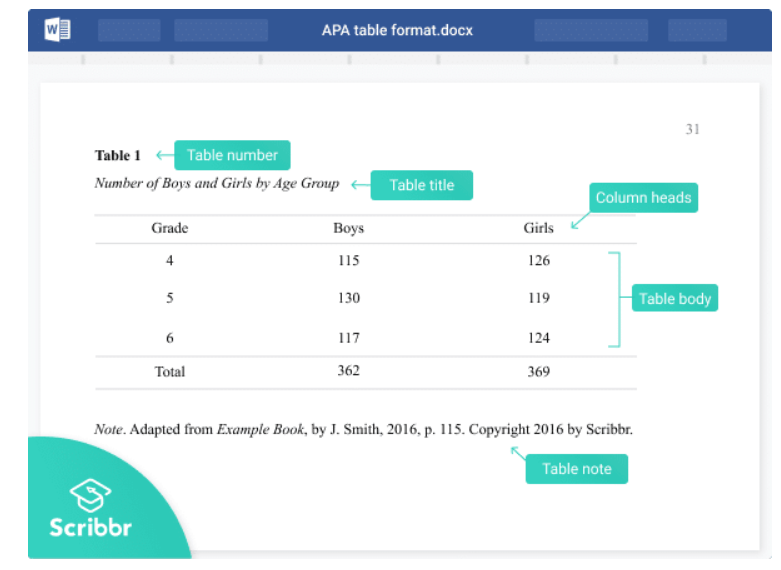
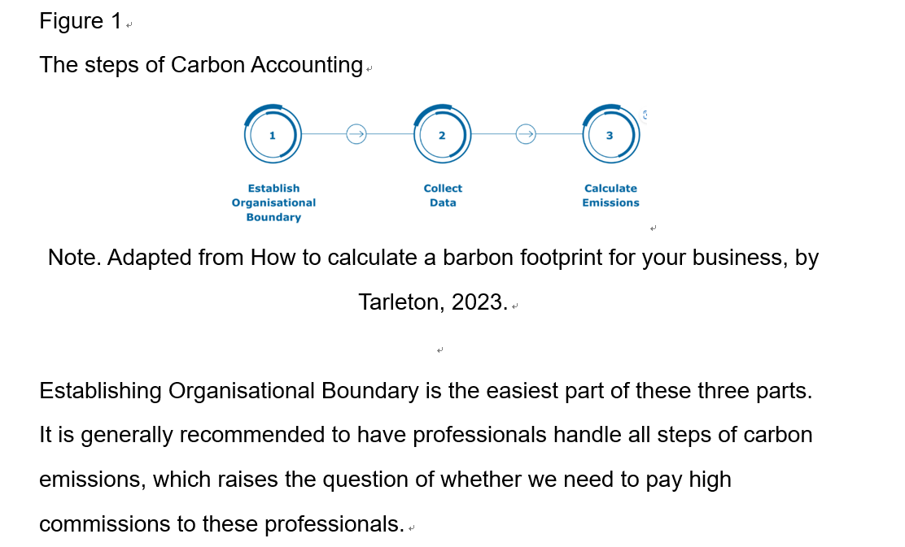
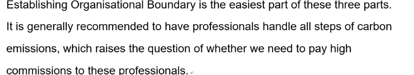
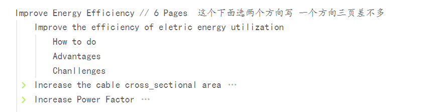

~~~text
To mohanmod
Hi bro, Your report is already very good, but there is only a small problem. Could you compress your report into four or three pages?

And If you quote some pictures in the report, please follow this format:
~~~
28号晚上汇总
# 问题
## 字体行距
Arial 字体 12 号字体 1.5 倍行距
ctrl+A 全选后 再设置这些:Arial 字体 12 号字体 1.5 倍行距
页数是在这个行距和字体下的页数,因为如果报告的基本格式是这样的,然后不能超过30页.

## 图片引用
格式是这样 :

然后Note下空一行.

然后我们不分图片还是表格统一都写figure number
### 引用的图片
就按照上面 把figure写上面

不是引用的图片就这样:把figure写下面. 数字还是接着上面的来.

						Figure 2 : XXXXXXXXXXX

## 分工
- [ ] 两个工程问题   wmy csy
- [ ] 其他人改一下自己的报告
- [ ] Introduction  lyy  就是介绍一下我们这个项目
- [ ] conclusion  rs
- [ ] 查重rs 
- [ ] reference rs 
- [ ] abstractive rs

## 时间安排
29号上午给我材料我汇总好下午再开一次会.
30号总报告. 查重

# Challenge Part
## Increase the cable cross sectional area

这个主题的challenges移到下面去, 但是
 such as laying power lines and installing compensation equipment, vegetation damage and soil erosion may be caused to some extent, which may have some impact on the ecological environment in the university.
这只是我个人的看法可能不对:

这个个植被破坏可以写上去,但是有没有其他的和工科相关的专业的能写的? 就是植被破坏可能没工科没什么关系.
然后就是把你这个项目的challenge单独拿出来写到Challenge Part 里面. 要是实在写不下去,写一页半,或者多放点图片,但是多一点这个方法实施起来的工科问题以及解决办法.
按照:
Engeneering Challenge one

How it rise up?
​How to deal with it?

---
# 图片引用格式
[Citing tables, figures & images: APA (7th ed.) citation guide | SFU Library](https://www.lib.sfu.ca/help/cite-write/citation-style-guides/apa/tables-figures)
[Citing Tables and Figures in APA Style | Format & Examples](https://www.scribbr.com/apa-examples/citing-tables-figures/)

Engeneering Challenge two

How it rise up?
​How to deal with it?
这样写

## Improve the efficiency of eletric energy utilization
<mark style="background: #FFB8EBA6;">这个分工还有一个人没写</mark>

这个之前是之前商量的安装电表统计电量并且可以用app随时查看用电量,用app随时关停电器实现不浪费电能的,等一段时间自动没人使用就关闭这个电器的,

---
---
How to write the part Chanllenges : 

在这个部分我们写会遇到的挑战,比如和别的比起来造价过高, 材料难获取, 不好实施...etc
我们从这里面选两个Chanllenges放到最后面的 Engineering Challenge 里面.
比如: 节约能源需要统计能源,查看能源消耗 怎么去实施?

1. 自己设计一款app能岁随时查看电量消耗,但是硬件[电表需要联网/或者人手工统计],以及哈看电量的app怎么设计.
2. ............

---------------------------- Outline Part ------------------------------------
<mark style="background: #FFB8EBA6;">Title Page 封面页 1 Pages</mark>

<mark style="background: #FFB8EBA6;">Executive Summary 1 Pages</mark>

Content Tables 目录 1 Pages

Improve Energy Efficiency // 6 Pages  这个下面选两个方向写 一个方向三页差不多
	<mark style="background: #FF5582A6;">Improve the efficiency of eletric energy utilization</mark>  // 3 pages
		How to do
		Advantages
		Chanllenges
	Increase the cable cross_sectional area   // actually 4 pages 减一页
		How to do
		Advantages
		Chanllenges
	Increase Power Factor
		How to do
		Advantages
		Chanllenges
	
Promote Renewable Energy // 6 Pages
	Solar Power           // actually 5 Pages  再减两页
		How to do
		Advantages
		Chanllenges
	Wind Energy             // actually 4pages 再减一页
		How to do
		Advantages
		Chanllenges
		
<mark style="background: #FFB8EBA6;">Engineering Challenge // 3 Pages</mark>
	 Challenge_1
	​	Whats it is
​		How it rise up
​		How to deal with it

​	 Challenge_2
​		Whats it is
​		How it rise up
​		How to deal with it

Carrbon Accounting // 3 Pages  3 Pages
	How to do
	Advantages
	Chanllenges

Green House //3 pages  6 Pages  肯定要删除一点 2 页
	How to do
	Advantages
	Chanllenges
	
<mark style="background: #FFB8EBA6;">Conclusion // 1 Pages</mark>
	对比以上的所有方法找出,选出一个最合适的,并说说其他几个为什么不合适.
	"Among all the methods compared above, choose the most suitable one and explain why the others are not suitable."
	
<mark style="background: #FFB8EBA6;">Appendix 附录 // 1 Pages</mark>

26

---

# 最终分工
29号上午给我我整理一下,查重,看看需不需要再改报告.
- [ ] 两个工程问题   wmy csy
	抛开challenge 写3 页.
	challenge 写 1.5page 或者2pages
- [ ] 其他人改一下自己的报告
	- [x] 梁宇阳
	- [ ] wmy
	- [ ] csy
	- [ ] wrf
	- [x] rs
- [x] Introduction  lyy  就是介绍一下我们这个项目
	0.5 page - 1page就行

- [x] conclusion  rs
- [ ] 查重rs 
- [ ] reference rs 
- [ ] abstractive rs
