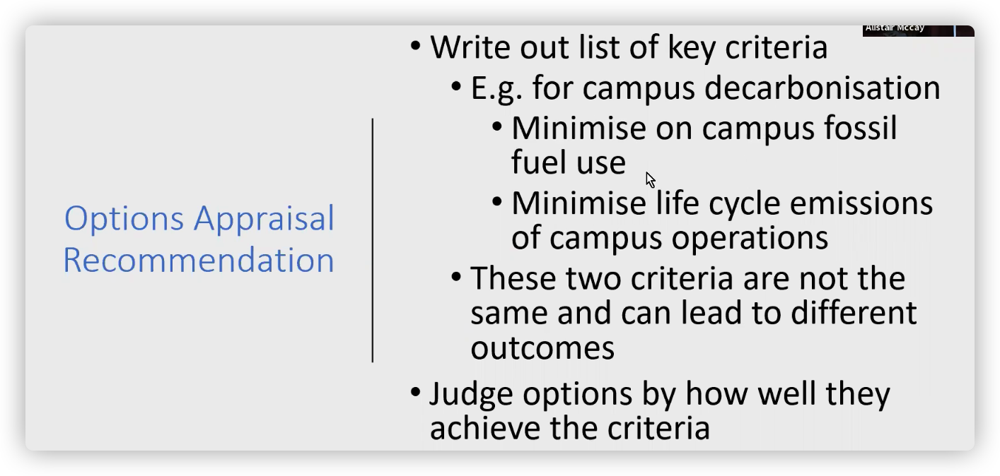
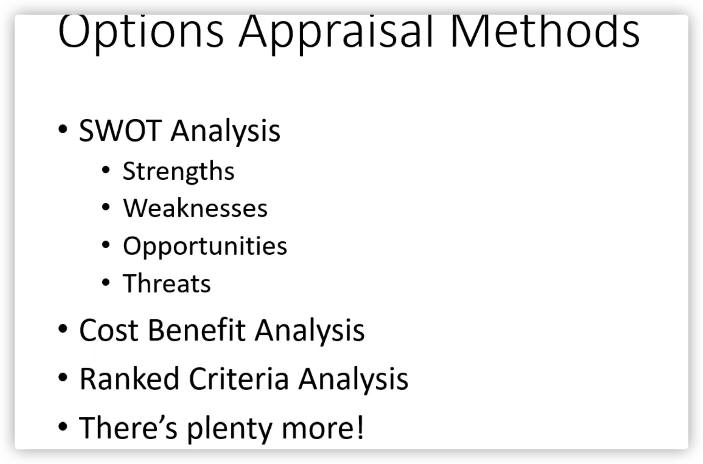

# Notes

# Plans

1. 先给老师发邮件,表面我们是想要在联系上所有同学后再联系他,但是有一个同学现在还没有联系上.
2. 先看那13分钟的视频,搞清楚需要做什么

1. 按照计划分配任务

五个项目选择一个来做

# Options Appraisal

Options Appraisal 翻译为中文是 "选项评估"。

选项评估是指在决策过程中，对各种可能的选项进行评估和比较，以便选择最佳选项的过程。这包括分析各种选项的利弊，评估可能的结果，并考虑其他因素，如风险和成本。选项评估是确定最佳决策的重要组成部分，它可以帮助决策者更全面地了解不同选项的可能影响，并确定最终决策。

Options Appraisal is a process of evaluating and comparing different options or alternatives to determine the best course of action. It involves analyzing the costs, benefits, and risks of each option, as well as considering any constraints or external factors that may impact the decision. The goal of options appraisal is to provide a systematic and objective way of choosing the best option for achieving a specific goal or objective.

​​

So best of luck and to help you out your first one of your first tasks is to do an option to appraisal.

中文翻译: 那么祝你好运, 为了帮助你, 你的第一项任务是进行一项选项评估。

解释: 选项评估是指对一个项目或计划的可行性进行评估，通常在项目开始之前进行。选项评估是一种重要的决策支持工具，能够帮助管理者评估不同的选择并选择最优方案

SWOT analysis 是一种常用的策略分析方法，它的全称是 Strength, Weakness, Opportunities, and Threats analysis. 它通过对公司或组织的内部因素和外部环境进行评估来识别优势、劣势、机会和威胁。这种方法可以帮助公司或组织识别其可能面临的问题和挑战，并为制定有效的战略和计划提供基础。

# 工作流程

Decide some initial, initial concepts. Number one, and then immediately straightaway. You should develop a robust options appraisal methods before thinking about your initial concepts too much so immediately think how you're going to assess these options

翻译: 先决定一些初步的概念，第一个，然后立即进行。在太多地思考初步概念之前，您应该先开发一种强大的选项评估方法。立即考虑如何评估这些选项。 解释: 这段话讲的是在决定初步的概念之前，应该先考虑如何评估这些选项，而不是立即过多地思考初步概念。

‍

‍

先写下评判标准 ,在评估一个选项时再更具这个标准来评判这个选项的好坏.

​​

# Options Appraisal

​​
