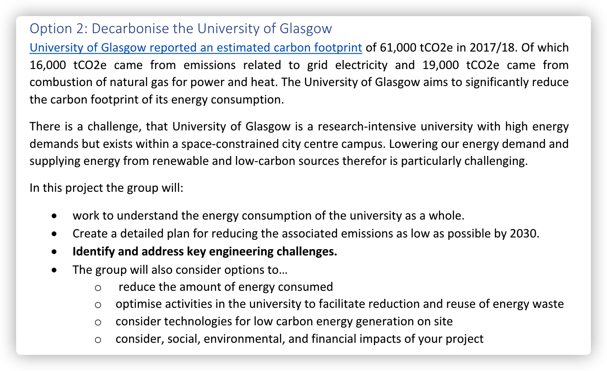

# Workflow

# What we should do now

‍

1. 先找一些解决的方法

2. 三个标准 例如 减少电量使用 循环使用纸张 使用可持续能源

3. 再根据swot评判标准
4. 然后再评估可行性  经济效益 社会影响

1. Identify potential solutions
2. Propose three criteria. For example, reduce electricity use, recycle paper, use sustainable energy
3. analyse the solutions using SWOT analysis
4. Evaluate feasibility from economic and social impact. etc

Better to have some data to support your data.

​​

reduce electricity use

use sustainable energy

‍

1. 先想碳中和的方法. 每个人写一点在措施里.
2. 然后根据方法制定标准
3. 用swot来分析方法.
4. PPT presentation 5 mins video

周日前写完[写英文] 写在共享文档里 周日早上8:30开会

1. Think about methods for carbon neutralization. Each person writes a little in the shared docs.
2. Then, establish standards based on the methods. Can do it after the second meeting
3. Use SWOT analysis to analyze the methods. Can do it after the second meeting
4. PPT presentation 5-minute video.

‍
