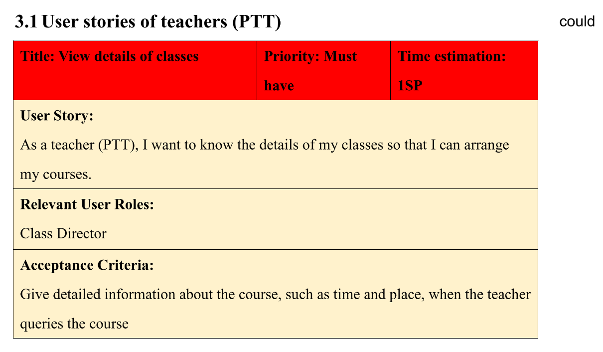
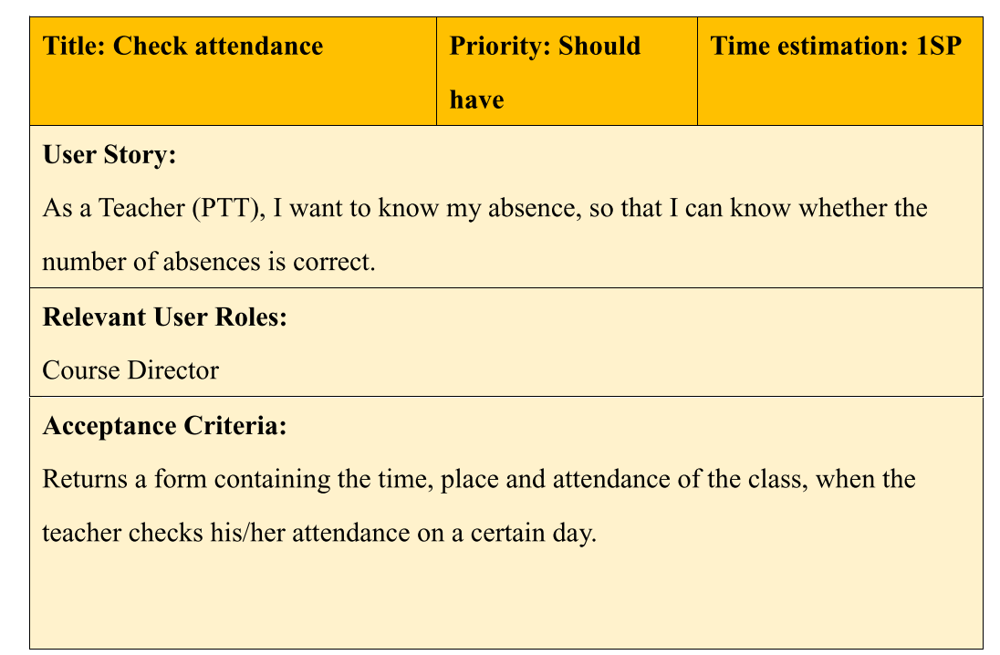
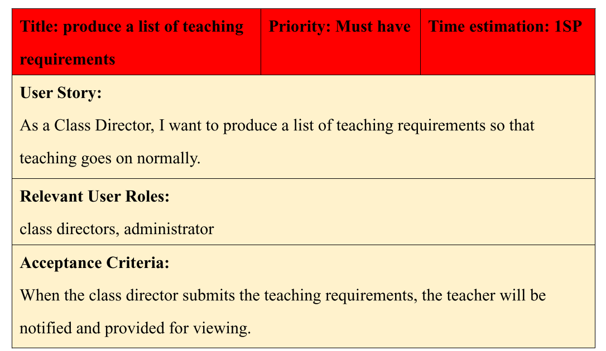
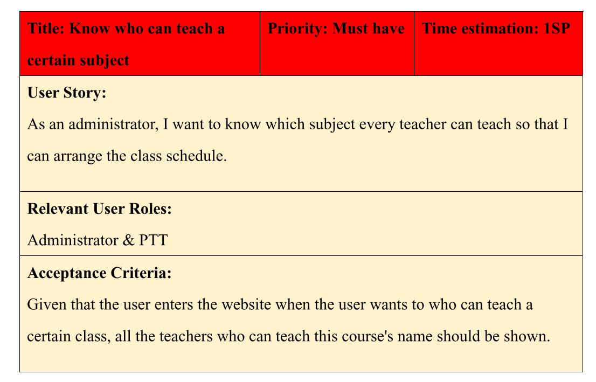
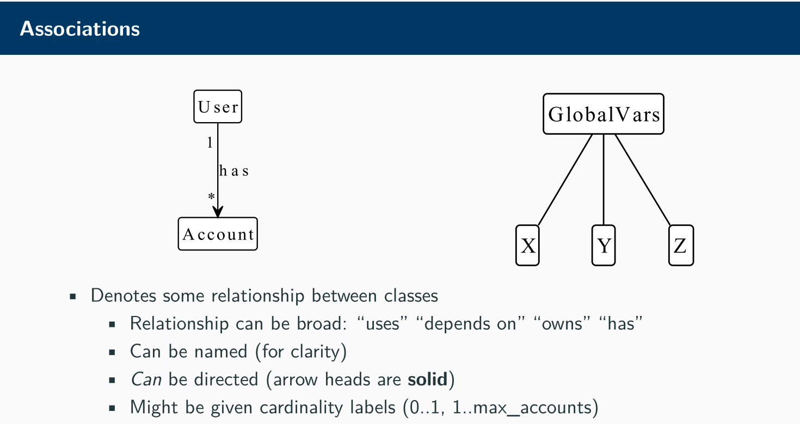

[AE2](assets/AE2_merged_public_with_bookmark.pdf)
DDL : 03/17 下午5点
# 代做事项

# PPT
could

could

# Class Director
must

class equirements:
	开课结课时间
	地点
	开销
	创建人
	创建时间
	课程名称

# Administrator
must

# Basic 
log in / log out

# Menu

1. 登陆验证 萱
2. Controller 流程 ---
3. Menu Print 冉
4. 文件输入 黄

 ~~~text
 Menu Print:
	 1. Welcome View
	 2. 
----从别的函数得到staffID-----
staffID : SP001
解析 staffID 的出身份 调用不同的___View()

PPTView:
	1. 查看个人信息
		print 个人信息 toString
	1. 查看自己被分配的requirement 以及 traning 安排
	2. 登出

Class Deiector:
	1. 查看个人信息
	2. 创建requirements
	3. 查看修改requirements
	4. 登出
Administrator:
	1. 查看 requirement
	2. 分配requiement1
	3. 登出
~~~

2023年3月13日
~~~text
Administrator 加了 toString
PTT 加了 toString
ClassDirector 加了 toString
Requirement 加了 getclassDirectorId
新增了View.java
新增了Viewtest.java

# 日期

ClassDirector:显示

二级菜单

-----
(requirement的 List)
	requiremntid; 是否被分配状态

---

单独的一句话: 选序号来显示requirement的详细信息

显示requirement的详细信息
显示可以教class的PTT列表
1
2
3
4
请选择分配给分配给这个requirement的PTTID  1 2 3 4

根据courseID显示ptt列表

是否想要修改
~~~

# 2023年3月14日
~~~text
# 日期

ClassDirector:显示

二级菜单

-----
(requirement的 List)
	requiremntid; 是否被分配状态

---

单独的一句话: 选序号来显示requirement的详细信息

显示requirement的详细信息
显示可以教class的PTT列表
1
2
3
4
请选择分配给分配给这个requirement的PTTID  1 2 3 4

根据courseID显示ptt列表

是否想要修改
~~~

traningID

# UML

Model :
- [x] Administator
- [x] Classdirector
- [x] Staff
- [x] PTT
- [x] Requirement
- [x] Course
- [x] Training
- [ ] RelationshipMap

pttID

# 2023年3月15日
只改了controller

~~~java
public void runPTTSession() {

}
// 改变这个

    // 输入对应的字符串查找相应的requirement

// 加了一个search函数
public Requirement StringArrayExample(String searchKey) {

	// String[] stringArray = { "apple", "banana", "cherry", "date" };

	// this.requirementList 需要在 requirement_List 中查询需要的 requirement

	// searchKey 就是 pttID requirementID

	Requirement searchResult = new Requirement(); // 查询找到的requirement结果

	for (int i = 0; i < this.requirementList.size(); i++) {

		if (searchKey == this.requirementList.get(i).getPttID())

			return this.requirementList.get(i);

		if (searchKey == this.requirementList.get(i).getRequirementID())

			return this.requirementList.get(i);

		if (searchKey == this.requirementList.get(i).getclassDirectorID())

			return this.requirementList.get(i);

		if (searchKey == this.requirementList.get(i).getCourseID())

			return this.requirementList.get(i);

		if (searchKey == this.requirementList.get(i).getAdminstratorID())

			return this.requirementList.get(i);

		// getTrainingID 但是实际上没用到

		// if (searchKey == this.requirementList.get(i).getT())

		// return this.requirementList.get(i);

		// System.out.println(item);

	}

	return searchResult;

}

~~~