# Polymorphism
1.  静态多态性（方法重载）
[什么是多态](assets/2023-04-24_172127.png)
```java
public class Calculation {
    public int add(int x, int y) {
        return x + y;
    }

    public double add(double x, double y) {
        return x + y;
    }
}

public class Main {
    public static void main(String[] args) {
        Calculation calc = new Calculation();
        int sum1 = calc.add(10, 20); // 调用第一个add方法
        double sum2 = calc.add(10.5, 20.5); // 调用第二个add方法
        System.out.println("Sum of integers: " + sum1);
        System.out.println("Sum of doubles: " + sum2);
    }
}
```
2. 动态多态性
```java
public class Animal {
    public void makeSound() {
        System.out.println("The animal makes a sound");
    }
}

public class Cat extends Animal {
    @Override
    public void makeSound() {
        System.out.println("Meow");
    }
}

public class Dog extends Animal {
    @Override
    public void makeSound() {
        System.out.println("Woof");
    }
}

public class Main {
    public static void main(String[] args) {
        Animal animal1 = new Cat(); // 创建一个Cat对象，使用Animal类型引用
        Animal animal2 = new Dog(); // 创建一个Dog对象，使用Animal类型引用
        animal1.makeSound(); // 调用Cat的makeSound方法
        animal2.makeSound(); // 调用Dog的makeSound方法
    }
}
```
# code-owners and code-users
abstrction


# Coupling And Cohension

## Types of Coupling: 
• Content Coupling 
• Common Data Coupling 
• Control Coupling 
• Stamp Coupling 
• Data Coupling 
• Routine/Temporal Coupling 
• Interface

## logical Cohension
逻辑内聚性是指模块或组件内部元素在功能上相互关联的程度。换句话说，它是衡量模块或组件内部元素之间关系的好坏程度。如果模块内部的元素在逻辑上没有明显的关联或是关联度较弱，就称其具有低逻辑内聚性。通常情况下，低逻辑内聚性不是一个好的设计选择，因为它可能导致代码难以理解、维护和扩展。

举个例子来说明逻辑内聚性的概念。假设我们有一个计算器程序，它有以下几个功能：

-   加法
-   减法
-   乘法
-   除法
-   平方根
-   取反

如果我们将这些功能都放在同一个方法中实现，那么这个方法就具有很低的逻辑内聚性，因为这些功能并没有明显的关联。这样的实现方式可能导致代码难以理解、维护和扩展。

相反，如果我们将这些功能分别放在不同的方法中实现，那么这些方法就具有更高的逻辑内聚性。例如，我们可以创建一个叫做 Calculator 的类，其中包含 add()、subtract()、multiply()、divide()、squareRoot() 和 negate() 方法。这样，每个方法都只实现一个明确的功能，并且与其他方法之间没有复杂的相互依赖关系，使得代码更加清晰、易于理解和扩展。

因此，逻辑内聚性是一种重要的设计原则，有助于提高代码的质量和可维护性。

## Sequential/Procedural/Temporal Cohesion

解释并举例

这三个概念都属于模块或组件的内聚性的不同类型。

-   Sequential Cohesion（顺序内聚性）：模块内部的元素按照某种特定的顺序进行执行。这种内聚性最常见于过程式编程语言中，比如 C 和 Fortran。例如，一个计算税费的函数，需要先计算收入，再计算扣除项，最后计算税费，这些步骤必须按照顺序依次执行。
    
-   Procedural Cohesion（过程内聚性）：模块内部的元素按照某种特定的逻辑或目标组织在一起。这种内聚性最常见于过程式编程语言中，比如 C 和 Pascal。例如，一个处理学生信息的函数，可以包括获取学生信息、验证学生信息、保存学生信息等多个子过程，这些子过程之间没有必要按照特定的顺序执行。
    
-   Temporal Cohesion（时间内聚性）：模块内部的元素按照某种特定的时间段或事件组织在一起。这种内聚性通常与异步编程和事件驱动编程相关。例如，一个处理网络消息的模块，可能包括收到消息、解析消息、执行相关逻辑等多个事件处理函数，这些函数之间没有特定的顺序或逻辑关系。
    

需要注意的是，这些内聚性类型并不是相互独立的，同一个模块或组件可以同时具有多种内聚性类型。在实际的软件设计中，我们需要根据具体的需求和场景，选择合适的内聚性类型来组织代码，以提高代码的可读性、可维护性和可扩展性。

## Communication/Informational Cohesion 

Communication Cohesion（通信内聚性）和 Informational Cohesion（信息内聚性）都属于模块或组件的内聚性的不同类型。

-   Communication Cohesion：模块内部的元素之间通过某种共享的数据结构进行通信。这种内聚性通常与面向对象编程语言中的类或对象相关。例如，一个负责计算电费的类，可能包括获取电表读数、获取电费单价、计算电费等多个方法，这些方法之间通过共享的电费计算规则进行通信。
    
-   Informational Cohesion：模块内部的元素都与同一个抽象的概念或信息相关联。这种内聚性通常与面向对象编程语言中的类或对象相关。例如，一个负责处理学生信息的类，可能包括获取学生姓名、获取学生年龄、获取学生成绩等多个方法，这些方法之间都与同一个抽象的“学生信息”概念相关联。
    

需要注意的是，通信内聚性和信息内聚性是两种不同的内聚性类型。通信内聚性是通过共享的数据结构来实现元素之间的通信，而信息内聚性是通过抽象的概念或信息来实现元素之间的关联。在实际的软件设计中，我们需要根据具体的需求和场景，选择合适的内聚性类型来组织代码，以提高代码的可读性、可维护性和可扩展性。

## Functional Cohesion（功能内聚性） 

Functional Cohesion（功能内聚性）**是模块内部的元素都共同完成一个明确定义的任务，没有其他不必要的功能或操作。** 这种内聚性通常是面向过程编程语言中常见的，例如C语言和Fortran。

Functional Cohesion通常被认为是最好的内聚性类型，因为它使得模块内部的元素紧密相关，并且易于理解和维护。当模块内部的元素都与同一个任务相关联时，我们可以很容易地预测模块的行为，从而更容易地修改和扩展它。

举个例子，考虑一个负责计算平均数的函数。这个函数可能需要接收一个数组作为参数，并返回数组元素的平均值。这个函数内部只需要完成计算平均数的功能，没有其他不必要的操作。这就是一个典型的Functional Cohesion的例子。所有的函数元素都紧密相关，并且共同完成一个明确定义的任务，即计算平均数。

## Content Coupling（内容耦合）

是指一个模块在某种方式下直接访问了另一个模块的内部数据或操作.

这种耦合方式是通常被认为是不好的，因为它会导致两个模块之间的高度依赖，限制了模块的独立性和可重用性。

Content Coupling违反了模块的封装原则，因为模块内部的细节暴露给了其他模块，使得其他模块必须了解模块内部的实现细节才能正确地使用它。这种依赖关系会导致代码的紧耦合和难以维护，因为任何一个模块的修改都可能影响到其他模块。

举个例子，考虑两个模块A和B，A模块包含了一些与数据库相关的操作，例如查询、插入和删除数据，而B模块需要获取A模块中查询的数据来进行一些操作。如果B模块直接访问A模块的数据库连接或查询语句，那么这种耦合方式就是Content Coupling。这样做会导致A和B模块高度依赖，限制了它们的独立性和可重用性。正确的做法是将数据库连接和查询语句封装在A模块中，通过公共的接口提供给B模块使用，从而降低两个模块之间的耦合度。

## Common Data Coupling（公共数据耦合）
是指多个模块**共享相同**的数据结构或变量。这种耦合方式通常被认为是不好的，因为它会导致各个模块之间高度依赖，使得修改一个模块的数据结构或变量可能会影响到其他模块的正确性。

Common Data Coupling 违反了模块之间的独立性原则，因为各个模块之间共享相同的数据结构或变量，使得模块的修改可能会影响到其他模块。这种依赖关系会导致代码的紧耦合和难以维护，因为任何一个模块的修改都可能影响到其他模块。

需要注意的是，如果共享的数据结构或变量是只读的，则 Common Data Coupling 可能是可以接受的。这是因为只读数据结构或变量不会影响其他模块的状态，不会影响程序的正确性。

举个例子，考虑一个包含多个模块的程序，这些模块共享同**一个全局变量**来表示当前时间。这种耦合方式就是Common Data Coupling。如果某个模块修改了这个全局变量的值，那么其他模块的逻辑可能会受到影响。正确的做法是将这个变量封装在一个类中，并通过类的接口来访问它，从而降低各个模块之间的耦合度。

## Control Coupling（控制耦合）
是指一个模块直接控制另一个模块的逻辑流程，通常是通过参数、标志或者函数调用来控制。**这种耦合方式不总是坏的，但需要谨慎使用。**

Control Coupling 违反了模块之间的独立性原则，因为它使得一个模块依赖于另一个模块的控制逻辑。这种依赖关系可能会导致代码的紧耦合和难以维护，因为任何一个模块的修改都可能影响到其他模块。

需要注意的是，有时候为了实现特定的功能，使用 Control Coupling 是有必要的。例如，一个模块可能需要控制另一个模块的行为，以确保正确的执行顺序或者避免竞态条件。

举个例子，考虑一个购物车系统，其中一个模块负责处理订单，另一个模块负责处理支付。当订单提交后，订单处理模块需要调用支付模块的函数来处理支付，以确保订单和支付的顺序正确。在这种情况下，使用 Control Coupling 是有必要的，但需要注意避免过度依赖和不必要的耦合。

## Stamp Coupling

#特点 组件之间传递的信息比需要的信息要多. 函数传递的参数太多,超过所需要的参数.

是一种耦合类型，**表示两个或多个模块使用相同的数据结构**，但是这些数据结构不是从一个模块传递到另一个模块的参数。这种耦合类型通常被认为是一种较弱的耦合方式。
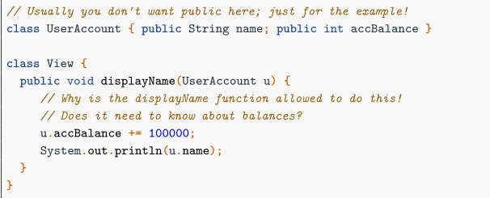
他这个数据结构就直接用类来表示了
Stamp Coupling 违反了模块化原则，因为它在模块之间共享数据结构，导致模块之间的相互依赖。这种依赖关系可能会导致代码的紧耦合和难以维护，因为修改一个模块的数据结构可能会影响到其他模块。

举个例子，考虑一个简单的电子商务系统，其中一个模块负责管理用户数据，另一个模块负责处理订单。如果订单模块和用户数据模块使用相同的数据结构来表示用户信息，那么这两个模块就存在 Stamp Coupling。这可能会导致问题，因为任何一个模块的修改都可能影响到其他模块。

为避免这种耦合类型，可以将数据结构作为参数传递给模块，而不是直接共享数据结构。这种方法可以减少模块之间的依赖关系，并提高代码的可维护性和可扩展性

## Routine/Temporal Coupling（例行/时间耦合）
是一种耦合类型，表示两个或多个模块在特定时间内必须按特定顺序执行。这种耦合类型通常被认为是一种较强的耦合方式。

Routine/Temporal Coupling 的示例是，一个模块必须在另一个模块之后执行。例如，在一个订单处理系统中，一个模块负责验证用户的订单，而另一个模块负责处理付款。如果付款模块在订单验证模块之前运行，将会导致错误的付款或者订单验证失败。因此，这两个模块之间存在例行/时间耦合。

## Interface Coupling（接口耦合）

是一种松散的耦合类型，表示模块之间的通信仅通过它们共享的接口。这种耦合类型通常被认为是最佳形式的耦合方式。

Interface Coupling 的示例是，一个模块提供了一个API（应用程序编程接口），另一个模块使用该API来实现某些功能。这两个模块通过共享的接口进行通信，它们可以独立地开发和维护，因为它们互相不依赖。

Interface Coupling 使代码易于维护和扩展，因为更改一个模块不会影响其他模块，只要接口保持不变。它也使得代码更加灵活，因为不同的实现可以被用于实现相同的接口。因此，在设计软件时，应该尽可能地使用 Interface Coupling。

## Conclusion
P80-83 有例子 讲这些耦合
**高内聚 低耦合**

内聚性 是指模块内部的元素相互依存的程度，也就是模块内部各个元素间的关联度。高内聚的模块指的是模块内部各元素紧密联系，共同实现某一单一功能或一组相关的功能。相反，低内聚的模块指的是模块内部各元素联系松散，实现的功能分散或独立。

耦合性 是指模块间的相互依存程度，也就是模块之间的关联度。高耦合的模块指的是模块之间相互依赖性强，互相影响严重，一旦其中一个模块发生变化，其他模块也需要相应地修改。相反，低耦合的模块指的是模块之间相互独立，互相影响小，一个模块的变化不会影响其他模块。

例如，对于一个电子商务网站，购物车模块应该是高内聚的，因为它包含了所有关于购物车的逻辑和数据。而与购物车模块相连的模块应该是低耦合的，以便于未来的扩展和修改。这意味着购物车模块与其他模块之间的交互应该是通过定义清晰的接口实现的，这种耦合方式称为接口耦合（Interface Coupling），在此情境下是最佳的耦合方式。

## 难点
什么是 Common Data

# 修饰符 
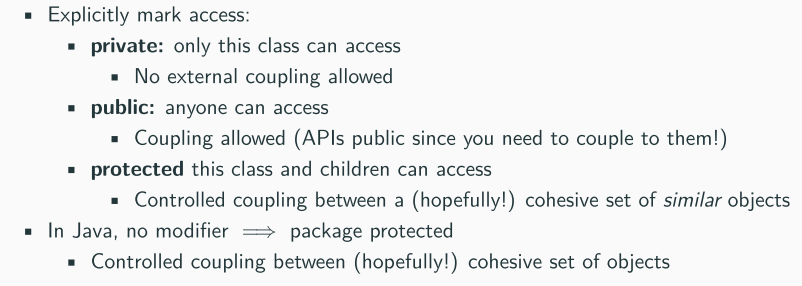

# Super Methods
```java
public class Parent {
    public void sayHello() {
        System.out.println("Hello from parent!");
    }
}

public class Child extends Parent {
    @Override
    public void sayHello() {
        super.sayHello(); // 调用父类的方法
        System.out.println("Hello from child!");
    }
}

public class Main {
    public static void main(String[] args) {
        Child child = new Child();
        child.sayHello(); // 输出: "Hello from parent!" 和 "Hello from child!"
    }
}

```

# 抽象类 接口类
一个子类只能继承一个父类
但是一个类可以实现多个接口

## 抽象类
```java
abstract class Shape {
   protected String color;
   
   public Shape(String color){
      this.color = color;
   }
   
   public abstract double getArea();
}

```
这个抽象类名为"Shape"，具有一个受保护的字符串变量"color"和一个抽象方法"getArea()"。由于"Shape"类是抽象的，它不能被直接实例化，而是必须由子类继承并实现"getArea()"方法。这个抽象类提供了一个通用的"color"属性和一个要求子类实现的"getArea()"方法，以便子类可以根据不同的形状（如圆形、矩形等）来具体实现该方法。这个抽象类为子类提供了一个通用的行为和属性，而不是作为实际的对象来使用的。

## 接口

Interfaces are abstract classes with 
• no data 
• all methods marked abstract
*接口是抽象类
*无数据•所有标记为abstract 的方法

```java
public interface Shape {
    double getArea();
    double getPerimeter();
}

```
这个接口定义了两个方法：`getArea()`和`getPerimeter()`。任何实现了`Shape`接口的类都必须实现这两个方法。通过这个接口，我们可以将所有的形状对象统一处理，例如计算它们的面积和周长。同时，我们可以创建不同的形状类来实现这个接口，例如矩形、圆形、三角形等，它们可以根据自己的特点来实现这两个方法，同时保证了对外统一的接口

# Final 关键字
Final can be applied elsewhere: 
• Final classes cannot be inherited from
• Final variables cannot be reassigned 
• It’s all about controlling use/relations between components 
• That is, controlling coupling/cohesion


---

# Unified Model Language
## 修饰符怎么画
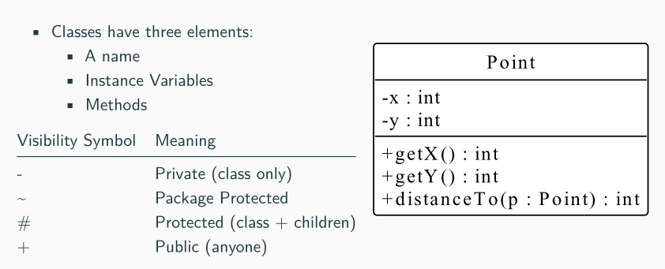

## Abstract Class
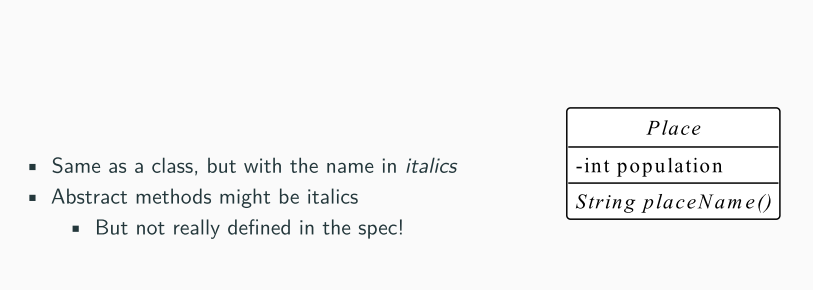
抽象方法 斜体

## Association
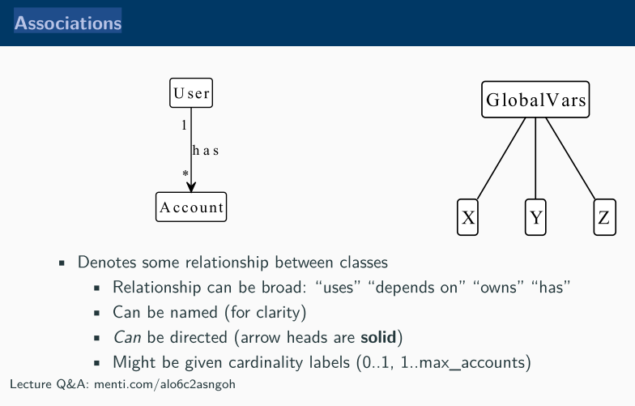
关联表示一个类与另一个类之间的关系，这种关系可以是单向的或双向的。在一个类中，**可以定义一个实例变量来引用另一个类的实例，这就是关联.**

比如这里的User的示例有一个 Account 的示例

## Inheritance
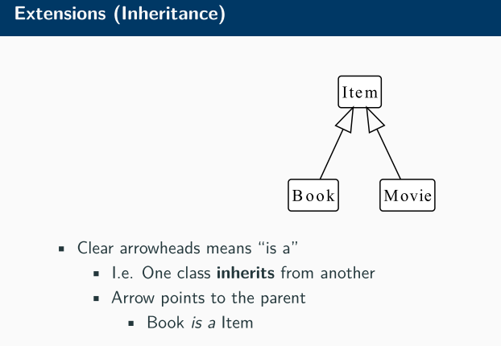

## Aggregation
弱关联

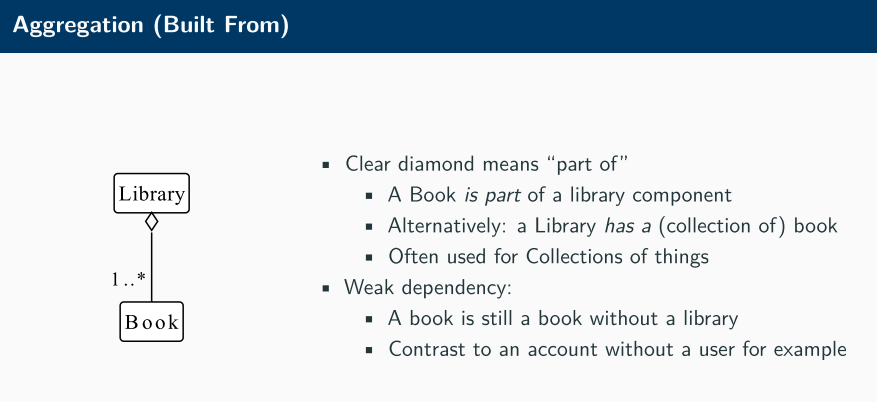

## Compositon
强关联

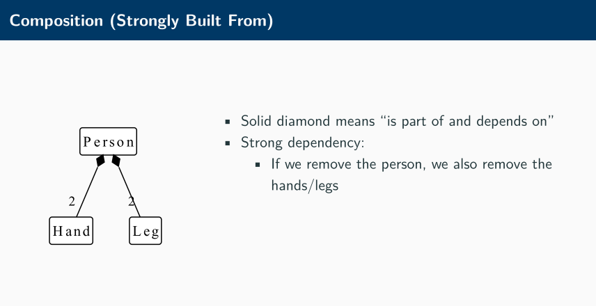

## Class implement interface

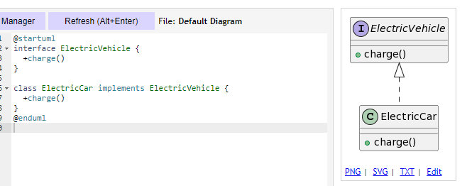


## Confusion
这个什么都没画的线是什么:
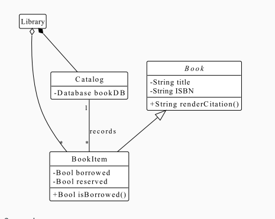
只是有联系,多付一


# Sequence Diagram
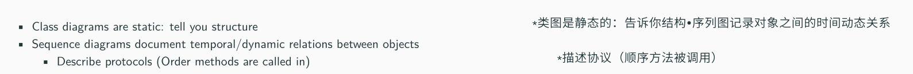


# Testing

这个test我并没有怎么看
## Types of Testing
• Each component/class does what it should: Unit Tests 
• Components work together correctly Integration Tests 
• The acceptance criteria (semester 1) are met Acceptance Tests

## Test Cases
• Givens: What state is the system in before testing 
• Operations: What do I do to the system 
• Assertions: What state do I expect the system is now in


# Safe Classes Packages Error Handling
## Exceptions
Exceptions Language constructs that allow control flow to be changed on an error


**catch**

这段代码使用了异常处理机制来处理文件读取错误的情况。代码中的 try-catch 块包含了可能会抛出 FileNotFoundException 异常的代码。如果在 try 块中调用 readDataFromFile("badFile.txt") 函数时出现了 FileNotFoundException 异常，程序将跳转到 catch 块中执行。


## Throw keyword
```java
public void readFile(String fileName) throws FileNotFoundException {
    File file = new File(fileName);
    Scanner scanner = new Scanner(file);
    // ...
}
```

在这个示例中，readFile 方法可能会抛出 FileNotFoundException 异常，因为它试图打开一个文件并读取它的内容。因此，方法使用 "throws" 关键字来声明这个异常。如果调用者想要调用这个方法，它必须使用 try-catch 块来处理这个异常，或者也可以使用 "throws" 关键字将异常传递给它的调用者。

总之，"throws" 关键字用于声明一个方法可能会抛出哪些异常，以便调用者可以在调用该方法时处理这些异常。

## Handing Errors

Handling Errors: 
• Return something sensible 
• Returning error values (possibly Optional) 
• Exceptions

## Design Principles for Safe Objects
• Data Hiding • Don’t leak data 
• Atomic Operations • Don’t see internal “false” states 
• Explicit Constructors • Objects are always fully initialised 
• Exceptions • Potential for invalid states are clearly marked

原子操作是指在执行期间不可中断的操作，它们要么全部执行成功，要么全部失败。在多线程编程中，原子操作是非常重要的，因为它们可以确保线程安全，避免竞态条件和死锁等问题。

举个例子，假设我们有一个计数器变量 count，多个线程需要对它进行增加操作。如果我们使用普通的加法操作，可能会出现竞态条件，导致计数器的值不正确。但是，如果我们使用原子操作，例如 AtomicInteger 类的 incrementAndGet() 方法，就可以确保每个线程都能正确地增加计数器的值，而不会出现竞态条件。

另一个例子是使用原子操作来更新布尔变量的值。如果我们使用普通的赋值操作，可能会出现内部“false”状态，即一个线程在检查变量的值时，可能会看到一个已经被另一个线程修改但尚未更新的值。但是，如果我们使用原子操作，例如 AtomicBoolean 类的 compareAndSet() 方法，就可以确保每个线程都能正确地更新布尔变量的值，并且不会出现内部“false”状态。

总之，原子操作是一种非常有用的编程工具，可以确保线程安全和避免竞态条件等问题。在多线程编程中，我们应该尽可能地使用原子操作来更新共享变量的值，以确保程序的正确性和可靠性。


  

在软件开发中，为了维护不变量，我们可以使用一些其他的技术。以下是一些常见的技术：

• 抽象类禁止构造：抽象类是一种不能被实例化的类，它只能被用作其他类的基类。通过将类声明为抽象类，我们可以禁止直接构造该类的实例，从而确保该类的不变量不会被破坏。例如，假设我们有一个抽象类 Animal，它有一个抽象方法 makeSound()，我们可以定义一个具体的子类 Dog，它实现了 makeSound() 方法。由于 Animal 是抽象类，我们不能直接构造它的实例，但是我们可以构造 Dog 的实例，并调用它的 makeSound() 方法。

• 多态禁止知道确切的子类型：多态是一种面向对象编程的概念，它允许我们使用基类的引用来引用派生类的对象。通过使用多态，我们可以禁止知道确切的子类型，从而确保不变量不会被破坏。例如，假设我们有一个基类 Animal，它有一个方法 eat()，我们可以定义一个具体的子类 Dog，它重写了 eat() 方法。由于我们可以使用 Animal 类型的引用来引用 Dog 对象，我们不能知道确切的子类型，但是我们可以调用 eat() 方法，它会调用 Dog 类的 eat() 方法。

• final 禁止重新分配变量/覆盖函数：final 是一种 Java 关键字，它可以用于变量和方法。通过将变量声明为 final，我们可以禁止重新分配变量的值，从而确保不变量不会被破坏。例如，假设我们有一个 final 变量 PI，它的值为 3.14159，我们不能重新分配它的值。同样，通过将方法声明为 final，我们可以禁止子类覆盖该方法，从而确保不变量不会被破坏。

总之，为了维护不变量，我们可以使用一些其他的技术，例如抽象类、多态和 final 关键字。这些技术可以帮助我们确保不变量不会被破坏，并提高程序的可靠性和正确性

## Packages

P285开始举例子


---

## ---


# Design Patterns


## Patterns
• Singletons: 实现全局数据 Singletons 是一种创建型设计模式，它确保一个类只有一个实例，并提供了一个全局访问点，以便在程序的任何地方访问该实例。Singletons 经常被用于实现全局数据，例如日志记录器或配置文件等。

• Composite: 树形结构的对象构建 Composite 是一种结构型设计模式，它允许你将对象组合成树形结构，以表示部分-整体的层次关系。Composite 可以让客户端以一致的方式处理单个对象和对象组合。

• Factories: 抽象对象创建过程 Factories 是一种创建型设计模式，它提供了一个通用的接口来创建对象，而无需指定它们的具体类。Factories 可以隐藏对象创建的具体细节，并提供一种标准的方法来构建对象。

• Factory Method: 类知道该创建什么对象 Factory Method 是一种创建型设计模式，它定义了一个用于创建对象的接口，但让子类决定实例化哪个类。Factory Method 可以使一个类的实例化延迟到其子类。

• Abstract Factory: 外部类知道该创建什么对象 Abstract Factory 是一种创建型设计模式，它提供了一种创建相关对象的接口，而无需指定它们的具体类。Abstract Factory 可以让你通过指定产品的种类来创建一组相关的对象。

• Prototype Factory: 基于示例对象构建 Prototype Factory 是一种创建型设计模式，它通过使用现有对象作为原型来创建新的对象。Prototype Factory 可以帮助你避免复杂对象的创建过程，并让你的代码更加灵活。

• Builders: 分离创建和表示接口 Builders 是一种创建型设计模式，它将对象的构造过程与其表示形式分离开来。Builders 可以帮助你更加清晰地组织你的代码，并让你的构造过程更加灵活。

Creational Patterns是一类设计模式，用于解决对象的创建问题。这些模式的主要目标是将对象的创建与使用相分离，从而提高代码的灵活性和可维护性。以下是一些常见的Creational Patterns及其解释和示例：

1.  Singleton Pattern: 保证一个类仅有一个实例，并提供全局访问点。示例：数据库连接池。
    
2.  Factory Method Pattern: 定义一个用于创建对象的接口，让子类决定实例化哪一个类。示例：不同操作系统下的对话框。
    
3.  Abstract Factory Pattern: 提供一个接口，用于创建相关或依赖对象的家族，而不需要指定具体类。示例：GUI工具包的组件。
    
4.  Builder Pattern: 将一个复杂对象的构建过程分离出来，使得相同的构建过程可以创建不同的表示。示例：HTML页面构建器。
    
5.  Prototype Pattern: 用原型实例指定创建对象的种类，并通过复制这个原型来创建新对象。示例：游戏中的道具或角色。
    

这些Creational Patterns可以帮助开发人员更加灵活和可维护地创建对象，并且有利于降低代码的耦合度，提高代码的可读性和可重用性。

----

• 装饰器模式（Decorator Pattern）：装饰器模式是一种结构型设计模式，它允许我们在运行时动态地为对象添加新的行为。该模式通过将对象包装在一个装饰器对象中，来实现对对象的功能扩展。例如，假设我们有一个基本的汽车对象，我们可以使用装饰器模式来为它添加新的功能，例如 GPS 导航、音响系统等。

• 观察者模式（Observer Pattern）：观察者模式是一种行为型设计模式，它允许我们定义对象之间的一对多依赖关系，当一个对象的状态发生改变时，它的所有依赖对象都会收到通知并自动更新。该模式通过将观察者对象注册到主题对象中，来实现对对象状态的观察和更新。例如，假设我们有一个气象站对象，我们可以使用观察者模式来让多个显示器对象观察气象站对象的状态，并在气象站状态发生改变时自动更新。

• 命令模式（Command Pattern）：命令模式是一种行为型设计模式，它允许我们将请求封装成对象，从而使我们能够将请求的发送者和接收者解耦。该模式通过将请求封装成一个命令对象，来实现对请求的封装和解耦。例如，假设我们有一个遥控器对象，我们可以使用命令模式来将遥控器按钮和电器对象解耦，从而实现对电器的远程控制。

• 适配器模式（Adapter Pattern）：适配器模式是一种结构型设计模式，它允许我们将一个类的接口转换成客户端所期望的另一个接口。该模式通过创建一个适配器对象，来实现对不兼容接口的转换。例如，假设我们有一个英国插头，但是我们在中国，我们可以使用适配器模式来将英国插头转换成中国插头，从而实现在中国使用英国电器。

• 状态模式（State Pattern）：状态模式是一种行为型设计模式，它允许我们将对象的行为根据其内部状态的改变而改变。该模式通过将对象的状态封装成一个状态对象，来实现对对象行为的动态改变。例如，假设我们有一个电梯对象，我们可以使用状态模式来将电梯的状态封装成一个状态对象，例如开门状态、关门状态、上升状态、下降状态等，从而实现对电梯行为的动态改变。

• 其他模式简介（Quick look at other patterns）：除了上述模式之外，还有许多其他的设计模式，例如工厂模式、单例模式、策略模式、模板方法模式等。这些模式都有不同的用途和应用场景，可以帮助我们更好地组织和设计我们的代码。
## Singleton

实现单例模式。

单例模式是一种创建型设计模式，它确保一个类只有一个实例，并提供对该实例的全局访问点。实现单例模式的方法可以有多种，但是它们都具有一些共同的特征，例如限制类的实例化、提供对单个实例的全局访问以及确保线程安全。实现单例模式的方法包括饿汉式、懒汉式、双重检查锁定等。选择哪种方法取决于应用程序的具体需求和环境。

## Factory Method Pattern
Factory Method Pattern（工厂方法模式）是一种创建型设计模式，它定义了一个用于创建对象的接口，但是让子类决定实例化哪个类。在工厂方法模式中，一个类的实例化是由其子类来完成的。

工厂方法模式通常包含一个抽象的工厂类和多个具体的工厂类。抽象工厂类中定义了创建对象的方法，而具体的工厂类则实现了这些方法，用于创建具体的对象。

以下是一个简单的工厂方法模式的示例代码：

~~~java
// 定义一个抽象的产品类
abstract class Product {
    public abstract void operation();
}

// 具体的产品类
class ConcreteProduct1 extends Product {
    public void operation() {
        System.out.println("Concrete Product 1");
    }
}

class ConcreteProduct2 extends Product {
    public void operation() {
        System.out.println("Concrete Product 2");
    }
}

// 抽象的工厂类
abstract class Factory {
    public abstract Product createProduct();
}

// 具体的工厂类
class ConcreteFactory1 extends Factory {
    public Product createProduct() {
        return new ConcreteProduct1();
    }
}

class ConcreteFactory2 extends Factory {
    public Product createProduct() {
        return new ConcreteProduct2();
    }
}

// 客户端代码
public class Client {
    public static void main(String[] args) {
        Factory factory = new ConcreteFactory1();
        Product product = factory.createProduct();
        product.operation(); // output: Concrete Product 1
    }
}
~~~