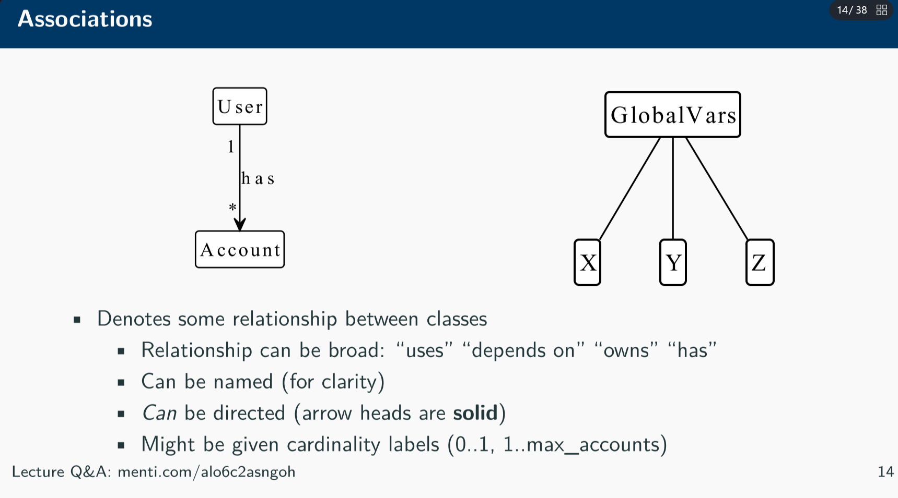
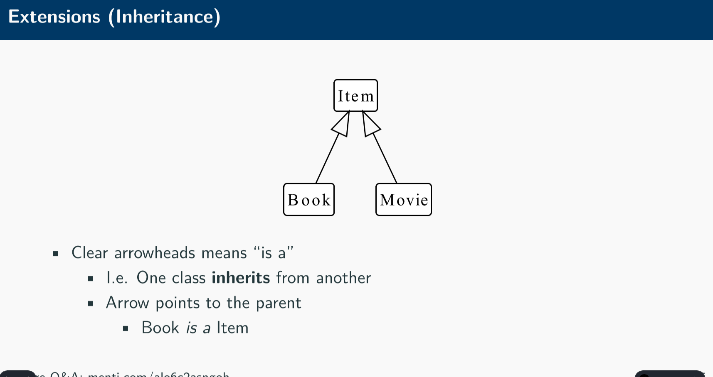
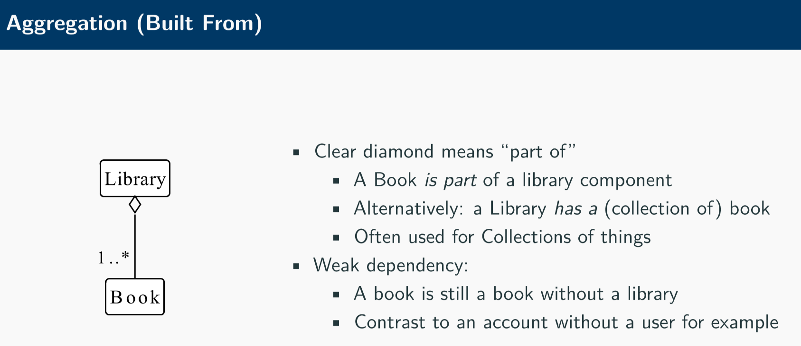
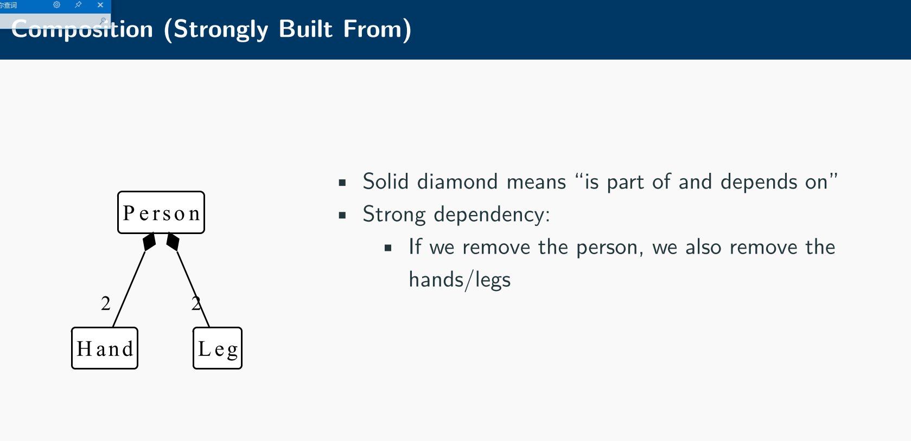
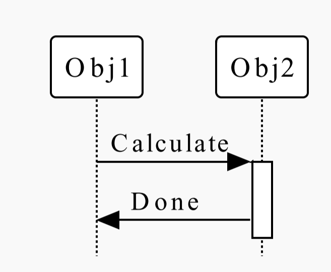
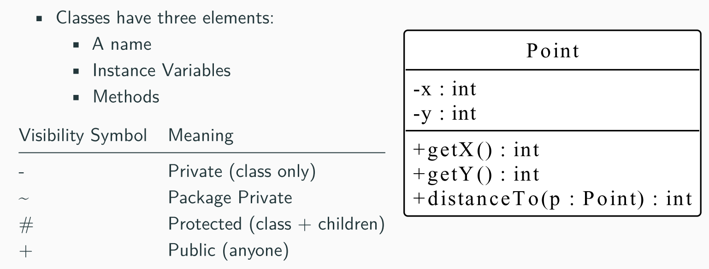
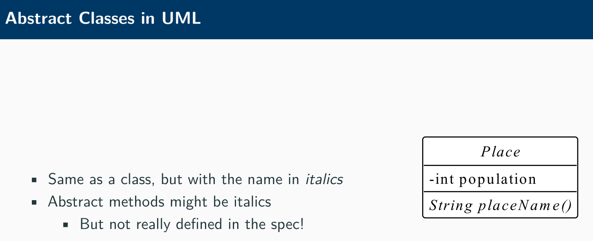
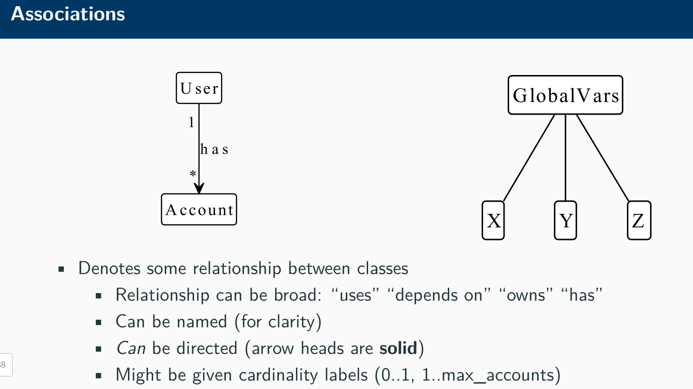

# Week4

[5-Tools_for_Software_Design-generated.pdf](assets/5-Tools_for_Software_Design-generated-20230201171816-dhx8s9x.pdf)

UML图

UML是一种通用的、用于描述、规划、构建、验证软件系统的建模语言。UML类图用于描述系统中的对象、类和它们之间的关系。UML序列图用于描述系统中对象间互相交互的消息流。
# UML图网站
[UML学习（三）-----序列图 - silent - 博客园](https://www.cnblogs.com/silent2012/archive/2011/09/14/2172219.html)
[UML学习（二）-----类图 - silent - 博客园](https://www.cnblogs.com/silent2012/archive/2011/09/07/2169946.html)
## PlantUML
[VSCode还能绘制UML图](https://www.bilibili.com/video/BV1kv411q7Kt/?spm_id_from=333.337.search-card.all.click&vd_source=2f6e531d9d833ca7fdcd8c5bb99bd1bb)

# UML 各种图标分别代表什么

Association

实心箭头代表所属关系

Extension/Inheritance

空心箭头表示继承

Agregation 聚合

is a part of

Compstion 组成

一般实心的都是强关系

‍

Class Diagrams show:

 • Elements of a class (the data + API) • Relationships between classes • Associations • Extensions  
• Aggregations/Compositions

Classes/Objects/Components go along the top

 • Time runs down the diagram • Solid rectangles means “doing work” 

• Control is passed using an arrow • A method call 

• Usually implicit that the left-most object starts with control

 • Useful for complex protocols with lots of objects

类/对象/组件位于顶部；时间向下流动；实心矩形表示“执行工作”；控制通过箭头（方法调用）传递；通常隐含的是最左边的对象首先拥有控制；对于具有大量对象的复杂协议非常有用。

---
# Assement2 Example

• UML is a way to document/model software systems • Class diagrams show relationships between classes
统一建模语言UML包含:
1. Class Diagram
2. Sequence Diagram

• associations, inheritance, aggregation, composition

• Sequence diagrams show specific interactions between objects • You should be able to:

• Draw Class/Sequence Diagrams from code or a specification • Identify and explain errors in a diagram

• Use diagrams to critically reflect on the design of a system

# Class diagram

# Sequence Diagram

• Class diagrams are static: tell you structure 
• Sequence diagrams document temporal/dynamic relations between objects
• Describe protocols (Order methods are called in)