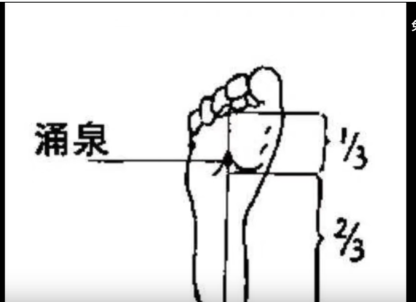

```
Aythor: RanShuai
Created Time:  2023-03-21 23:15:13
```
[球衣](https://www.icons.com/teams/premier-league/manchester-united.html?p=2)

1. 找工作
	1. 先给父亲看一下简历,询问一下有什么需要更改的地方
	2. 不想在常州,想去大一点的厂,大一点的地方.
	3. 不想一回去就立刻工作
	4. 要慢慢找,找到一份大厂的工作虽然不那么合适,但是先在大厂. 等过几年再回去


[球星卡](https://uk.topps.com/rbsalzburg2223.html)
1. 球星卡简介
2. 玩不玩球星卡
3. 球服



---

06/02 周五
- 办理一下法签的证件
	- 用别人的银行卡里的钱,买机票和酒店可以嘛?
- 读一下文献
- 约一下剪头发的时间 -> 最好是明天 或者后天04

06/03 周六
- 如果好的话剪头发
- 画杯子
- 基本打印整理好法签需要的所有文件

06/04
- 基本整理好所有的资料,开始打印