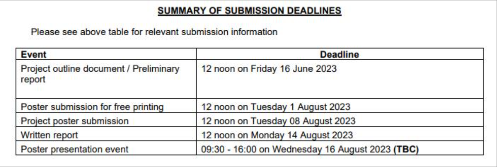

| Project           | Information                                |
| ----------------- | ------------------------------------------ |
| Family Name       | RAN                                        |
| First Name        | Shuai                                      |
| Plan Code         | HG55-5200                                  |
| Allocated Project | Last 10 metres travel aid for blind people |
|   Supervisor      | Marion Hersh                               |
|Second   Supervisor |          Oana Dobre                        |

##### Description

GPS systems for blind people can provide useful guidance for most of the journey. 

However, currently available systems are not accurate enough to guide the user the last short distance (10 metres or so) to the entrance. 

An environmental information beacon could be placed at the entrance and guide the use, with for instance an infrared signal. 

However, these beacons are not widely used. Therefore, a technological solution, preferably in the form of an app on the user's phone or other mobile device, is required to solve this problem. 

The following is required of the app: 

• Compute an appropriate path from the user's current location to the target entrance. 
• Guiding the user along this path to the target entrance, using appropriate sensors 

• Using appropriate sensors to identify and safely avoid obstacles and hazards along the path. 

• Obtaining crowd-sourced information about the local area and using it to determine a safe path and the appropriate entrance if there is more than one. 

• Have a user friendly interface with speech and gesture input and speech, non-speech audio and haptic output. Individual students will investigate, develop to prototype level and, if time permits, test with end users one (or more) of the following: 

• An appropriate guideance algorithm and combination of sensors to guide the user to the target entrance while avoiding obstacles and hazards. 

• Different designs of end-user interface 

• A crowd-sourcing algorithm

Prerequisite Skills

Programming

---

描述： 针对盲人的GPS系统在大部分旅程中都能提供有效的指导。然而，目前可用的系统精度不足以引导用户在最后的短距离（大约10米）内到达入口。可以在入口处放置一个环境信息信标，通过红外信号等方式引导用户。然而，这些信标并没有被广泛使用。因此，需要一种技术解决方案，最好是以用户手机或其他移动设备上的应用程序形式，来解决这个问题。

应用程序需要具备以下功能： 

• 计算从用户当前位置到目标入口的合适路径。 

• 使用适当的传感器引导用户沿着这条路径到达目标入口。 

• 使用适当的传感器识别并安全地避开路径上的障碍物和危险。 

• 获取关于当地区域的群众来源信息，并使用它来确定安全路径和合适的入口（如果有多个入口的话）。 

• 具有用户友好的界面，支持语音和手势输入，以及语音、非语音音频和触觉输出。

单独的学生将调查、开发原型级别，并在时间允许的情况下，与最终用户测试以下一个（或多个）方面： 

• 一个合适的导航算法和传感器组合，以在避开障碍物和危险的同时引导用户到达目标入口。 

• 不同的最终用户界面设计 

• 一个群众投票算法

先决技能 编程

解释： 这个项目描述提出了一个为盲人设计的GPS应用程序，以解决现有GPS系统无法精确引导用户到达目标入口的问题。该应用程序将计算合适的路径，使用传感器引导用户，识别并避开障碍物，获取并利用来自群众的信息，并具有用户友好的界面。学生们将研究并开发原型，如有时间，还将与最终用户进行测试。这个项目需要具备编程技能。