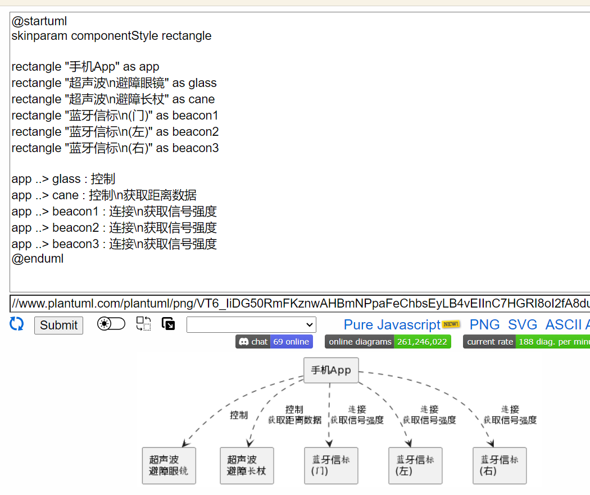

```PlantUML
@startuml

skinparam componentStyle rectangle

rectangle "手机App" as app
rectangle "超声波\n避障眼镜" as glass
rectangle "超声波\n避障长杖" as cane
rectangle "蓝牙信标\n(门)" as beacon1
rectangle "蓝牙信标\n(左)" as beacon2  
rectangle "蓝牙信标\n(右)" as beacon3

app ..> glass : 控制
app ..> cane : 控制\n获取距离数据
app ..> beacon1 : 连接\n获取信号强度
app ..> beacon2 : 连接\n获取信号强度 
app ..> beacon3 : 连接\n获取信号强度

@enduml

```


