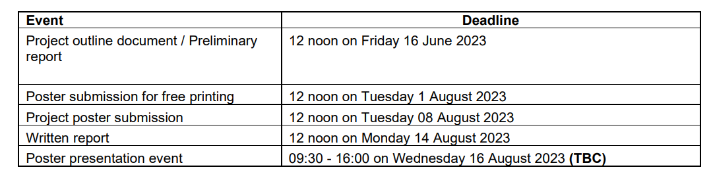

|     | 时间       | 项目 |
| --- | ---------- | ---- |
| 1   | 29         |      |
| 2   | 30         |      |
| 3   | 31         |      |
| 4   | 01         |      |
| 5   | 02         |      |
| 6   | 03         |      |
| 7   | 04         |      |
| 8   | 05         |      |
| 9   | 06         |      |
| 10  | 07         |      |
| 11  | 08         |      |
| 12  | 09         |      |
| 13  | 10         |      |
| 14  | 11         |      |
| 15  | 12         |      |
| 16  | 13         |      |
| 17  | 14   12:00 |      |

- [ ] 制图 一些报告中需要用到的图
- [ ] 修改代码的注释 格式等等

- [ ] 老师的论文中已经提到了很多其他的参考文献,引用老师的文献和老师推荐的文献
- [ ] 找刘羿和萱萱要一下他们之前的ISDP的报告,看一下格式.

# 注意点
A report is not a story. Write ‘The voltage was measured’ rather than ‘I measured the voltage’. This document contains instructions and therefore uses a different style.

___
Analyse the uncertainties in your results to increase the impact of your results. 
Please avoid horrors like this: *The gain was quite accurate.* 

The sentence is meaningless and the reader will doubt whether you have any idea of the accuracy. 

Contrast this sentence: *The accuracy of the gain was estimated to be ±2%, limited by the tolerance of the resistors.* A detailed analysis is given in Appendix C. This is informative and convinces the reader that you have a full understanding.

那么我在写报告的时候就可以写蓝牙的信号测量并不准确,详情请参见下表

___

Avoid direct quotations from references in general; make it absolutely clear that the text is a quotation if this is unavoidable.

___
Reports whose references are all or mainly from the web, especially from anonymous sites, will be penalised.

参考文献完全或主要来自网络，尤其是匿名网站的报告，将受到处罚。

___
#页数限制
There are no strict limits to length of the report though as guide you should consider about 40-50 pages (approximately 10,000 to 15,000 words1) as being about right. Appendices are additional to this guideline. 

An electronic version of the report must be submitted as a PDF document on the Moodle page and checked using the plagiarism software.

书面报告 报告的长度没有严格的限制，但作为指南，你应该考虑大约40-50页（大约1万至1.5万字）为宜。附录不计入此指南。报告的电子版本必须以PDF文档形式提交到Moodle页面，并使用抄袭检测软件进行检查。

你的书面报告将由你的导师和审核员按照MSc项目报告评分指南进行评分。

___

# 开头几页需要注意的事情

Mechanical aspects The length of the body of the report will be specified in the instructions for the project (for MSc project about 40-50 pages, approximately 10,000 to 15,000 words). 

Extra material may be provided in appendices but this material should be for reference only: you cannot assume that the reader will study it. 

In other words, do not put vital points in an appendix. You will probably think that the report is too short but this is deliberate. 

Most reports are submitted to busy managers, who do not have time to read lengthy documents. It is important to learn how to pick out the vital points and write a concise report with maximum impact. 

Reports should be word-processed and submitted electronically. 

Use A4 pages and a clear typeface such as 12-point Times, single line spacing, number the pages and leave margins of at least 25 mm all round. 

Follow this layout (this document breaks some of the rules to keep it compact). 

• The front cover should show the title of the project with your name(s) and matriculation number(s) and the name of your supervisor(s). 
• Put the abstract on the next page. It should be about 100–250 words and gives a brief summary of the report including the background and aims of the project, the principal results and conclusions. 
• The next page should show the table of contents. 
• The body of the report should be divided into numbered sections, each starting on a new page. Figures (diagrams, plots or photographs) and tables need captions and should be numbered.

# Abstarct
本旨主要研究开发盲人最后十米的导航, --- 取得了什么成果?

1. 研究了Beacon
2. 研究了超声波测距
3. 研究了Beacon

# List of Objective

# Nomenclature（术语、命名法）
BLE
RSSI

# Table Of Contents

# Discussion 

信标的分析
1. 每个信标即使在同一点测量到的信号值也有可能不同.
2. 每个信标在10m的最远距离和0m的最近距离得到的信标值.

最好是自己再重新弄一个app能够显示信标的RSSI. 按一下显示一下.

测距仪器的分析
1. 距离测距分析20  40 60 100 , 仪器数据 实物数据对比. 与实际的距离进行误差分析.

# 页数分析

一共需要40-60页
附录不包含在页数之中.
但是没有严格的页数与字数限制.

| 内容              | 页数 | 总页数 |
| ----------------- | ---- | ------ |
| Front Cover       | 1    | 1      |
| Abstract          | 1    | 2      |
| Nomenclature      | 1    | 3      |
| Table Of Contents | 2    | 5      | 
