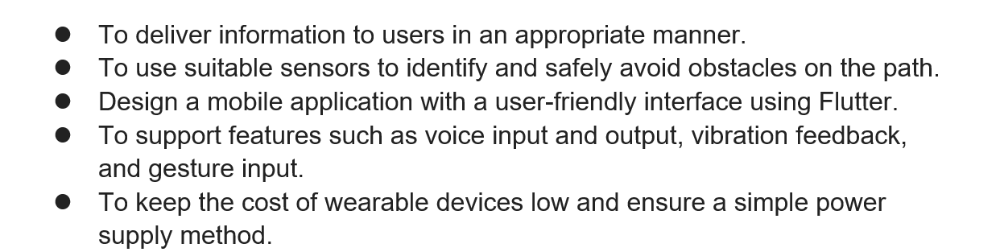
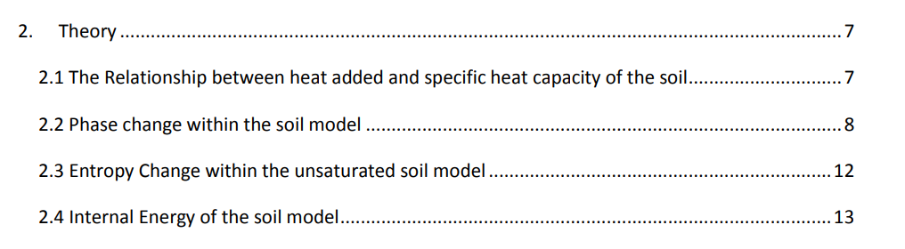
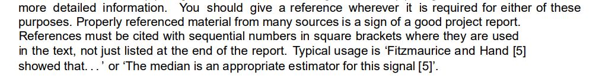
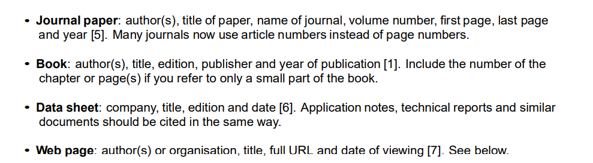
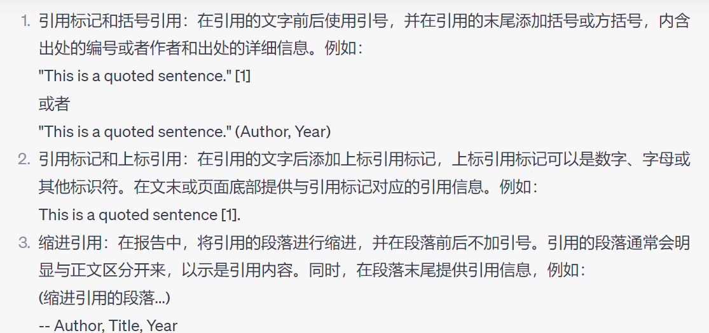
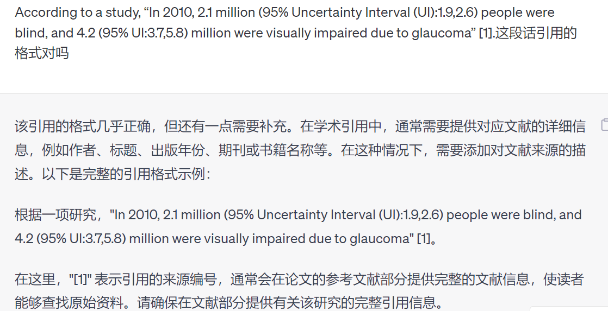
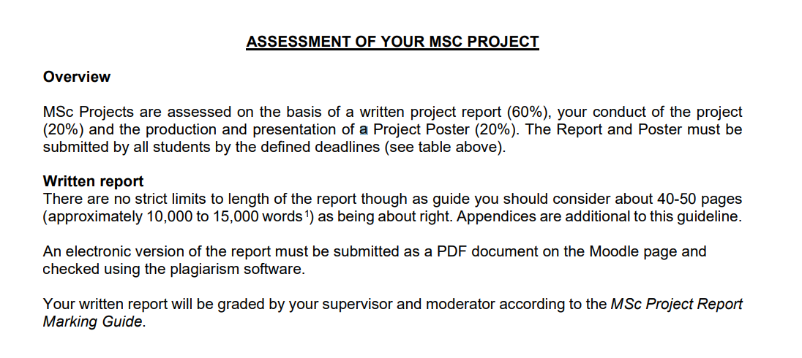
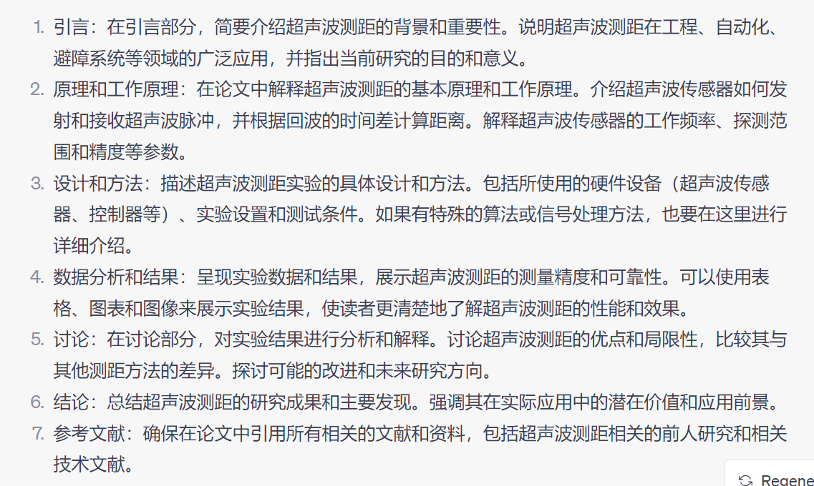
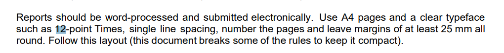

# 时间安排
|     | 时间       | 项目                                   |
| --- | ---------- | -------------------------------------- |
| 1   | 29         |                                        |
| 2   | 30         |                                        |
| 3   | 31         |                                        |
| 4   | 01         |                                        |
| 5   | 02         | 可穿戴设备理论                         |
| 6   | 03         | 可穿戴设备理论 移动应用理论            |
| 7   | 04         |                                        |
| 8   | 05         | 可穿戴设备结果 移动应用结果 conclusion |
| 9   | 06         | 翻译 找文献 语法            |
| 10  | 07         | 翻译 找文献 凑字数     语法   电路图   |
| 11  | 08         | 重新再看一遍                           | 
| 12  | 09         |                                        |
| 13  | 10         |                                        |
| 14  | 11         |                                        |
| 15  | 12         |                                        |
| 16  | 13         |                                        |
| 17  | 14   12:00 |                                        |

可穿戴设备结果
1. [ ] 先给出整体的电路图
2. [ ] 测距
3. [ ] 蓝牙接收发送

移动应用结果

- [ ] 制图 一些报告中需要用到的图
- [ ] 修改代码的注释 格式等等

- [ ] 老师的论文中已经提到了很多其他的参考文献,引用老师的文献和老师推荐的文献
- [ ] 找刘羿和萱萱要一下他们之前的ISDP的报告,看一下格式.

# 注意点
A report is not a story. Write ‘The voltage was measured’ rather than ‘I measured the voltage’. This document contains instructions and therefore uses a different style.

___
Analyse the uncertainties in your results to increase the impact of your results. 
Please avoid horrors like this: *The gain was quite accurate.* 

The sentence is meaningless and the reader will doubt whether you have any idea of the accuracy. 

Contrast this sentence: *The accuracy of the gain was estimated to be ±2%, limited by the tolerance of the resistors.* A detailed analysis is given in Appendix C. This is informative and convinces the reader that you have a full understanding.

那么我在写报告的时候就可以写蓝牙的信号测量并不准确,详情请参见下表

___

Avoid direct quotations from references in general; make it absolutely clear that the text is a quotation if this is unavoidable.

___
Reports whose references are all or mainly from the web, especially from anonymous sites, will be penalised.

参考文献完全或主要来自网络，尤其是匿名网站的报告，将受到处罚。

___
#页数限制
There are no strict limits to length of the report though as guide you should consider about 40-50 pages (approximately 10,000 to 15,000 words1) as being about right. Appendices are additional to this guideline. 

An electronic version of the report must be submitted as a PDF document on the Moodle page and checked using the plagiarism software.

书面报告 报告的长度没有严格的限制，但作为指南，你应该考虑大约40-50页（大约1万至1.5万字）为宜。附录不计入此指南。报告的电子版本必须以PDF文档形式提交到Moodle页面，并使用抄袭检测软件进行检查。

你的书面报告将由你的导师和审核员按照MSc项目报告评分指南进行评分。

___

# 开头几页需要注意的事情

Mechanical aspects The length of the body of the report will be specified in the instructions for the project (for MSc project about 40-50 pages, approximately 10,000 to 15,000 words). 

Extra material may be provided in appendices but this material should be for reference only: you cannot assume that the reader will study it. 

In other words, do not put vital points in an appendix. You will probably think that the report is too short but this is deliberate. 

Most reports are submitted to busy managers, who do not have time to read lengthy documents. It is important to learn how to pick out the vital points and write a concise report with maximum impact. 

Reports should be word-processed and submitted electronically. 

Use A4 pages and a clear typeface such as 12-point Times, single line spacing, number the pages and leave margins of at least 25 mm all round. 

Follow this layout (this document breaks some of the rules to keep it compact). 

• The front cover should show the title of the project with your name(s) and matriculation number(s) and the name of your supervisor(s). 
• Put the abstract on the next page. It should be about 100–250 words and gives a brief summary of the report including the background and aims of the project, the principal results and conclusions. 
• The next page should show the table of contents. 
• The body of the report should be divided into numbered sections, each starting on a new page. Figures (diagrams, plots or photographs) and tables need captions and should be numbered.

# Reference
[2] D. Banks, Introduction to Thermogeology, Blackwell Publishing (2008) pg. 37 这是什么引用格式

这是一种标准的引用格式，通常用于学术论文和研究报告中，遵循了特定的引用规范（如APA、MLA、Chicago等）。但是，从您提供的信息来看，我无法确定具体采用的是哪种引用格式。因为缺少一些必要的信息，比如作者的姓名、出版地点等。

通常，在学术引用中，您需要提供以下信息：

1.  作者的姓名或者组织的名称
2.  文献的标题
3.  出版年份
4.  出版物的名称（书籍的标题或期刊的名称）
5.  出版商（适用于书籍）
6.  页码（适用于书籍中的特定章节或篇目）

根据您提供的信息，我们只能确定这是一本书的引用，并提供了页码信息。但是缺少了作者的姓名、出版年份、出版商等信息。

如果您能提供完整的引用信息，我将可以帮您更准确地格式化引用。

# Abstarct
所有报告都以摘要开始，其中包含项目的概要：

目标是什么
做了什么以及取得了什么成果

本文档描述了工程学院硕士项目报告的要求，并提供了如何获得更好成绩的建议。其结构尽可能与项目报告相匹配。

本旨主要研究开发盲人最后十米的导航, --- 取得了什么成果?

1. 研究了Beacon
2. 研究了超声波测距
3. 研究了Beacon

# List of Objective

# Nomenclature（术语、命名法）
BLE
RSSI
TXD
RXD
VCC
GND
HZ
元素 elements 指移动应用中的文本框 按钮 等

# Table Of Contents

- [ ] 这个还可以扩展来写以下为什么需要这些功能

# Introduction
This is where you talk about the context of the problem that you are trying to solve or address, the problem itself, 

and what you are going to do about it. The goal of this project is to …. This is important because…. [this answers the question ‘why should someone care about this work’] 

To address this problem this work describes….

你要解决的是什么问题? 
为了解决这个问题你准备怎么做

# Theory

这里我就在网上找一些理论,但是我不写结果,在disscussion的时候我再写结果,我的测量数据,表格等等.

# Results and Discussion 

信标的分析
1. 每个信标即使在同一点测量到的信号值也有可能不同.
2. 每个信标在10m的最远距离和0m的最近距离得到的信标值.

最好是自己再重新弄一个app能够显示信标的RSSI. 按一下显示一下.

测距仪器的分析
1. 距离测距分析20  40 60 100 , 仪器数据 实物数据对比. 与实际的距离进行误差分析.

# Reference

在文本中使用顺序编号的方括号引用参考文献，而不仅仅在报告末尾列出。典型用法是“Fitzmaurice和Hand [5] 表明……”或“中值是这个信号的适当估计器 [5]”。

一般应避免直接引用参考文献中的内容；如果不可避免，应明确标明这段文字是引用。另外，来自数据手册等的图示也属于引用的一种，通常在图题中标注。这是完全可接受的，不要浪费时间重新绘制图表。

# Conslusion

# Future Consideration
- [ ] 在界面上加上使用教程

# 页数分析

一共需要40-60页
附录不包含在页数之中.
但是没有严格的页数与字数限制.

| 内容              | 页数 | 总页数 |
| ----------------- | ---- | ------ |
| Front Cover       | 1    | 1      |
| Abstract          | 1    | 2      |
| Nomenclature      | 0    | 2      |
| Table Of Contents | 2    | 4      | 

# 可以添加
- [ ] 红外 超声波测距仪差异
- [ ] 信号强度随距离变化 对比excel表格
- [ ] 三点定位算法
- [ ] 界面的调查 布局
- [ ] 为什么不能在Iphonr上用 
- [ ] 有一些手机不支持检测蓝牙信号的强弱 Nokia C21 / Honor Lite 90
	- [ ] [Nokia C21蓝牙5.0与蓝牙5.1区别](https://zhuanlan.zhihu.com/p/57012966)
- [ ] 蓝牙透明传输协议
- [ ] 距离测距分析20  40 60 100 , 仪器数据 实物数据对比. 与实际的距离进行误差分析.

# 还未完成
- [ ] 格式的确定

# 报告的评分标准

very good
___
Clear and well written, easy to understand, and mostly free of errors.

Clear and consistent presentation which is easy to read. Most figures are clear and well-presented and customised to establish the narrative.

An appropriate range of relevant sources used and evaluated, indicating substantial background reading and consideration of the wider context of the problem.

A lucid, coherent narrative, dictated by significant analyses, indicates a very good grasp and novel solution of a difficult technical problem.

Conclusions integrate well with key themes of the text, critically assessing the wider relevance to current and future societal needs.

清晰且写作流畅,易于理解,几乎没有错误。

清晰一致的呈现方式,易于阅读。大多数图表清晰且呈现良好,定制性强,有助于塑造叙事。

使用并评估了广泛的相关文献,表明作者进行了充分的背景阅读并考虑了问题的更广泛背景。

流畅连贯的叙事受到重要分析的指导,表明作者对困难的技术问题有非常好的理解和创新性的解决方案。

结论部分与正文的关键主题紧密结合,批判性地评估了研究对当前和未来社会需求的更广泛意义。

Excellent
___
Most of the text is clear and easily understood. There are some issues with grammar and spelling.

Minor flaws in the presentation and clarity of the figures. Typically, some figures from web which are not tailored to the narrative.

References used and discussed indicate a good level of core and wider background reading.

The narrative is clear and shows how good technical or design choices followed from key technical analyses.

Text and conclusions show good insight into the technical results of the project, and their relation to the wider engineering and societal context.

大部分文本清晰易懂。语法和拼写存在一些问题。

图表的呈现和清晰度存在细微缺陷。通常使用一些未定制的网络图片。

参考文献的使用和讨论显示作者具备良好的核心和广泛的背景知识。

叙事清晰,很好地展示了关键的技术分析如何指导良好的技术或设计选择。

正文和结论很好地洞察了项目的技术成果,以及它们与更广泛的工程和社会背景的关系。

# 谁来评分

# 网址&datasheet

[HC06](https://components101.com/wireless/hc-06-bluetooth-module-pinout-datasheet)

[GP2Y0A02YK0F](chrome-extension://efaidnbmnnnibpcajpcglclefindmkaj/https://docs.rs-online.com/268d/0900766b81364822.pdf)

[Nokia C21 - Full phone specifications](https://www.gsmarena.com/nokia_c21-11380.php)
# 按照这样凑字数

每一部分都按照这个方法来来写

# 找文献

# 没有写进去的
- [ ] 三点定位算法

# 画图
我现在一共有三种选择
1. 使用PCB软件画图
2. 使用哪个什么Firting画图软件
3. 使用Draw.io画图

# 格式要求

