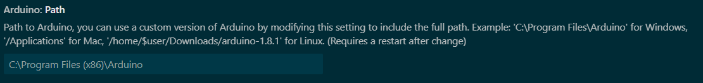
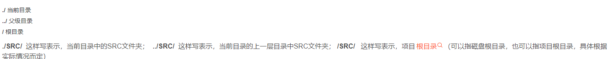
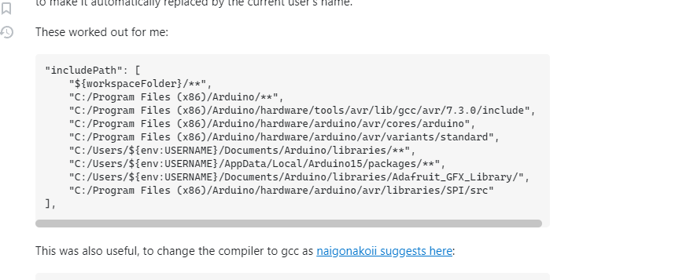

# 资料
[PDF - Pinout-Mega2560](assets/Pinout-Mega2560rev3_latest.pdf)


[Arduino Mega 2560中文教程含接口定义](https://spotpear.cn/index/study/detail/id/784.html)


#学习视频
[Arduino基础教程 视频 太极创客](https://www.bilibili.com/video/BV164411J7GE?p=4&spm_id_from=pageDriver&vd_source=2f6e531d9d833ca7fdcd8c5bb99bd1bb)


#参考资料
**[Arduino编程语句参考 – 太极创客](http://www.taichi-maker.com/homepage/reference-index/arduino-code-reference/)**
[Arduino编程参考手册中文版-arduino编程基础教程-DFRobot产品资料库](https://wiki.dfrobot.com.cn/Arduino%E7%BC%96%E7%A8%8B%E5%8F%82%E8%80%83%E6%89%8B%E5%86%8C#pinmode)
[Arduino手册 狮子学](https://www.w3cschool.cn/arduino/arduino_data_types.html)


#如何分开编写Arduino源文件

[Arduino自定义库的学习](https://www.cnblogs.com/lulipro/p/6090407.html)

[Arduino自定义库的学习](https://blog.csdn.net/qq_42099097/article/details/82216059)


# 使用VSCODE编写Arduino程序

[使用VSCODE编写Arduino代码](https://www.sohu.com/a/411067875_100122356)


在Vscode中安装插件Arduino,并在他的Extention Setting中设置好路径.
然后开始新建工程


1. 首先使用Arduino 创建一个工程文件,并关闭
2. 使用Vscode打开这个工程文件
3. 如果`#include "Arduino.h"`头文件提示出错直接关闭出错提示就行,这个没关系.

___
或者直接用VSCODE新建也行,但是需要注意一点,Arduino工程项目`ino`的文件名必须和项目文件夹的名字一样.否则就会出错.这个和JAVA里面的规则是一样的.




#Arduino端口对应

Arduinio的端口对应就和板子上的一样.
板子上写的什么,在编程的时候就使用这个编号进行编程就行了.

```C++
serialPrint test;
int pinIn = 0;
int pinOut = 14;

// 初始化串口波特率为11520:
void setup()
{
  // 使用Serial.begin()函数来初始化串口波特率,参数为要设置的波特率
  Serial.begin(115200);
  pinMode(pinIn, INPUT);
  pinMode(pinOut, OUTPUT);
}

// the loop routine runs over and over again forever:
void loop()
{
  int x = digitalRead(pinIn);
  Serial.println(x);
  delay(500); // 延时500ms
}
```


