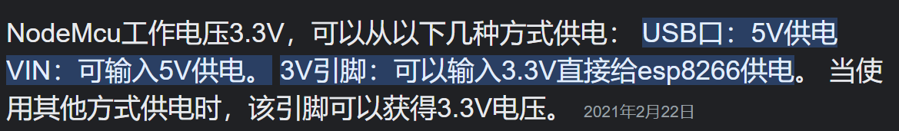

```c++

void setup() {
  // put your setup code here, to run once:
  pinMode(4, INPUT);//右边第三个引脚
  Serial.begin(115200);

}

void loop() {
  // put your main code here, to run repeatedly:
  Serial.println(digitalRead(4));
  delay(1000);
}
```

[3-1-2 为ESP8266-NodeMCU搭建Arduino IDE开发环境 – 太极创客](http://www.taichi-maker.com/homepage/esp8266-nodemcu-iot/iot-c/nodemcu-arduino-ide/)


- [ ] 引脚的使用 读数字信号引脚
- [ ] 怎么给ESP8266用电池供电 在B站搜
- [ ] 所有驱动移植


ESP8266有一个稳压器,理论上可以输入高达12V的电压.

如何供电
___



```c++
Vibrator::Vibrator(int ledPin, int vibratorPin)

Vibrator v1(5, 16);


v1.setStatus(true);
delay(1000);
v1.setStatus(false);
delay(1000);
```

```c++
SR04 s1(int echoPin, int trigPin)
SR04 s1(9, 10)

```

# SR04
[详解超声波测距模块HC-SR04的使用\_\_会飞\_的鱼的博客-CSDN博客](https://blog.csdn.net/lin5103151/article/details/102767115)
需要5V供电


# 串口
Software Serial 软件串口
他自己有串口库在Lib文件夹的EEPROM里
```c++
#include <SoftwareSerial.h>

SoftwareSerial mySerial(4, 0); // RX, TX
String  x = "1111111";
void setup() {
  // Open serial communications and wait for port to open:
  Serial.begin(9600);


  Serial.println("Goodnight moon!");

  // set the data rate for the SoftwareSerial port
  mySerial.begin(9600);
  mySerial.println("Hello, world?");
}

void loop() { // run over and over

  if (mySerial.available()) {
    mySerial.println(mySerial.readString());

  }

  delay(500);

}
```
## 使用蓝牙的注意事项
ESP8266的电平是3.3v的. 
他既可以输出3.3v的电源也可以输出5V的电源我们需要给HC 06 用5V供电才能正常使用HC06.
至于为什么电平是3.3V也行,可能是因为HC06在3.3 - 6V都能用所以可以识别.
所以
HC06 Vcc  ---->   ESP8266 GPIO09_SDD2