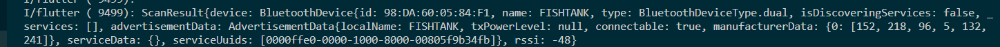
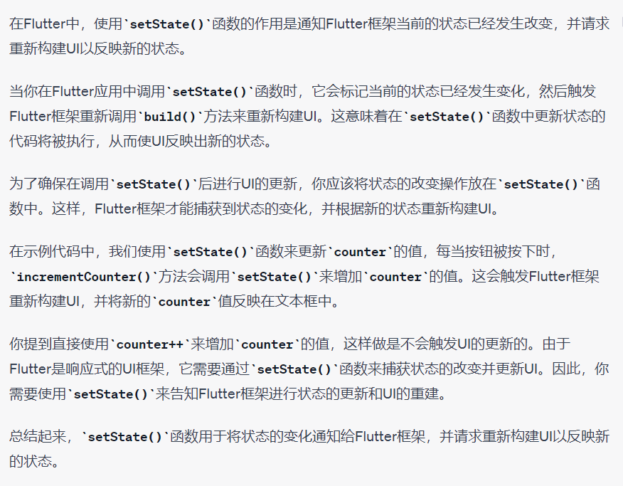

```dart
r.device
r.rssi


 ElevatedButton(

                onPressed: () async {

                  this.scanDevice();

                  this.test.map((device) {

                    if (device.device.name == "FISHTANK")

                      print("---------------");

                  });

                },

                child: Text("扫描设备")),
```




我是不愿意弄这个项目吗? 并不是
只是因为这个项目没什么进展我才没弄得.
现在这恶鬼项目有进展了,那么接下来就是水到渠成的事情了.


# 可以写在报告里的事
1. 根据盲人模式的使用情况,我们优化了界面.
情况: 盲人模式下盲人通过左右滑动来听取手机上的元素,双击空白处来激活选中的按钮.
因此我们在界面上使用了极少的按钮,且留出了大部分的空白

2. 随插随用.
我们采用micro usb供电.这意味着你可以用家里的充电宝给他供电.当你不用他们时,只要拔下充电线.避免了更换电池的风险.

3. Nokia C21 与 Honor 10
蓝牙的支持问题 因该是5.0 4.0的关系

手机能否检测蓝牙信号强弱主要取决于手机的蓝牙模块和系统的不同。

一般来说,检测蓝牙信号强弱需要满足以下几点:

1. 蓝牙模块支持信号强度检测。部分低端蓝牙模块为了降低成本,会省略信号强度检测功能。

2. 系统层面提供蓝牙信号强度的API。Android从4.3版本开始提供了getRssi()等API可获取信号强度。

3. 厂商的系统做了兼容。并不是所有Android手机厂商的定制系统都完全兼容官方提供的信号强度API,部分厂商可能去除或修改了这部分功能。

4. 应用层做了实现。应用需调用对应API获取信号强度并显示,不同应用的实现会有差异。

综上,如果手机的蓝牙模块、系统和应用层都满足条件,就可以检测到蓝牙信号的强弱,否则只能检测到信号的有无。一般来说,高端和新款手机更可能具备信号强度检测功能。

___

好的,我来详细解释一下蓝牙模块对信号强度检测的支持:

蓝牙模块主要包含蓝牙芯片和固件。芯片负责蓝牙基带信号的收发,固件实现蓝牙协议栈。

蓝牙信号强度检测需要硬件层面测量实际接收的信号强度(RSSI)。测量方法有:

1. 通过ADC直接采集天线接收信号的模拟电压强度。这需要芯片集成专门的ADC模块。

2. 数字式检测,在解调环节测量信号强度。这需要固件层面实现相关算法。

3. 利用射频测试功能,通过回读天线端口功率来计算信号损耗。这需要额外的调试接口。

低端蓝牙芯片为降低成本,通常会:

1. 去掉专门的ADC硬件,不直接采集信号电压。

2. 简化数字式检测固件,省去信号强度计算代码。 

3. 减少调试接口,无法回读射频信号参数。

所以就丧失了信号强度检测能力。高端蓝牙芯片才会有硬件支持和完整固件来实现精确的RSSI检测。

这个是蓝牙模块信号检测功能差异的硬件原因。希望解释清楚了!

4. 你可以在这期间做其他事情,即使你跳转到别的软件也许.他会在后要运行,播报你的位置.