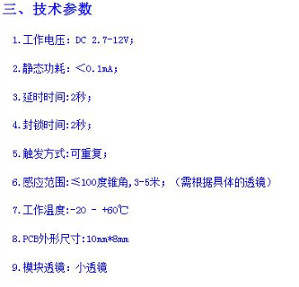

- [x] MCU : [Arduino Mega 2560](assets/截图_20230626154923.png)
- [ ] 声波传感器 : [HC - SR04](assets/截图_20230626155036.png)
- [ ] 红外传感器 : [GP2YOAO2YKOF](assets/dce3e41fc3c9b3fbfbb9cf8f017b6ec.jpg)
- [x] 振动片:  
- [x] 人体传感器 : Human Sensor

# HC_SR04
___
[Arduino HC_SR04教程](https://projecthub.arduino.cc/Isaac100/getting-started-with-the-hc-sr04-ultrasonic-sensor-7cabe1)

# HumanSensor
___

[HC-SR312](https://zhuanlan.zhihu.com/p/144836311)

测试结果:
1. 角度宽的时候能测试的距离很近
2. 角度窄的时候能测试的距离很远
3. 只检测有温度的生物: 小猫,小狗,人体等生物.

- 有时会出错,这里需要写一个算法,当多次检测到有物体的时候才提示有人.
例如连续5次都检测到有人就提示有人.

# 红外传感器
[红外传感器](https://www.aranacorp.com/en/using-a-distance-sensor-gp2y0a21-arduino/)
