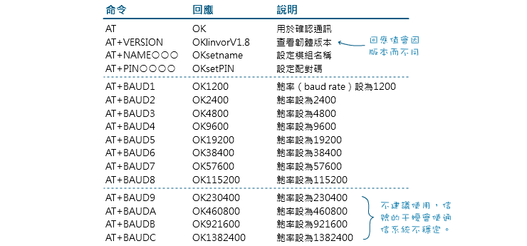

- [x] MCU : [Arduino Mega 2560](assets/截图_20230626154923.png)
- [ ] 声波传感器 : [HC - SR04](assets/截图_20230626155036.png)
- [ ] 红外传感器 : [GP2YOAO2YKOF](assets/dce3e41fc3c9b3fbfbb9cf8f017b6ec.jpg)
- [x] 振动片:  
- [x] 人体传感器 : Human Sensor

# HC_SR04
___
[Arduino HC_SR04教程](https://projecthub.arduino.cc/Isaac100/getting-started-with-the-hc-sr04-ultrasonic-sensor-7cabe1)

# HumanSensor
___

[HC-SR312](https://zhuanlan.zhihu.com/p/144836311)

测试结果:
1. 角度宽的时候能测试的距离很近
2. 角度窄的时候能测试的距离很远
3. 只检测有温度的生物: 小猫,小狗,人体等生物.

- 有时会出错,这里需要写一个算法,当多次检测到有物体的时候才提示有人.
例如连续5次都检测到有人就提示有人.

# 红外传感器
[红外传感器](https://www.aranacorp.com/en/using-a-distance-sensor-gp2y0a21-arduino/)

# HC 06

# 设备

- [x] 电池
___
5V的干电池,或者5V的纽扣电池

HC-06是3.6 - 6V 刚刚试过3.3V也行
ESP8266有一个稳压器,理论上可以输入高达12V的电压.

[CR2032 3V纽扣电池](https://www.amazon.co.uk/Duracell-Specialty-Lithium-Designed-Wearables/dp/B01CG0TO76/ref=sr_1_5?crid=1SEUJ2F3QAR5L&keywords=CR2032&qid=1689240848&sprefix=cr2032%2Caps%2C101&sr=8-5) 4个 
[CR2032 Battery Holder](https://www.amazon.co.uk/20PCS-CR2032-Battery-Holder-Button-1cell/dp/B09M2SGP7S/ref=sr_1_5?crid=3CBUK6I0MTBQW&keywords=Button%2Bcell%2Bbattery%2Bholder&qid=1689240783&sprefix=button%2Bcell%2Bbattery%2Bholder%2Caps%2C109&sr=8-5&th=1) 1个

| 器件   | 个数   | 到达日期 |
| ------ | ------ | -------- |
| CR2032 | 3个    | 15       |
| 电池盒 | 20PICS | 15       |
| HC 06  | 3个    | 16/17    | 

蓝牙芯片
___
[HC-06 Bluetooth Serial Transceiver | The Pi Hut](https://thepihut.com/products/hc-06-bluetooth-module?variant=38035091062979) 4个