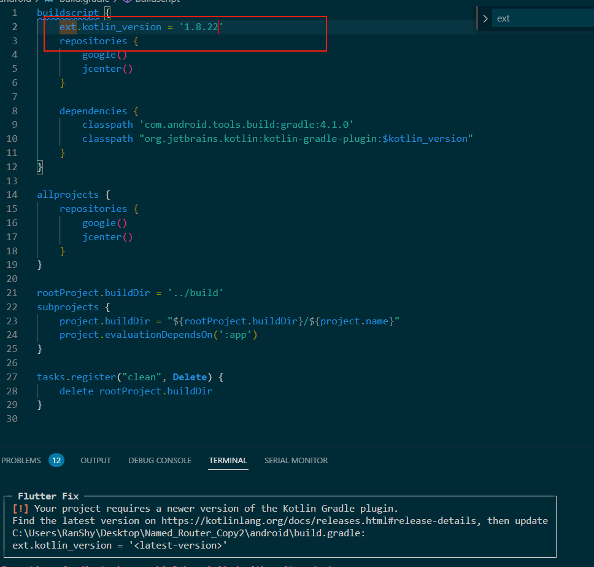
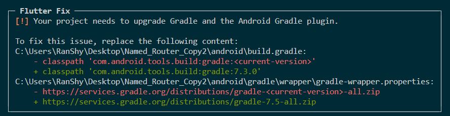
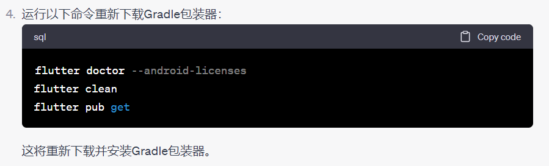

按照以下步骤就能够安装好应用了:
___
改ext 的版本号
```dart
两个许可也得放好
<uses-permission android:name="android.permission.CALL_PHONE" />

<uses-permission android:name="android.permission.READ_PHONE_STATE" />
```










语音转文字


桌面上的named router才是对的


[Fetching Title#dyjt](https://www.youtube.com/watch?v=wDWoD1AaLu8)